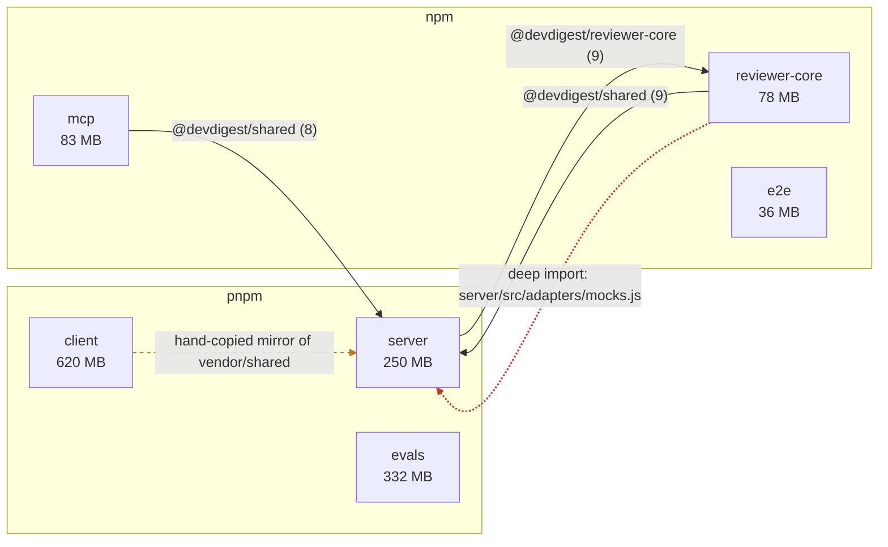

# The graph

The graph answers one question: **how do our own packages reach each other, and
by what mechanism.** Not "what is on npm" — that is the size table's job.

Mermaid syntax itself lives in the `mermaid-diagram` skill. This file is only
about what to put in the picture.

## Rules

**Nodes are the repo's own packages.** One per package root, never an npm
package. A graph with `zod` in it has stopped being a graph of the system and
become a picture of a lockfile.

**Every edge carries its mechanism as a label** — the alias, or the relative
path. An unlabelled arrow between two packages is the part the reader most
needs and the part you left out.

**Draw violations differently from healthy edges.** A dashed line and a
`linkStyle` is enough. The reader should see the problem before reading a word
of the findings section.

**Group by package manager.** Two managers in one repo is a real constraint that
the graph can state for free, and it explains why nothing is deduplicated.

**Put the weight on the node.** `client pnpm · 620 MB` costs nothing and
saves the reader a lookup into the size table.

**Draw what is real, including what no tool reports.** A hand-maintained
vendored mirror is a dependency with a human doing the resolution. If the repo
has one, it belongs in the picture — leaving it out makes the graph agree with
the tools and disagree with the repo.

**Leave out** anything below package level: files, folders, rings, individual
imports. That is `onion-architecture`'s picture, not this one. A graph that
needs a scrollbar has stopped being a summary.

## Shape for this repo

What that picture says without a sentence of prose: the two managers never mix;
`server` holds the shared contracts three other packages depend on; `server` and
`reviewer-core` point at each other, so neither is downstream of the other; one
edge is a boundary violation; `client` is not linked at all but must be
hand-synchronised; and `e2e` and `evals` depend on nothing internal.

`linkStyle` indexes count edges in declaration order from zero — recount them
after adding or removing an edge, or the wrong line goes red.

## When the graph would be empty

Say so in one line and skip the diagram. Six unconnected boxes is not
information. A repo where no package imports another is a fact for `Scope`.
