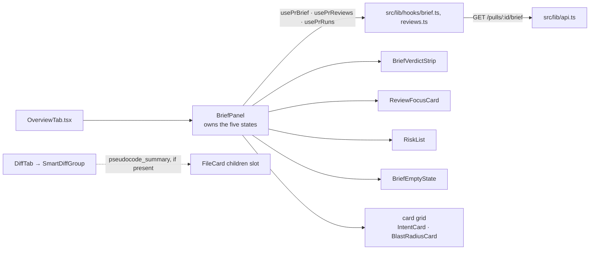
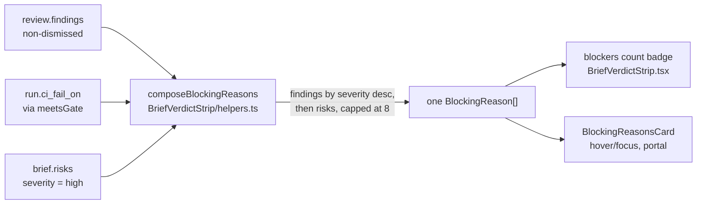

# Spec: PR Why + Risk Brief (client)

Source spec: `specs/2026-08-24-pr-why-risk-brief.md` (SPEC-03). This document
covers only the browser half — the new Overview-tab brief section and the
per-file "What this does" line in the Files-changed tab. The server half is
`server/specs/2026-08-24-pr-why-risk-brief.md`.

Before this feature, `client/messages/en/brief.json` was an orphaned i18n
namespace nobody called `useTranslations("brief")` against, and its
`unavailableHint` read *"Run a review or open the PR to compute it."* — naming
two triggers the spec's AC-39 explicitly forbids. Both are fixed here: the
namespace is filled out and `unavailableHint` is reworded to name only the
paid Generate action.

## Composition

`BriefPanel` is the section that owns state; every other brief component is
presentational, taking data through props. `IntentCard` and `BlastRadiusCard`
moved **into** `BriefPanel`'s own card grid — `OverviewTab.tsx` now mounts only
`<BriefPanel prId repoFullName headSha />`, nothing else. `SmartDiffGroup`
(a different tab entirely) reads `pseudocode_summary` off the smart-diff
response it already has and renders it through `FileCard`'s existing
`children` slot — it does not call any brief hook.

## Two paid controls, one tab, told apart by label

**Component:** `.../OverviewTab/_components/IntentCard/IntentCard.tsx:97`
**Behavior:** renders its own Recompute control under `t("recompute")` /
`t("compute")`, from the `intent` i18n sub-namespace.

**Component:** `.../OverviewTab/_components/BriefPanel/BriefPanel.tsx`
**Behavior:** renders its own Generate/Regenerate control under `t("regenerate")`
/ `t("generating")` (`brief` namespace, AC-81), opening a `Modal` confirmation
before issuing any request (AC-40) and naming the last successful generation's
cost when one is known (`t("confirm.lastCost")`, AC-82) or no currency figure
otherwise.

**Why X and not Y — position stopped being enough.** Before this feature
`IntentCard` and `BlastRadiusCard` sat in `OverviewTab`'s own grid, at a
distance from anything else that cost money. Moving both into `BriefPanel`'s
card grid (AC-1 requires all four cards inside one brief section) put two
differently-priced paid controls in one section, so proximity alone no longer
tells a reader which button triggers which call — only the visible label does
now. Any future paid control added to this section needs the same treatment
(`client/INSIGHTS.md`, 2026-08-24).

## The verdict strip: two mutually exclusive renderings

> **Superseded by AC-83–AC-98, below.** This section describes the strip's
> shape before the amendment; the `review` prop's shape has since changed
> (`blockers` replaced by the whole `review: ReviewRecord` plus `ciFailOn`) and
> the merge-risk band no longer disappears when a review is present. Kept here
> because the composition rule two paragraphs down — the parent decides which
> data to pass, the strip fetches nothing — is still exactly true; see
> `## Amendment (AC-83–AC-98): the strip stops being either/or` for the current
> rendering.

**Component:** `.../BriefVerdictStrip/BriefVerdictStrip.tsx`
**Behavior:** takes `summary`, `mergeRisk` and an optional `review` prop
(`{ verdict, summary, score, findingsCount, blockers }`). With `review` present
it renders the existing `VerdictBanner` unchanged — verdict label, that
review's own summary, finding count, blocker count, `CircularScore` (AC-6).
Without one, it renders the brief's own `summary` and a labelled merge-risk
band, omitting the verdict label, both counts and the donut entirely (AC-7).

**Component:** `.../BriefPanel/helpers.ts:stripReviewFrom`
**Behavior:** the parent, not the strip, decides which rendering applies. It
finds the latest review with a non-null `verdict` from `usePrReviews`, looks
up the matching run in `usePrRuns` by `run_id` for `blockers`, and passes the
composed object or `null`. `BriefVerdictStrip` fetches nothing itself.

**Why the parent composes this instead of the strip fetching its own data.**
The brief response carries exactly the field set the spec's ACs enumerate for
the *no-review* path (`summary`, `merge_risk`); the review-present path's
verdict/score/findings/blockers are not brief fields at all — they already
live behind `usePrReviews`/`usePrRuns`, which already feed the pre-existing
`VerdictBanner`. Composing at the parent keeps `BriefVerdictStrip` a pure
presentational component and reuses `VERDICT_META`/`CircularScore` from
`VerdictBanner` rather than duplicating either.

## Amendment (AC-83–AC-98): the strip stops being either/or

AC-83–AC-98 fix a defect found against a real pull request: an approving
review with score 100 stood over a brief that had derived `high` merge risk,
and the brief's own judgement left the screen entirely the moment a review
existed. The fix removes the branch, not adds a third one.

**`composeBlockingReasons`** reads two sources — the review's live findings
filtered against the run's recorded gate, and the brief's own `high`-severity
risks — into **one** array; the **badge** and the **card** both render off that
same array, so there is exactly one number on screen, never two that can
disagree. Gate lookup: `client/src/lib/severity.ts:meetsGate`.

**Component:** `.../BriefVerdictStrip/BriefVerdictStrip.tsx`
**Behavior:** renders the merge-risk band unconditionally — `s.iconBox`,
`s.bandLabel` and the summary paragraph render whether or not `review` is
present (AC-83). When `review` is present it additionally renders the verdict
label, that review's own summary, `CircularScore`, and a finding/blocker badge
in `s.reviewSection`; the `if (review) return <VerdictBanner …/>` early return
is gone — both judgements render in the same strip now, and a mismatch between
them is called out explicitly (see `judgementsDisagree` below), not hidden by
picking one.

**Component:** `.../BriefVerdictStrip/BriefVerdictStrip.tsx`,
`.../BriefVerdictStrip/helpers.ts:composeBlockingReasons`
**Behavior:** the badge's blocker count is `composeBlockingReasons(...).length`
(`liveBlockerCount`), never `review.blockers` / `agent_runs.blockers` — that
column still exists (`server/src/db/schema/runs.ts:30`) and is still written
on every completed run, but nothing under `BriefVerdictStrip/` reads it. AC-85:
dismissing a finding changes `liveBlockerCount` on the next render because
`composeBlockingReasons` filters `!f.dismissed_at`; the frozen column would not
have moved.

**Component:** `.../BriefVerdictStrip/helpers.ts:composeBlockingReasons`
**Behavior:** a **blocking reason** is defined as the union of blocker
findings and high-severity risks (AC-84) — a non-dismissed `review.findings`
entry whose severity meets `meetsGate(severity, run.ci_fail_on)`, unioned with
`risks` entries at `severity === "high"`. Findings are sorted by severity
descending (`sortBySeverity`) and listed first; risks follow in the order the
brief stored them, never re-sorted by severity (AC-87). The combined list is
capped for display by `visibleBlockingReasons` at `MAX_BLOCKING_ROWS` (8), with
an `{count} more not shown` overflow line for the remainder (AC-91).

**Component:** `.../BriefVerdictStrip/helpers.ts:BlockingReason`
**Behavior:** the interface is `{ severity, title, ref: { path, startLine,
endLine } }` — no `rationale`, no `explanation`, from either a `FindingRecord`
or a `Risk`. `findingReason`/`riskReason` construct it by hand rather than
spreading the source object, so there is no field on the type through which
model-authored prose (a finding's `rationale`, a risk's `explanation`) could
reach `BlockingReasonsCard` (AC-88). The reference is exactly one `file:line`
per row, never the finding's/risk's full `file_refs` array.

**Component:** `.../BriefVerdictStrip/BriefVerdictStrip.tsx`,
`.../_components/BlockingReasonsCard/BlockingReasonsCard.tsx`
**Behavior:** the info control (`infoControl`) renders whenever
`blockingReasons.length > 0`, independent of whether `review` is present —
including a pull request with no review at all but a brief-derived `high` risk
(AC-86). Absent any blocking reason, in either rendering, no control renders.
The card itself carries `role="tooltip"`, opens on hover (`OPEN_DELAY_MS` /
`CLOSE_DELAY_MS`) or keyboard focus, closes on `Escape`, and renders through a
`createPortal` into `document.body` rather than inside the strip's own DOM
subtree (AC-90) — reusing `FindingsHoverCard`'s contract (open/close delays,
scroll-dismiss) rather than re-deriving it, per the root spec's own directive
at `specs/2026-08-24-pr-why-risk-brief.md` AC-90. A reference links to GitHub
when `repoFullName`/`headSha` are both known and renders as plain monospace
text otherwise (AC-89), the same degradation rule `## File-ref rendering:
link when possible, plain text otherwise` above already set for `RiskList` and
`ReviewFocusCard`.

**Component:** `.../BriefVerdictStrip/helpers.ts:judgementsDisagree`
**Behavior:** `true` when `mergeRisk === "high"` and either `verdict ===
"approve"` or the live blocker count is `0` — the AC-92 case the amendment
exists to surface, rendered as a one-line disagreement sentence
(`s.disagreement`) directly under the review section rather than left for the
reader to notice by comparing two numbers themselves.

**Why X and not Y — `BlockingReasonsCard` was copied, not imported.**
`client/src/app/repos/[repoId]/pulls/_components/FindingsHoverCard/` (the pulls
**list** route) already renders a hover/portal card with the same mechanics —
delayed open, `Escape` to close, viewport-aware placement, a portal into
`document.body`. `BlockingReasonsCard` under
`.../pulls/[number]/_components/BriefVerdictStrip/_components/` duplicates
that mechanism rather than importing it, because a route-feature importing
another route-feature's component is the one import direction
`frontend-ui-architecture` rules out — `pulls/_components/` and
`pulls/[number]/_components/` are two different route features. A later
self-review flagged that the better fix is promoting the shared hover/portal
mechanics to a common layer (`src/components/`) so a third route-feature
never has to copy it again; **that promotion has not happened** — this is the
known cost of the copy, recorded here as still owed, not as done.

**Why `meetsGate` is a second definition of `reviewer-core`'s gate rank, not a
shared one.** `reviewer-core/src/output/to-review.ts` already defines
`SEV_RANK`/`FAIL_ON_MIN_RANK` and the `wouldFail`/`countBlockers`-style logic
`meetsGate` mirrors, but `reviewer-core/` cannot be imported from `client/` —
there is no dependency path between the two packages (see `CLAUDE.md`'s module
table: `reviewer-core` has no client-facing export surface, and `client/` only
ever calls the server's HTTP API). `client/src/lib/severity.ts:meetsGate`
re-declares the same rank table (`GATE_MAX_RANK`) locally, defaulting a
`null`/`undefined` gate to `"critical"` — the same default the server documents
for a `null` `ci_fail_on` column (`server/specs/2026-08-24-pr-why-risk-brief.md`
`## Amendment`). This holds the definition at **two** copies (server's
`reviewer-core` and client's `severity.ts`) rather than letting a third one
drift in from a route component, matching the precedent already set for
`SEV_COLOR` earlier in this document.

**Component:** `client/src/lib/brief.ts:mergeRiskToken`
**Behavior:** maps each of the three `MergeRiskBand` values to a `SEV` token
from `src/vendor/ui/primitives/tokens.ts` — `low → SUGGESTION`, `medium →
WARNING`, `high → CRITICAL` — reusing the existing severity colour scale
rather than a new one.

**Component:** `.../BriefVerdictStrip/BriefVerdictStrip.tsx`
**Behavior:** always renders `` `${t("mergeRisk.label")}: ${t(`mergeRisk.${mergeRisk}`)}` ``
as a text element alongside the coloured icon box — the band's word is never
carried by colour alone (AC-10), and the label text is distinct from any score
label the review-present rendering might show.

**Why reuse `SEV` instead of a new `SEV_COLOR` map.** Two hand-rolled
`SEV_COLOR` copies already exist elsewhere in this codebase and have already
drifted from each other and from `SEV`. `client/CLAUDE.md` (via
`frontend-ui-architecture`) rules out a third; `MERGE_RISK_SEVERITY` in
`lib/brief.ts` is a lookup table pointing *at* `SEV`, not a new palette.

## `lib/brief.ts` stays pure; wording lives in i18n, not the helper

**Component:** `client/src/lib/brief.ts:costLine`
**Behavior:** returns a formatted **string**
(`"12,345 in / 678 out · $0.02"`) given token counts and a nullable cost.

**Component:** `.../BriefPanel/BriefPanel.tsx:BriefFooter`
**Behavior:** never calls `costLine`. It calls `t("cost.line", { tokensIn,
tokensOut, cost })` / `t("cost.lineNoCost", { tokensIn, tokensOut })` directly
from the `brief` namespace, passing the raw formatted pieces as parameters.

**Why `costLine` exists and is unused in production.** AC-77 requires every
string the brief adds to come from the `brief` i18n namespace. A pure
`lib/*.ts` helper that pre-assembles the whole sentence in English is the
wrong owner of that sentence once i18n needs to own the wording — the fix was
to have the component interpolate the *data* (`costLine`'s inputs) through
`t()` itself, not to delete the helper. `costLine` is still exercised by
`lib/brief.test.ts` and kept as the data-shaping reference, but a `grep -rn
"costLine" src/` outside that test file returns only the definition
(`client/INSIGHTS.md`, 2026-08-24). Any future numeric-line helper in this
module should return the pieces, not the sentence.

## Disclosure rows: hand-rolled, and only when there is something to show

**Component:** `.../RiskList/RiskList.tsx:RiskRow`, `.../RiskList/helpers.ts:isExpandable`
**Behavior:** a risk row is expandable when its `explanation` is non-empty
**or** it carries `MIN_REFS_FOR_EXPANSION` (2) or more `file_refs` — a row with
an empty explanation and exactly one ref renders no `role="button"`, no
`tabIndex`, no `aria-expanded` and no chevron (AC-76); every other row carries
all four and responds to `Enter`/`Space` via a hand-rolled `onKeyDown` (AC-75).
Collapsed, a row shows its icon, title and first `file_refs` entry only
(AC-18); expanded, it shows the full `explanation` and every ref (AC-19).

**Why hand-rolled instead of a shared primitive.** There is no `Collapsible`
component in `@devdigest/ui` (`server/specs/2026-08-16-blast-radius.md` set
the same precedent for the blast card's zero-caller symbol rows). A row that
is focusable but does nothing is a keyboard trap, and an `aria-expanded` that
never changes lies to a screen reader — which is why the four attributes are
applied as a set, never individually.

## File-ref rendering: link when possible, plain text otherwise

**Component:** `.../RiskList/RiskList.tsx:RiskRefLink`,
`.../ReviewFocusCard/ReviewFocusCard.tsx:FocusRowItem`
**Behavior:** both components render a `file_refs`/`review_focus` entry as an
anchor built by `src/lib/github-urls.ts:githubBlobUrl` when both
`repoFullName` and `headSha` are known, and as plain monospace text (a ``) otherwise (AC-20).

**Why this degrades to plain text rather than a broken link.** Same rule
`client/specs/2026-08-16-blast-radius.md` already set for the blast card:
`repoFullName`/`headSha` are not always loaded by the time this section
renders, and a link built from a missing sha would be worse than no link.

## The empty, running, stale, degraded and failed states

**Component:** `.../BriefPanel/BriefPanel.tsx`
**Behavior:** state is derived from `usePrBrief`'s `{ brief, generation, stale
}` plus `isLoading`/`error`, not from separate booleans:

- in flight with nothing cached (`isLoading && data == null`) → a `Skeleton`
  block (AC-70);
- `data.brief == null` → `BriefEmptyState`, an enabled Generate control, and
  `unavailableHint` naming only the paid-generation trigger (AC-71);
- `generation?.status === "running"` → both the header's Generate/Regenerate
  control and `BriefEmptyState`'s control disabled (via `controlDisabled`,
  AC-44), while whatever brief is already stored keeps rendering underneath
  (AC-45);
- a non-404 fetch error with nothing cached → `ErrorState` with a `retry`
  callback into `refetch()`, no automatic retry (`retry: false` in the hook,
  AC-72);
- `brief.degraded_reason` non-empty → a partial badge naming the mapped reason
  key (AC-31); `brief.truncated` → a truncation badge (AC-33); `data.stale` →
  a Stale badge with the stored content still rendered underneath (AC-38);
- `generation?.status === "failed"` → `BriefFailureNotice`, rendered alongside
  whatever brief is stored, naming that attempt's error and — when the failed
  attempt billed tokens — that attempt's own cost, while the footer below it
  keeps showing the last **successful** generation's cost (AC-52, AC-73).

**Why the five states are branches of one `data`/`isLoading`/`error` triple
rather than a state machine of their own.** `PrBriefResponse` already encodes
every distinction a state machine would need — `brief: null` vs. populated,
`generation.status`, `stale` — so `BriefPanel` reads them directly rather than
re-deriving a parallel enum that could drift from the response shape.

## Polling stops the moment `running` ends

**Component:** `client/src/lib/hooks/brief.ts:briefPollInterval`, `usePrBrief`
**Behavior:** `refetchInterval` is a function of the *previous* response's
`generation.status` — `1500` while `"running"`, `false` for `"done"`,
`"failed"`, or `undefined` (never generated). `useGenerateBrief` invalidates
`briefKey(prId)` on success rather than optimistically writing a new cache
entry.

**Why derive the interval from a function instead of a constant.**
TanStack Query's `refetchInterval` accepts a function of the latest query
state specifically so the interval can react to a field inside the response
body, not just to loading/error — the alternative (a `setInterval` managed by
the component) would need to be manually torn down and would not share
`usePrBrief`'s cache key.

## Every brief string comes from one namespace

**Component:** `client/messages/en/brief.json`
**Behavior:** this session filled the namespace from the pre-existing
`block.risks`/`noRisks`/`unavailable`/`unavailableHint` (four keys) to the full
set the feature needs: `mergeRisk.*`, `crossModel.*`, `cost.*`, `badges.*`,
`degraded.reason.*`, `reviewFocus.*`, `footer.generatedFrom`, `confirm.*`,
`failure.*`, `error.title`, `fileSummary.label`, plus `generate`/`regenerate`/
`generating`. `unavailableHint` was reworded from *"Run a review or open the
PR to compute it."* to *"Generating the brief calls a paid model — press
Generate when you want one."*

**Why this file was the whole feature's one i18n task, not several.** Five
different components would otherwise edit the same JSON file across different
waves of the same build, which is exactly the kind of shared-file collision
the plan's task split was built to avoid; owning the fill-and-reword in one
task also meant the behaviour-contradicting `unavailableHint` (naming two
triggers AC-39 forbids) was fixed in the same commit as the empty state that
depends on it, rather than shipping broken and being patched later.

## The Files-changed tab: "What this does"

**Component:**
`.../DiffTab/_components/SmartDiffViewer/SmartDiffGroup.tsx`
**Behavior:** when a file's `pseudocode_summary` is present, renders it inside
`FileCard`'s existing `children` slot, beneath a label from
`t("brief.fileSummary.label")` ("What this does", AC-65). Absent or empty →
renders nothing, no placeholder and no empty label. Touches no ordering, no
grouping and no severity badge (AC-66) — the summary is additive content
inside an already-expanded card, not a sort key.

**Why this reads `brief`'s i18n key rather than adding a `smartDiff`-namespace
one.** The label belongs to the brief feature conceptually (AC-65 lives under
the spec's US-7, "PR Why + Risk Brief"), even though it renders inside a
different tab's component tree; `SmartDiffGroup` already imports
`useTranslations("prReview")` for its own strings and adds a second
`useTranslations("brief")` call rather than duplicating the key into a second
namespace.

## Client bundling: every `@devdigest/shared` import stays type-only

**Component:** every new file under `_components/BriefPanel/`,
`_components/BriefVerdictStrip/`, `_components/RiskList/`,
`_components/ReviewFocusCard/`, `_components/BriefEmptyState/`,
`client/src/lib/brief.ts`, `client/src/lib/hooks/brief.ts`
**Behavior:** every import from `@devdigest/shared` in this feature's new code
is `import type` — `Risk`, `ReviewFocusRow`, `PrBrief`, `PrBriefResponse`,
`PrBriefGenerationState`, `Verdict`. The three fixed value sets the UI needs
(`MERGE_RISK_BANDS` in `lib/brief.ts`, `DEGRADED_REASONS` in
`BriefPanel/constants.ts`, the icon name constants) are declared locally as
plain arrays/`Set`s, never read off a Zod enum's `.options`.

**Why this matters enough to spell out per file.** A single value import from
the vendored barrel drags the whole `@devdigest/shared` module into webpack
and can break `pnpm build` while `typecheck` and `test` both stay green
(`client/INSIGHTS.md`, 2026-08-04) — the failure mode is invisible to every
other verification command in this feature's build.

## Contract impact

Additive, **MINOR**, non-breaking on the client side — see
`server/specs/2026-08-24-pr-why-risk-brief.md` `## Contract impact` for the
full list. The one client-specific fact: `client/src/lib/types.ts:43`
re-exports `PrBrief` as a **type** (`export type { PrBrief, SmartDiff } from
"@devdigest/shared"`), and a type-only re-export widens for free with the type
it re-exports — no edit was needed at that line for any of the nine new
`PrBrief` fields to reach a consumer that imports through it.

**Amendment (AC-83–AC-98):** `RunSummary.ci_fail_on` (server's
`vendor/shared/contracts/trace.ts:118`, additive `.nullish()` field) is
consumed on the client only through `BriefPanel/helpers.ts:stripReviewFrom`,
which reads `run?.ci_fail_on ?? null` into the `ciFailOn` field of
`BriefVerdictStripReview` and passes it to `composeBlockingReasons`. No client
type re-declares the field — `run_id` continues to be looked up in
`usePrRuns`'s existing `RunSummary[]`, unchanged in shape apart from the one
new nullish key.

## Client tests

- `client/src/lib/brief.test.ts` — `mergeRiskToken` for all three bands;
  `shortSha` on a real sha and on `null`/`undefined`; `formatFileRef` for each
  of the three `file_refs` forms (`path`, `path:line`, `path:start-end`);
  `costLine` with and without a known cost.
- `client/src/lib/hooks/brief.test.ts` — `briefPollInterval` pinned for all
  four statuses including `undefined`; `usePrBrief` with `retry: false` leaves
  exactly one request on a 500.
- `.../BriefEmptyState/BriefEmptyState.test.tsx` — the rendered empty state
  names neither "review" nor "open the PR" as a trigger, and renders an enabled
  Generate control.
- `.../RiskList/RiskList.test.tsx` — the collapsed row, the expansion, both ref
  renderings (link vs. plain text), the no-risks empty state, keyboard
  expansion via `fireEvent.keyDown`, and a non-expandable row asserting the
  absence of all four disclosure attributes and the chevron.
- `.../ReviewFocusCard/ReviewFocusCard.test.tsx` — a populated card with its
  count badge, the empty state with the heading still present, and that
  rendered order matches prop order (the client re-sorts nothing).
- `.../BriefVerdictStrip/BriefVerdictStrip.test.tsx` — `CircularScore` present
  with a review and absent without one; the band label text differs from any
  score label.
- `.../BriefVerdictStrip/BriefVerdictStrip.test.tsx` (AC-83–AC-98 amendment) —
  the merge-risk band, verdict label, both counts and the donut all render
  together for a PR with a review (AC-83); the band alone renders for a PR
  without one (AC-83, AC-7 still holds for the no-review case); the info
  control appears exactly when at least one blocking reason exists, with and
  without a review, including a no-review PR carrying a `high` risk (AC-86);
  the badge count and the opened card's row count stay in sync across a
  dismissal (AC-85); the disagreement sentence appears when the verdict
  approves but the band is `high`, and is absent when the judgements agree
  (AC-92); the cost line renders in both the with-score and without-score
  layouts (AC-96).
- `.../BriefVerdictStrip/helpers.test.ts` — `composeBlockingReasons` unions
  gated findings (severity descending) with `high` risks (stored order, AC-84,
  AC-87), excludes a dismissed finding that would otherwise meet the gate,
  excludes `medium`/`low` risks, and treats a `null` gate and a missing run
  identically to `"critical"` (AC-93); each produced `BlockingReason` carries
  only `severity`/`title`/`ref`, verified by asserting no
  `rationale`/`explanation` key exists (AC-88); `visibleBlockingReasons`
  returns every row under the cap and caps at 8 with a hidden count above it
  (AC-91); `judgementsDisagree` is true for an approving verdict or a zero
  live-blocker count against a `high` band, and false otherwise (AC-92).
- `.../BlockingReasonsCard/BlockingReasonsCard.test.tsx` — the card renders
  through a portal into `document.body`, outside the anchor's own subtree,
  with `role="tooltip"`; opens on hover after `OPEN_DELAY_MS` and on keyboard
  focus; closes on `Escape` (AC-90); a reference links to GitHub with
  `repoFullName`/`headSha` known and renders as plain mono text otherwise
  (AC-89); the overflow line appears above 8 reasons and is absent at or under
  8 (AC-91); an empty `reasons` array renders the "No blocking reasons."
  message; no row ever renders `rationale` or `explanation` text (AC-88).
- `.../BriefPanel/BriefPanel.test.tsx` — all five states; both confirmation
  variants (with and without a known last cost); no request issued until
  confirmed; two distinct cost figures on screen after a failed regeneration;
  the cross-model note with and without reviews; the URL unchanged after every
  disclosure in the section is toggled.
- `.../SmartDiffViewer/SmartDiffViewer.test.tsx` — a file with a
  `pseudocode_summary` renders it under "What this does"; a file without one
  renders neither the label nor a placeholder; group order is unchanged in
  both cases.

## Out of scope

Taken from `specs/2026-08-24-pr-why-risk-brief.md`'s `## Non-goals`, unchanged
on the client side:

- Editing a brief in place — only Generate/Regenerate exist; there is no edit
  affordance anywhere in this section.
- Any query-parameter view state for the brief section — expanding a risk row
  or any other disclosure never touches the URL (AC-74).
- Re-specifying Smart Diff's ordering, grouping or severity badges — the only
  change there is the additive "What this does" line.
- Pressing Generate from `e2e/` — `e2e/README.md` forbids an LLM in that
  harness; the e2e flow this feature adds covers the cached-read path only.
