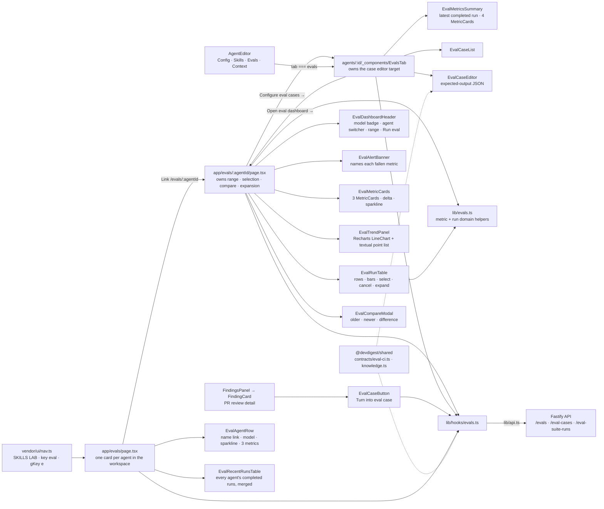

# Spec: Eval pipeline (client)

Source spec: `specs/2026-08-30-eval-pipeline.md` (SPEC-04). This document covers
only the client half — the `/evals` dashboard route, the per-agent dashboard at
`/evals/[agentId]`, the **Evals tab** of the agent editor that owns eval-case
CRUD, the components behind them, the `lib/hooks/evals.ts` data layer, the nav
entry, and the eval-case control added to the finding action row. The server half is
`server/specs/2026-08-30-eval-pipeline.md`; the operating model of the pipeline
itself is `server/docs/eval-pipeline.md`.

## Composition

The **dashboard** lists one `EvalAgentRow` per reviewer agent in the
workspace, whether or not that agent owns any eval cases, and below them one
`EvalRecentRunsTable` merging every agent's completed runs. The **per-agent
dashboard page** is the stateful half of the feature: it holds the date range,
the run selection, the compare-modal flag and the expanded-run id, and it owns
the start/cancel mutations (`app/evals/[agentId]/page.tsx`). The **Evals tab**
holds only the case-editor target and owns the case mutations. Every component
below either of them is presentational and takes callbacks — no component
fetches, and no component owns a mutation. **`lib/hooks/evals.ts`** is the single data
boundary; `EvalCaseButton` reaches it through `FindingsPanel`, not directly.
Deeper architecture lives in the module READMEs: [`client`](../README.md) ·
[`server`](../../server/README.md).

## The dashboard lists every agent as a row, and links from its name

`GET /evals` returns one `EvalDashboard` per reviewer agent in the workspace —
sourced from `AgentConfigSource.listAgents`, not from the agents that happen to
own eval cases (`server/src/modules/eval/service.ts` `listDashboards`). The page
renders whatever the server sends, one `EvalAgentRow` each (AC-38), under an
`AGENTS` section label, above a second section that merges every agent's run
history into one `RECENT EVAL RUNS · ALL AGENTS` table.

**Why every agent and not only the ones with cases.** The row is the only route
into an agent's eval surface from this screen, so listing only agents that
already own a case makes the first case uncreatable from the dashboard: the seed
plants its cases on `Security Reviewer` alone, and four of the five seeded agents
were invisible here. An agent with `cases_total === 0` renders
`dashboard.noRuns` and a `dashboard.configure` link to `/agents/<id>?tab=evals`,
and renders **no metric block, no sparkline and no `%` at all** (AC-69) — not a
row of dashes, and never a `0%`, for the reason the next section gives.

**Why the name is the link and the row is not.** The whole card this row replaced
used to be one `<Link>`, which makes its accessible name the concatenation of
everything inside it and forbids a second link within it. The create affordance
is a link, so the wrapper had to go: the agent name is the anchor, the row is a
plain `<li>`, and the link's accessible name is exactly the agent name. That is
asserted by `EvalAgentRow.test.tsx` along with the href and the fact that the
row holds **exactly one link**.

**Why the e2e flow clicks a `data-testid` and not the role.** `find role link
--name "Security Reviewer"` passes locally under every combination tried —
`next dev`, a production build, agent-browser 0.33.2 and 0.35.2 — and fails
deterministically on CI with `Element not found`, while the accessibility tree
captured **immediately before the click** contains
`link "Security Reviewer"` with that exact accessible name. Presence was
therefore never the problem and the guard steps the flow already carries
(`wait --load networkidle`, then `wait --text` on the target) cannot fix a
locator that does not match what the snapshot shows. The link carries
`data-testid` from `agentRowTestId(agentName)` — a pure, tested slug — and the
flow selects `find testid eval-agent-security-reviewer click`, which depends on
an attribute rather than on a computed accessible name. The role assertion
stays in the colocated test, so the accessible name is still pinned; only the
e2e locator changed.

**Why the design's row-wide chevron is decorative.** The mockup draws a `›`
affordance at the right of each row, implying the whole row navigates. Making it
a second link would either duplicate the agent name in the accessibility tree or
add a link whose name is meaningless; wrapping the row would resurrect exactly
the concatenated-name problem the card already suffered. The chevron is therefore
`aria-hidden`, and the name remains the single navigational target.

**Why the recent-runs table does not link its agent column.** The e2e selector is
a *substring* match, so a second link containing `Security Reviewer` anywhere on
this page makes `find role link --name "Security Reviewer"` ambiguous and the
flow's outcome dependent on DOM order. The table's agent cell is plain text and
its **version** cell carries the link (`v7` → `/evals/<agentId>`), which is
unambiguous by construction. `EvalRecentRunsTable.test.tsx` asserts the absence
of an agent-named link, not merely the presence of the version one.

**Where the cross-agent run list comes from.** No endpoint returns runs across
agents, and `EvalDashboard.trend` carries neither the agent version nor the
passed-of-total tally the table shows. `useEvalSuiteRunsForAgents` therefore
issues one `GET /agents/:id/eval-runs` per agent through TanStack's `useQueries`,
under the **same query key** `useEvalSuiteRuns` uses, so opening an agent's own
dashboard afterwards is a cache hit rather than a refetch. `recentRunsAcrossAgents`
merges, filters to `status === 'done'`, sorts newest-first and caps the list —
all in `app/evals/helpers.ts`, all unit-tested, none of it in the component.

**Why only completed runs appear in that table.** A `running` run has no metrics
yet and a `cancelled` one has them deliberately suppressed (`aggregateMetric`
returns `null` for it). A cross-agent table is a scanning surface, and a row of
dashes among real numbers reads as a regression rather than as an absence. The
per-agent page still shows every run in every state — that is where a specific
run is investigated.

## The per-agent surface is a page, and the tab keeps the cases and the latest run

`messages/en/agents.json` has declared `editor.tabs.evals` since before this
feature, `messages/en/eval.json` has carried an `evalsTab` block for just as
long, and `AgentEditor.tsx` said in a comment that the tab "arrives in later
lessons". This is that lesson: `Evals` is a real tab, sitting between `Skills`
and `Context` exactly where `agents.json` orders it, registered in
`AgentEditor/constants.ts` and admitted by the page's `VALID_TABS`.

The feature first shipped with **everything** in that tab and
`app/evals/[agentId]/page.tsx` reduced to a `redirect()` into it. That is no
longer true. The per-agent surface is now a real page at `/evals/[agentId]`,
carrying the trend and the run history. The tab owns eval-case CRUD **and a
read-only summary of the latest completed run**.

**Why the split, and why along this line.** Reading a regression *over time* —
a trend across runs, a table of runs to select and compare — is a monitoring
task, and its natural breadcrumb is `Skills Lab › Eval Dashboard › <Agent>`.
Authoring an eval case is an editing task on the agent itself, and its natural
breadcrumb is `Skills Lab › Agents › <Agent>`. Both halves sit where their
breadcrumb says they do, and each links to the other: the page carries a
`dashboard.configure` link into the tab, the tab a `dashboard.openDashboard`
link back.

**Why the tab kept the numbers after all.** An earlier revision of this document
moved *every* metric out of the tab, leaving it a bare case list. That went too
far: the question "is this agent's set passing right now" is asked while
*editing* the set, not while auditing its history, and answering it should not
cost a navigation. The line is therefore drawn at **time**, not at metrics —
the tab states the latest completed run (`EvalMetricsSummary`: recall,
precision, citation accuracy and a traces-passed tally), and the page owns
everything that compares runs to each other: the trend chart, the run table,
the selection and the compare modal. `EvalsTab.test.tsx` asserts both halves of
that line, positively and negatively.

**What the page adds that the tab could not.** A header carrying the agent's
model, an agent switcher that navigates between dashboards, and a date-range
filter (7 / 30 / 90 days / all time, default 30) that narrows the run list and
the trend together. The range is applied **client-side** in
`app/evals/[agentId]/helpers.ts` — `filterRunsByRange` on `started_at`,
`filterTrendByRange` on `ran_at` — because the server already caps the run list
at 50 and the trend at 30, so no endpoint had to change to support it. A run
whose timestamp will not parse is **kept**, not dropped: a filter that hides
rows must fail towards showing too much, never towards silently losing a run.

**Where the components live.** Presentation for the page sits under
`app/evals/[agentId]/_components/` — `EvalDashboardHeader`, `EvalAlertBanner`,
`EvalMetricCards`, `EvalTrendPanel`, `EvalRunTable`, and `EvalCompareModal`.
The tab holds `EvalCaseList`, `EvalCaseEditor` and `EvalMetricsSummary` under
`app/agents/[id]/_components/EvalsTab/_components/`.

`EvalMetricsSummary` is not a re-export of the page's `EvalMetricCards` and must
not become one: a `_components` folder is private to its route, so the two
surfaces share `lib/evals.ts` rather than a component. They also differ — the
tab draws a fourth `TRACES PASSED` card and no sparkline, the page draws a
sparkline and no tally — and each reads `MetricCard` from `@devdigest/ui`
directly.

**Why the shared helpers went to `lib/`.** Both surfaces needed the same metric
and run-state predicates, and a cross-route import from `app/evals/**` into
`app/agents/**/_components/**` is exactly the import direction the placement
rules exist to prevent — a `_components` folder is private to its route. The
metric formatters, the delta and `fallenMetrics` logic, the run-state
predicates and the selection helpers therefore live in **`src/lib/evals.ts`**,
a peer of `lib/cost.ts` and `lib/time.ts`, with `src/lib/evals.test.ts` holding
the acceptance assertions that used to sit in the deleted components' tests.
`absoluteTime` — the `YYYY-MM-DD HH:mm` the run table shows instead of the
`relativeTime` the old list used — went to `lib/time.ts` for the same reason.

**Why the delta wording lives in the catalogue and not in `lib/`.** An earlier
revision had `lib/evals.ts` return the rendered string `"+4 pts"`. `client/CLAUDE.md`
requires every user-facing string to go through next-intl, and a pure `lib/*.ts`
module cannot: it has no `t`. `deltaLabelDescriptor` therefore returns
`{ key, amount }` — the DATA the label needs — and the component interpolates
`eval.metricStrip.{deltaUp,deltaDown,deltaFlat}`. `lib/brief.ts`'s `costLine`
made and fixed the same mistake before this feature existed.

**Why `METRIC_COLORS` and `METRIC_LABEL_KEYS` sit in `lib/evals.ts`.** Five
components across two routes key presentation off `MetricField`, and every one of
them already imports `METRIC_FIELDS` from the domain module. Keeping private
copies meant recolouring recall on one surface silently left it a different
colour on the other.

**Why the recent-runs table renders no bar at all for a null metric.**
`ProgressBar` always paints its full-width track, so `value={percent ?? 0}` draws
a visible empty bar that reads as a real 0%. The bar is conditional and its
wrapper carries `data-metric-bar`, which is what the test asserts on — an
assertion on the absence of the string `0%` passes while the misleading track is
still on screen.

**Why the design system, and not more hand-rolled SVG.** The old
`EvalMetricStrip` and `EvalTrendChart` hand-built their tiles and polylines
while `@devdigest/ui` already exported `MetricCard` (big value, signed delta,
inline `Sparkline`) and a Recharts `LineChart` with the exact 0.6–1.0 axis this
data wants. The page uses those, plus `ProgressBar` for the table's metric bars
and `SectionLabel` for the section headings. Two vendored components were
widened rather than forked: `ChartSeries.data` now accepts `(number | null)[]`
with `connectNulls`, because the previous `?? 0` would have plotted a *false
0% dip* for a metric whose denominator was zero; `Checkbox` gained
`hideLabel`, which keeps the label as the control's `aria-label` while taking
it out of the layout, because the run table needs a bare checkbox and the
accessible name still has to say which run it selects; and `MetricCard` gained
`deltaLabel`, because its built-in `Math.abs(delta).toFixed(2)` renders a
four-point rise as `0.04`, while the design says `+4 pts`. Both metric surfaces
now pass `delta` as the **rounded points** value and `deltaLabel` as the text, so
the arrow, the colour and the wording all derive from one number — passing the
unrounded fraction as `delta` put a green up-arrow beside `±0 pts` on any
sub-half-point move. A caller that passes no `deltaLabel` is unaffected. All
three are widenings, so all three are non-breaking for the existing callers
(`StatsTab`, `Showcase`, `EvalMetricCards`).

**What survived the rewrite.** Every acceptance behaviour the old components
carried is asserted against the new ones: the three-state metric rendering, the
"no previous run" statement, the named-and-quantified regression banner, the
trend's server ordering and its textual point list, the checkbox only on `done`
runs, cancel only while running, the cancelled run's suppressed aggregates with
readable per-case rows, and compare enabled at exactly two selections. The
trend's textual list is now visually hidden rather than printed below the
chart — Recharts renders nothing in jsdom, so that list is also the only thing
the trend panel's tests can assert against.

## The message catalogue is the design, and the code follows it

`messages/en/*.json` was written before this feature. Where a key already
existed for a label, the components use it and no second key was invented:

| Rendered | Key |
|---|---|
| Metric strip tile labels | `eval.dashboard.metrics.{recall,precision,citationAccuracy}` |
| Metric names inside the regression banner, and the trend legend and point list | `eval.dashboard.legend.{recall,precision,citation}` |
| Trend chart heading | `eval.dashboard.metricTrend` |
| Run list heading | `eval.dashboard.recentRuns` |
| Run list column headers | `eval.dashboard.table.*` |
| Case list | `eval.evalsTab.*` |
| Compare modal metric rows | `eval.dashboard.metrics.*`, `eval.dashboard.table.cost` |

Only the surfaces the original catalogue never described keep their own keys:
`eval.metricStrip` (deltas, the no-previous-run statement and the regression
banner — AC-40, AC-42), the cancel/cancelled strings and the per-case expansion
in `eval.runList` (AC-58, AC-62), and the whole `eval.compareModal` block
(AC-45–AC-48). `eval.dashboard.configure` is the zero-case card's create
affordance and `eval.dashboard.noRuns` its state line (AC-69) — both were in the
catalogue before the feature and neither needed a sibling invented for it.
`eval.dashboard.loading` remains declared and unused; nothing in this feature
has a place for it yet, and inventing one would be the same mistake in the other
direction.

## Every metric renders three ways, and one of them is not `0%`

The contract narrowing that made every metric field nullable exists for this
component tree. A metric has three renderable states and the components branch
on all three:

| State | Shape | Rendered as |
|---|---|---|
| computed | `0.83` | `83%` |
| **not computed** | `null` | `—` on a card, row or trend point; the `notComputed` string on a metric card |
| **no run at all** | no run record | the `neverRun` string, with no metric row drawn |

`formatMetricPercent` and `metricPercentValue` return `null` for a null input
and the caller supplies the dash (`lib/evals.ts`, `EvalAgentRow.tsx`,
`EvalRecentRunsTable.tsx`). Neither component re-implements the formatter; both
call `formatMetricPercent`.

**Why a dash and not `0%`, and why the tests assert the absence of `%` rather
than the presence of a dash.** `0%` recall is a real, terrible result. "We could
not compute recall" is not a result at all, and the two are one keystroke apart
for anyone writing `?? 0`. The component tests therefore assert on the *absence*
of a percentage-formatted value in the never-run and empty states
(`EvalAgentRow.test.tsx`, `EvalRecentRunsTable.test.tsx`,
`EvalMetricsSummary.test.tsx`, `EvalMetricCards.test.tsx`),
because that assertion still fails if someone reintroduces the coercion, where
an assertion on the dash would not.

The same rule reaches the delta: `metricDeltaPoints` and `metricDeltaFraction`
return `null` when either side is missing, `deltaLabelDescriptor` returns `null`
for a null delta, and `EvalMetricCards` passes `undefined` to `MetricCard.delta`
rather than a zero, so no delta element is drawn at all. `±0 pts` is reserved
for a delta that genuinely computed to zero, which is a different statement.

## The regression banner names the metric in text, not in colour

When any of the three metrics fell against the previous completed run,
`EvalAlertBanner` renders a `role="status"` banner listing every fallen metric
with the magnitude of its fall in points. It also surfaces
`EvalDashboard.alert` when the server supplies one, and renders nothing at all
when neither applies.

**Why a banner and not a red delta.** `MetricCard` already colours a negative
delta red, and colour alone is not an accessible signal — nor a scannable one,
on a screen with three deltas. The banner states the metric name and the number
in words, so the regression survives a screenshot, a colour-blind reader and a
text-only screen reader pass.

`fallenMetrics` lives in `lib/evals.ts` as a pure function with its own test,
and it excludes a metric where either side is not computed. **A metric that went from "not computed"
to a number has not fallen** — that transition means the case set changed shape,
not that the agent got worse.

## The page derives its deltas from the run list, not from `EvalDashboard.delta`

The server computes and returns `EvalDashboard.delta` for each agent
(`server/src/modules/eval/service.ts:312-319`). **The client never reads it.**
`currentAndPreviousSnapshots` filters the run list to `status === 'done'`, sorts
newest-first and takes the first two (`lib/evals.ts`); the metric cards compute
their own differences from that pair. It runs over the **range-filtered** list,
so narrowing the range narrows what "previous run" means, and the cards keep
agreeing with the table underneath them.

**Why the run list and not the dashboard field.** The metric cards sit directly
above the run table, and the two must agree: a user who reads "recall fell 12
points" and then looks at the two most recent rows has to see the same two runs.
The dashboard's `delta` is computed from a separate query at a separate moment,
so under polling the two could legitimately disagree for one refresh cycle and
the screen would contradict itself. One source, one truth on the page.

The dashboard query is still used on the page — for the trend series, the
`cases_total` count in the header and the `alert` string, because the trend is
the one thing the server caps and orders and the client must not re-derive.

> `EvalDashboard.delta` therefore has no client consumer today. It is not dead
> contract surface — the `/evals` agent rows are the natural reader, and the
> design draws no delta on them — but nothing reads it, and a future change to
> its computation will not surface in the UI.

## The trend is drawn twice: as a chart and as a list

`EvalTrendPanel` renders the vendored Recharts `LineChart` and, visually hidden
beside it, a textual summary plus a `<ul>` of every point with its date and its
three values.

**Why both, and why the list is hidden rather than the chart labelled.** Three
series distinguished by colour cannot be made meaningfully accessible through
`aria-label` on a path — the label would have to restate the data, at which
point the data itself is the better element. Listing the points makes the series
readable without relying on colour, which is what the criterion asks for, and
hiding that list keeps the panel looking like the chart it is.

There is a second, unglamorous reason the list has to stay: Recharts'
`ResponsiveContainer` measures zero in jsdom and renders nothing, so the hidden
list is the **only** thing `EvalTrendPanel.test.tsx` can assert against.

The component **does not re-sort and does not re-cap**. The server orders the
series oldest→newest and caps it at 30 completed runs, and the test asserts the
rendered point count equals the series length and that the first rendered point
is the oldest. Two sort orders for one series is how a chart and a table start
disagreeing.

## Selection, compare and the modal that only one control opens

`EvalRunTable` renders a selection checkbox **only** for a run in the `done`
state, so a `running`, `failed` or `cancelled` run
cannot be selected for comparison at all. That is the client half of the
server's `status = 'done'` query filter, and it is enforced by not rendering the
control rather than by disabling it.

The compare control is enabled at exactly two selected runs and disabled at
zero, one or three (`isCompareReady` in `lib/evals.ts`). It calls `onCompare`,
and `onCompare` is the **only** thing that sets `compareOpen`
(`app/evals/[agentId]/page.tsx`). Changing the selection closes the modal, and
dismissing it clears the selection. The control shows the short `Compare` label
the design asks for but keeps `runList.compare` — "Compare selected runs" — as
its `aria-label`, which is the name the e2e flow selects on.

**Why selection does not open the modal by itself.** Two runs can be selected
transiently on the way to selecting a third, and a modal that appears on the
second click and disappears on the third is a modal that fights the user. The
explicit control also gives the deterministic e2e flow something stable to
click; `e2e/specs/11-evals.flow.json` depends on exactly this sequence.

`EvalCompareModal` puts the older run on the left irrespective of the order the
two were selected in — `orderRunsByAge` is a pure function in `helpers.ts` whose
test asserts identical output for a pair passed in either order
(`EvalCompareModal/helpers.ts:18-25`).

**Why `promptDiffState` is a four-way discriminant and not a boolean.** The
prompt section has to distinguish four situations that a `promptDiff: string |
null` cannot: the server could not read both version snapshots
(*unavailable*), the two runs share an agent version so nothing changed by
construction (*same version*), the versions differ but the prompts are
byte-identical (*unchanged*), and there is a patch to show (*patch*)
(`EvalCompareModal/helpers.ts:39-46`). Collapsing the first two would tell a
user "the prompt diff is unavailable" when the honest answer is "the
configuration did not change" — a much better answer that requires no
investigation.

The system prompt reaches the DOM as the text child of a `<pre>`
(`EvalCompareModal.tsx:178`), never as markup. It is workspace-authored, but so
is every other string here, and workspace-authored is not the same as trusted.

## The case editor validates against the same schema the server enforces

The expected-output field is free text. `validateExpectedOutputText` parses it as
JSON and then `safeParse`s the result against `z.array(EvalExpectation)` — the
mirrored contract, not a hand-written shape (`EvalCaseEditor/helpers.ts:9-21`).
Save is `disabled` while either step fails.

**Why validate on the client when the server is the authority.** The server
still refuses an invalid payload with a 400 naming the failing index and field,
and it remains the only authority. Client validation exists so a malformed
expectation is caught while the user is still looking at the field that caused
it, without a round trip. The two agree *because they are the same schema
object*, which is the whole point of the vendored mirror — a second,
hand-written client shape would drift on the first contract edit.

The skeleton insertion requires a kind choice and inserts a skeleton valid for
that kind, with both skeletons in `constants.ts` and the insertion in
`helpers.ts` (`EvalCaseEditor/constants.ts:3-22`). `insertFindingSkeleton`
starts from an empty list when the current text is not valid JSON rather than
throwing, so the button is never a dead end.

An empty expectation list saves without error. That is not a permissive
fallback: an empty list is the assertion that the agent should say nothing about
this diff, and the pipeline scores it as such.

## `EvalCaseButton` is presentational; `FindingsPanel` owns the mutation

The control takes `acceptedAt` / `dismissedAt` and an `onCreate` callback, and
derives its own `disabled` state from the same two timestamps `FindingCard`
already reads (`EvalCaseButton.tsx:29,62`). When the finding is undecided it
renders disabled *and* a hint naming what has to happen first — a disabled
control with no explanation is a bug report waiting to be filed.

`FindingsPanel` owns `useCreateEvalCaseFromFinding` and passes `onCreate` down
(`FindingsPanel.tsx:40,125-130`). After the mutation resolves, the button
replaces itself with a confirmation naming the created case and an "open it"
control.

**Why `FindingsPanel` holds a `useRef` map from case id to owner id.** The
"open it" control has to navigate to `/agents/<agentId>?tab=evals`, and the
button only
knows the case. Rather than widen `EvalCaseButtonCreated` to carry an owner id
the button never renders, the panel records `case.id → case.owner_id` from the
mutation result and resolves it on navigation (`FindingsPanel.tsx:41,127,131-134`).
The button stays presentational and stays testable without a router.

**Why the disabled state is derived on the client at all, given the server
answers 400.** The client refusal and the server's refusal must agree, and they
do because both read the same two timestamps. The client one exists so the user
never sends a request that was always going to fail.

## Polling stops the moment nothing is running

`useEvalSuiteRuns` and `useEvalSuiteRun` set `refetchInterval` from the data
itself: four seconds while any run is `running`, and `false` otherwise
(`lib/hooks/evals.ts:202-206,217-218`).

This is why the server's stale-suite-run reaper matters to the client and not
only to the server: a `running` row that nothing will ever finish makes this
page poll every four seconds for as long as the tab is open. The reaper is what
turns that into a terminal state on the next API boot.

Failure handling branches on `err.code`, never on `err.status` — `evalErrorText`
maps `not_found`, `validation_error`, `conflict`, `internal_error` and
`network_error` to their own labels and falls back to `err.message` for anything
unrecognised (`lib/hooks/evals.ts:70-89`). `client/INSIGHTS.md` records three
distinct server errors that all answer 404, which is why the status code is not
a usable discriminant.

## The dashboard card reads the suite metrics but the *case* rows for its meta

`latestRunFromDashboard` takes recall, precision, citation accuracy and
passed-of-total from `dashboard.current`, and the agent version and timestamp
from `dashboard.recent_runs[0]` — a per-**case** `eval_runs` row, not the suite
run (`app/evals/helpers.ts`, with `app/evals/helpers.test.ts` pinning both
branches).

Two consequences, both current behaviour rather than intent:

- The version and time shown are the first per-case row's, which carries the
  suite's agent version, so the value is right. The `RECENT EVAL RUNS` table
  below reads `EvalSuiteRunRecord.agent_version` directly instead, so the two
  agree by coincidence of correctness rather than by construction.
- A completed suite run that wrote **no** per-case rows leaves `recent_runs`
  empty, and the card renders `neverRun` even though a completed run exists. The
  only way to reach that is a completed suite over zero cases; the row reads
  `cases_total` first, so an agent with no cases renders the zero-case branch
  and never that one.

Neither the Evals tab nor the cross-agent run table shares this dependency:
both derive everything from the suite-run list.

## Navigation

One entry in the `SKILLS LAB` group of `src/vendor/ui/nav.ts`, with
`key: "eval"`, `gKey: "e"` and a matching `g e` shortcut row. That file —
vendored, but this app's own nav registry — is what makes a route reachable
from the sidebar; the App Router is not.

**The key is `eval`, singular, and that is not cosmetic.** `messages/en/shell.json`
declares `nav.eval` and nothing else, `activeKeyFor` in
`components/app-shell/helpers.ts` already returned `"eval"` for any path
starting `/eval`, and `useShellCommands` calls `t(\`nav.${it.key}\`)` for every
NAV item on **every** shell mount. A key of `evals` therefore threw
`MISSING_MESSAGE: Could not resolve 'shell.nav.evals'` on every page in the app
and left the sidebar entry unhighlighted on `/evals` — a defect no typecheck,
test or build could see, because the key is a string on one side and a JSON
path on the other. The label is `shell.json`'s own wording, `Eval Dashboard`,
matching how every other NAV item's hardcoded label matches its `nav.*` value.

The per-agent dashboard at `/evals/[agentId]` is deliberately **not** a nav
entry: it is reached from a dashboard card, from the agent switcher in its own
header, from the agent editor's Evals tab, or from the "open it" control on a
created case. `activeKeyFor` already highlights the sidebar's `eval` entry for
any path starting `/eval`, so the deeper route keeps the group highlighted with
no extra registration.

## Client tests

- `client/src/app/evals/_components/EvalAgentRow/EvalAgentRow.test.tsx` —
  renders the latest run's three metrics, model badge, version, time and
  passed-of-total, **and the three metric labels themselves**; the agent name as
  the row's only link, with its href; a not-computed metric as a dash on a run
  that computed the others; never-run for an agent that owns cases but has no
  completed run, asserting no percentage anywhere; the zero-case row with the
  create affordance and no percentage at all. The two never-run cases are the
  positive counterpart that keeps the "no `%`" assertions from passing vacuously,
  and asserting the *rendered label text* is what catches a metric label pointed
  at the wrong message namespace — a defect that renders the key itself and
  passes every assertion phrased as an absence.
- `.../EvalRecentRunsTable/EvalRecentRunsTable.test.tsx` — a row per run with its
  agent, version link, three metrics and pass tally; every column named; **no
  agent-named link anywhere**, which is the assertion that protects the e2e
  substring selector; a dash and never a `0%` for an uncomputed metric; the
  no-runs statement rendered instead of an empty table.
- `client/src/app/evals/helpers.test.ts` — `latestRunFromDashboard` on a
  dashboard with and without case rows; `recentRunsAcrossAgents` interleaving
  several agents newest-first and tagging each run with its agent, dropping every
  non-`done` run, honouring the cap, and returning nothing when no agent has
  run.
The dashboard page's test files sit under
`client/src/app/evals/[agentId]/`; the case-editing ones stayed under
`client/src/app/agents/[id]/_components/EvalsTab/_components/`.

- `client/src/lib/evals.test.ts` — `formatMetricPercent` and
  `metricPercentValue` return null for a not-computed metric;
  `metricDeltaPoints` and `metricDeltaFraction` return null when either side is
  missing; `deltaLabelDescriptor` names the message key for a rise, a fall and an
  explicit zero and returns null for a null delta; `gotFindingCount` counts a
  review's findings and returns **null, never zero**, for the runner's error
  shape; `fallenMetrics` returns nothing with no previous run, names every
  fallen metric with its magnitude and ignores unchanged and risen ones;
  `currentAndPreviousSnapshots` takes the two newest completed runs past a
  running and a cancelled one; the run-state predicates and the selection
  helpers.
- `client/src/app/evals/[agentId]/helpers.test.ts` — the default range is 30
  days and every option maps to its own message key; the run and trend filters
  drop what falls outside the window, keep everything on all-time, and **keep**
  a row whose timestamp will not parse; `toCompareRunInput` maps a suite run
  onto the modal's input shape.
- `.../EvalDashboardHeader/EvalDashboardHeader.test.tsx` — the agent name, its
  model badge and the pluralised harness subtitle; the link to the tab that owns
  the cases; the switcher reporting another agent's id; the range picker
  reporting all-time; Run eval firing, and disabled with a "Running…" label
  while a run is already in flight.
- `.../EvalAlertBanner/EvalAlertBanner.test.tsx` — the fallen metric named with
  its magnitude in a `role="status"` banner; nothing said about metrics that
  improved; nothing rendered at all when no metric fell, or when there is no
  previous run; a server-supplied alert surfaced even when no metric fell.
- `.../EvalMetricCards/EvalMetricCards.test.tsx` — a card per metric with its
  rounded percentage; the explicit no-previous-run statement and no delta with
  one completed run; deltas against the previous run once there is one; not
  computed with **no `%` anywhere** for a null metric; and no metric row at all
  for an agent that has never run.
- `.../EvalTrendPanel/EvalTrendPanel.test.tsx` — the empty statement with no
  list items; a textual reading of every plotted point; the server's order
  preserved without re-sorting; a dash and never a `0%` for a point with no
  denominator; the panel and its three series labelled.
- `.../EvalRunTable/EvalRunTable.test.tsx` — one row per run with version, the
  three metrics, the pass tally and cost; the no-runs statement and the caller's
  range-specific replacement for it; Compare walked through zero, one and two
  selections and fired at two; a selection checkbox only for a completed run;
  cancel only while a run is in flight; a cancelled run labelled with no
  aggregate percentage or cost but readable per-case rows; the timestamp cell
  reporting the expansion.
- `.../EvalCompareModal/EvalCompareModal.test.tsx` — the older run on the left
  regardless of selection order, and Escape closing the modal; the
  prompt-difference-unavailable statement alongside still-rendered metric
  differences; the configuration-did-not-change statement for two runs at one
  agent version; the server-computed prompt patch rendered once when the
  versions differ.
- `.../EvalCompareModal/helpers.test.ts` — `orderRunsByAge` puts the earlier
  `ranAt` on the left either way round; `diffMetric` computes older, newer and
  their difference and reports none when either side is missing;
  `isSameAgentVersion`; `promptDiffState` distinguishes unavailable, same
  version, an empty patch and a patch with content.
- `.../EvalCaseList/EvalCaseList.test.tsx` — a status icon per case whose
  **accessible name** states passed, failed or never run; the passing tally in
  the header badge; `expected N findings, got M`, and the `got` clause **absent
  entirely** for a case the latest suite run did not cover; the severity·category
  chip and the `empty []` marker for a case that expects nothing; a
  create-offering empty state carrying no percentage value; run, edit and delete
  wired per case with Run disabled while it is in flight.

The action controls became icon buttons to match the design, and each keeps the
label it used to render as its `aria-label` — `Run`, `Edit`, `Delete`, and
`Running…` while a case is in flight. An icon button whose accessible name
disappears is how a redesign silently breaks a selector nobody re-reads.
- `.../EvalCaseEditor/EvalCaseEditor.test.tsx` and `helpers.test.ts` — an empty
  expectation list saves, and Save is disabled while the field holds invalid
  JSON; inserting a skeleton requires a kind choice and each choice inserts a
  skeleton of that kind; `validateExpectedOutputText` accepts an empty and a
  conforming list and rejects malformed JSON and a shape the server would
  reject; `insertFindingSkeleton` appends onto an existing list and starts from
  an empty one when the current text is unparseable.
- `.../EvalCaseButton/EvalCaseButton.test.tsx` — disabled for an undecided
  finding and enabled once accepted or dismissed; a confirmation naming the
  created case and offering a way to open it after `onCreate` resolves.
- `client/src/app/agents/[id]/_components/EvalsTab/EvalsTab.test.tsx` — case
  creation offered for an agent owning zero cases; the case list and the link
  out to the dashboard once it owns one; the latest completed run summarised as
  four metric cards; the got-finding counts read from the latest completed
  suite run; and, guarding the split from the other side, **no trend and no run
  list of its own** even when a completed run exists. It renders the tab with an
  `agentId` prop, so it needs neither a `next/navigation` mock nor an
  `@/components/app-shell` mock — the shell belongs to the page above it.
- `.../EvalsTab/_components/EvalMetricsSummary/EvalMetricsSummary.test.tsx` —
  the three metrics plus the traces tally and the link to the full dashboard;
  the explicit no-previous-run statement with **no `pts` anywhere**; each delta
  reported in points once a previous run exists; not computed with **no `%`
  anywhere**; and no metric row at all before the first completed run.
- `.../EvalsTab/_components/EvalCaseList/helpers.test.ts` — `caseStatus` across
  its three states; `gotFindingCount` counting a review's findings and returning
  **null, never zero**, for the runner's error shape and for anything that is not
  a review; `gotFindingCountByCase` leaving an uncountable run out of the map
  entirely; `expectationChip` joining severity and category, falling back to the
  category alone and returning null for an empty list; `passingTally`.
- `.../FindingsPanel/FindingsPanel.test.tsx` and
  `.../ReviewRunAccordion/ReviewRunAccordion.test.tsx` were amended rather than
  added: `FindingsPanel` now calls `useCreateEvalCaseFromFinding()`, whose
  `useQueryClient()` throws on mount without a `QueryClient`, and
  `ReviewRunAccordion` renders `FindingsPanel` internally.

## Out of scope

Taken from SPEC-04's `## Non-goals`, unchanged on the client side:

- `Learn` and `Reply to author` on the finding action row, and the `Stats` and
  `CI` tabs in the agent editor. All L07.
- A third route for the case editor — it is a modal inside the Evals tab.
- Server-side filtering for the dashboard's date range. The server already caps
  the run list at 50 and the trend at 30, so the range narrows what is already
  in hand; a range wider than those caps shows the caps, not more rows.
- The `Promote v7` control and a cross-agent `Run all agents` control. The
  supplied design draws `Run all agents` in the dashboard header and `Run all
  evals` in the Evals tab; both were deliberately left out on the user's
  instruction, so the header carries a title and a subtitle and nothing else.
  The per-case run control in the Evals tab is not one of these — it is the
  existing `useRunEvalCase` behaviour, restyled as an icon button.
- Any locale other than `en`. Every string goes through next-intl, and `en` is
  the only catalogue present.
- Any client-side re-sorting, re-capping or recomputation of a series the server
  already ordered.
