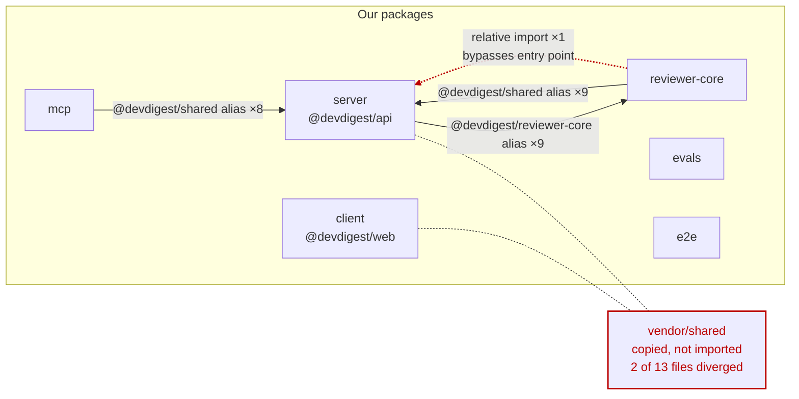

# Dependency report — 2026-08-28

Generated by the `dependency-checker` skill. Every number below came from
`assets/collect-deps.mjs`; nothing is estimated.

## Scope

**Six** packages, not the four `CLAUDE.md` documents — `evals/` and `mcp/` are not
listed anywhere. Two package managers, no workspace: each package carries its own
lockfile.

| Package | Dir | Manager | Source files | node_modules | Runtime / dev deps |
|---|---|---|---|---|---|
| `@devdigest/web` | `client/` | pnpm | 524 | 620.2 MB | 12 / 12 |
| `@devdigest/api` | `server/` | pnpm | 253 | 250.1 MB | 24 / 8 |
| `@devdigest/evals` | `evals/` | pnpm | 37 | 332.1 MB | 2 / 5 |
| `@devdigest/mcp` | `mcp/` | npm | 32 | 82.6 MB | 2 / 4 |
| `@devdigest/reviewer-core` | `reviewer-core/` | npm | 14 | 77.9 MB | 2 / 4 |
| `@devdigest/e2e` | `e2e/` | npm | 2 | 36.5 MB | 0 / 3 |

**Measured:** declared manifests, installed versions, on-disk size per declared package,
cross-package imports, vendored-contract copies, browser reachability for `client/`.

**Not measured:**

- Outdated versions and advisories — the collector ran without `--health`. `not
  established`; re-run with `--health` when the question is upgrades or CVEs.
- Per-package bundle bytes — needs a bundle analyser. `not established`.
- Licences, peer/optional dependency resolution, dynamic `import(variable)`.
- `server/clones/` — cloned third-party repositories, git-ignored, not our dependencies.

## Dependency graph



`client/` has **no import edge to `server/` at all**. It carries its own physical copy of
`vendor/shared`. `evals/` and `e2e/` have no internal edges in either direction — they
are fully standalone.

## Size breakdown

Repo total on disk: **1.37 GB** across six `node_modules` (transitive dependencies
included). Declared packages only: **424.8 MB** unique by `name@version`, **582.9 MB**
summed per declaring module — a **158.1 MB duplication overhead** from six separate
installs.

| Package | Module | Declared | Installed | On disk | Ships to browser | Kind |
|---|---|---|---|---|---|---|
| `next` | client | `^15.1.3` | 15.5.19 | 152.6 MB | yes | runtime |
| `mermaid` | client | `^11.15.0` | 11.15.0 | 75.3 MB | yes | runtime |
| `lucide-react` | client | `^0.469.0` | 0.469.0 | 36.2 MB | yes | runtime |
| `typescript` | ×6 modules | `^5.7.2` / `^5.6.0` | 5.9.3 | 22.8 MB ×6 | no | dev |
| `js-tiktoken` | server | `^1.0.21` | 1.0.21 | 21.5 MB | n/a | runtime |
| `drizzle-orm` | server | `^0.38.3` | 0.38.4 | 13.2 MB | n/a | runtime |
| `tsx` | ×5 modules | `^4.19.2` / `^4.19.0` | 4.22.4, 4.23.12 | 10.9 MB (server) | no | dev |
| `openai` | ×3 modules | `^4.77.0` | 4.104.0 | 9.6 MB ×3 | n/a | runtime |
| `react-dom` | client | `^19.0.0` | 19.2.7 | 7.1 MB | yes | runtime |
| `drizzle-kit` | server | `^0.30.1` | 0.30.6 | 7.4 MB | n/a | dev |
| `@modelcontextprotocol/sdk` | mcp | `^1.30.0` | 1.30.0 | 5.9 MB | n/a | runtime |
| `recharts` | client | `^2.15.0` | 2.15.4 | 5.2 MB | yes | runtime |
| `zod` | ×4 modules | `^3.24.1` | 3.25.76 | 5.0 MB ×4 | yes (client) | runtime |
| `@anthropic-ai/sdk` | server | `^0.33.1` | 0.33.1 | 4.1 MB | n/a | runtime |
| `fastify` | server | `^5.2.0` | 5.8.5 | 3.5 MB | n/a | runtime |

"On disk" is the package's own directory, excluding its transitive dependencies.

**Installed more than once**, by combined size: `typescript` ×6 = 137.0 MB ·
`openai` ×3 = 26.6 MB · `zod` ×4 = 20.1 MB · `@types/node` ×6 = 15.1 MB ·
`tsx` ×5 = 13.5 MB · `vitest` ×5 = 9.3 MB.

**Browser reachability (client/):** 124 `'use client'` roots reach 432 files, and **all
12** of `client/`'s runtime dependencies are reachable from them. This is reachability,
not bytes — the one real build figure is `.next/static` at **40.1 MB**.

## Findings & Priorities

### P0 — a boundary is already broken

**1. The two `vendor/shared` copies of `productionize.ts` disagree on a validation enum.**

`client/src/vendor/shared/contracts/productionize.ts:36` declares
`provider: z.enum(['openai', 'anthropic'])`. `server/src/vendor/shared/contracts/productionize.ts:36`
declares `z.enum(['openai', 'anthropic', 'openrouter'])`.

The server accepts `openrouter` and the client rejects it. Any payload carrying that
provider validates on one side and throws on the other — and `openrouter` is a provider
this repo actively uses (`reviewer-core/src/llm/openrouter.ts`, `EVAL_BACKEND=openrouter`).
This is the one finding here that can produce a user-visible failure today.

→ Decide which enum is correct, copy that file across, and diff the two directories
before the next release.

**2. `eval-ci.ts` has drifted the same way, asymmetrically.**

`server/src/vendor/shared/contracts/eval-ci.ts` (278 lines) exports `AgentManifest`,
`AgentManifest` (type) and `AgentManifestInput`; the client copy (247 lines) has none of
them. Additive rather than contradictory, so nothing breaks until the client needs that
schema — but it is the same missing sync that produced finding 1.

11 of the 13 mirrored files are still byte-identical.

**3. `reviewer-core` reaches into `server`'s internals by relative path.**

`reviewer-core/test/run.test.ts:3` imports `../../server/src/adapters/mocks.js`,
landing inside `server/src/adapters/` rather than on any entry point. Every other edge
between these packages goes through a declared tsconfig alias. `reviewer-core` is
documented as the pure engine that `server` consumes; this one edge runs backwards and
makes the two packages un-splittable.

→ Export the mocks from a shared test-support entry point, or duplicate the two mock
classes into `reviewer-core/test/`. Direction verdict belongs to `onion-architecture`.

### P1 — costs something now

**4. `mcp`'s shipped executable requires a `devDependency` at runtime.**

`mcp/bin/devdigest-mcp.mjs:4` imports `tsx`, which `mcp/package.json` declares under
`devDependencies`. Anyone installing that package without dev dependencies gets a binary
that cannot start.

→ Move `tsx` to `dependencies` in `mcp/package.json`, or precompile the bin.

**5. Two large libraries reach the browser through a single import site each.**

`mermaid` (75.3 MB on disk) is reached only from
`client/src/components/mermaid-diagram/MermaidDiagram.tsx:75`, and `lucide-react`
(36.2 MB) only from `client/src/vendor/ui/icons.tsx:83`. Both are tree-shakeable and
disk size is not bundle weight — but both are also single-site imports, which is the
cheapest possible place to apply a dynamic import or a per-icon import.

→ Not actionable on this data alone. Run a bundle analyser once; per-package bytes are
`not established` until then.

**6. `evals/src/skill-quality.ts:11` imports `gray-matter`, a `devDependency`.**

`evals/` ships its `src/` as a library that other eval files import, so its production
source depends on a dev-only package.

→ Move `gray-matter` to `dependencies` in `evals/package.json`.

### P2 — cleanup

**7. `@fastify/autoload` is declared and deliberately unused.**

`server/package.json` lists it as a runtime dependency (1.2 MB). The only occurrence of
the word in the source is `server/src/modules/index.ts:26`, a comment explaining that
modules are registered explicitly *instead of* filesystem autoload.

→ `pnpm remove @fastify/autoload` in `server/`. Confirm no plugin loader resolves it by
name first.

**8. `testcontainers` in `server` devDependencies is redundant.**

Only `@testcontainers/postgresql` is imported (`server/test/helpers/pg.ts:1`), and that
package already depends on `testcontainers@^10.28.0`. The explicit declaration is
`^10.16.0` — looser than what its own consumer requires.

→ `pnpm remove testcontainers` in `server/`, or tighten the range to match.

**9. `tsx` is declared in `reviewer-core` and used by nothing.**

No import, and none of its three scripts (`typecheck`, `build`, `test`) invoke it.

→ `npm remove tsx` in `reviewer-core/`.

**10. `@types/node` is installed at five different versions across six modules.**

`22.19.19` (client, server), `22.19.20` (reviewer-core), `22.19.21` (e2e), `22.20.0`
(evals), `22.20.1` (mcp) — from two declared ranges, `^22.10.0` and `^22.0.0` (evals).
`reviewer-core` and `server` type-check the same `vendor/shared` files under different
Node typings.

→ Align every module on one range. Same for `tsx` (`4.22.4` vs `4.23.12`) and the
`^5.6.0` / `^5.7.2` split on `typescript`, both of which currently resolve compatibly.

**11. 158.1 MB of the 1.37 GB on disk is duplication** across the six separate installs
— `typescript` alone is 137 MB of it. This is the standing cost of not being a
workspace. Noted, not recommended against: the split is a deliberate course-repo choice.

### Info

- **Intended internal edges, all through declared aliases:** `mcp → server` ×8,
  `reviewer-core → server` ×9 (both `@devdigest/shared`), `server → reviewer-core` ×9
  (`@devdigest/reviewer-core`). No action.
- **`pino-pretty` is *not* unused** — the collector flagged it, and it is loaded by
  string name at `server/src/app.ts:57` (`{ target: 'pino-pretty' }`). Confirmed false
  positive; do not remove.
- **`vitest` imported from `evals/src/dsl/case.ts`** is by design — that package wraps
  vitest as its public surface. Confirmed false positive.
- **`server` runtime dependency count is 24**, the largest of any module, and 21 of the
  24 are imported from at least one source file.

## Summary

1. **Reconcile the two diverged `vendor/shared` contracts.** `productionize.ts` is the
   urgent one: client and server disagree on whether `openrouter` is a valid provider.
2. **Move `tsx` to `dependencies` in `mcp/package.json`** — the shipped bin cannot start
   without it, and it is currently dev-only. Same class of fix for `gray-matter` in
   `evals/`.
3. **Fix the `reviewer-core → server` relative import** at
   `reviewer-core/test/run.test.ts:3` — one line, and it is the only edge between these
   packages that bypasses a public entry point.
4. **Drop three redundant declarations** — `@fastify/autoload` and `testcontainers` in
   `server/`, `tsx` in `reviewer-core/` — after confirming no config loads them by name.
5. **Align `@types/node` on one range**; five versions are installed across six modules
   that type-check overlapping files.

## Re-running

```bash
node .claude/skills/dependency-checker/assets/collect-deps.mjs --root . > /tmp/deps.json
node .claude/skills/dependency-checker/assets/collect-deps.mjs --root . --health   # + outdated/audit
```
