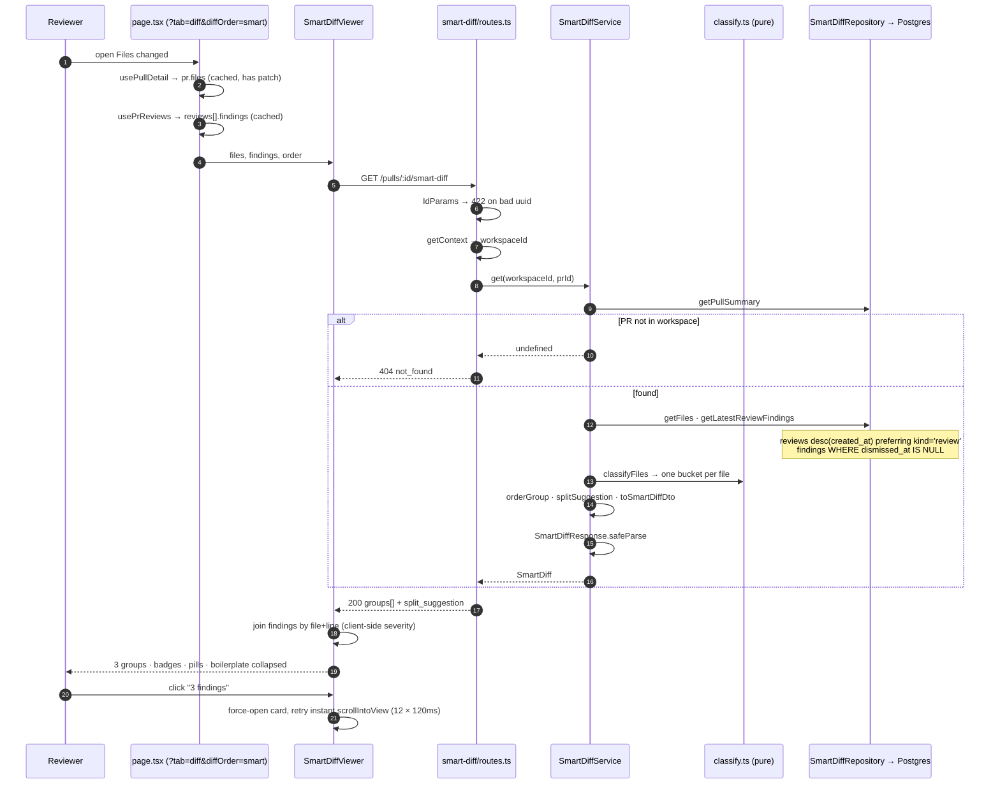

# Plan: Smart Diff (L03) — 2026-08-10

## Context

A reviewer opening the **Files changed** tab today gets `pr.files` in GitHub's
arbitrary order: `package-lock.json` (+92 −24) can sit above the one middleware
file that actually changed behaviour. The substance of the change competes for
attention with generated noise, and after a Run Review the findings live in a
*different tab* from the lines they describe.

Smart Diff fixes the ordering deterministically. It classifies every changed
file as `core` / `wiring` / `boilerplate` from its path alone, orders
findings-bearing files first, keeps boilerplate collapsed, and overlays the
latest review's findings onto the diff lines they point at. **No LLM call, no
new cost, no model latency** — it is a pure read-model over data the import and
review paths already wrote.

### The starter already shipped half of this, unwired

- `SmartDiffRole` / `SmartDiffFile` / `SmartDiffGroup` / `ProposedSplit` /
  `SmartDiff` — `server/src/vendor/shared/contracts/brief.ts:111-144`,
  byte-identical mirror at `client/src/vendor/shared/contracts/brief.ts`.
- `SmartDiffResponse = SmartDiff` —
  `server/src/vendor/shared/contracts/review-api.ts:72-74`.
- A passing contract test — `server/test/contracts.test.ts:108-120`.
- `client/messages/en/prReview.json:64-73` — a `smartDiff.*` namespace
  (`coreLabel`, `wiringLabel`, `boilerplateLabel`, `largeTitle`, `largeBody`,
  `filesCount`, `findingLines`, `groupedByRole`) that **nothing consumes**.
- `client/src/lib/types.ts:35` already re-exports the `SmartDiff` type.
- Roadmap slot `README.md:84` (L03); declared out of scope by
  `server/specs/2026-08-09-intent-layer.md:325`.

**Consequence: this feature edits no contract.** No `vendor/shared` change, no
mirror sync, no `reviewer-core/src/index.ts` export, no migration. A new route
plus a new UI subtree — additive, MINOR.

### Decisions locked with the user

| Question | Decision |
|---|---|
| Tests / docs roles | tests → `core` (demoted *within* the group by a sort tier); `.md`/`docs/`/`specs/` → `wiring`; `__snapshots__/`+`.snap` → `boilerplate` |
| Findings scope | latest `kind:'review'` row only (fallback to latest of any kind + `warn`) |
| `getFileRank` tiebreaker, `pr_files.pr_id` index | both **deferred** — keeps v1 migration-free and environment-independent |
| Plan artifact | `planner` writes `docs/plans/2026-08-10-smart-diff.md` after approval |

### Flow



## Source of truth

- spec: none yet — T12 of this plan writes
  `server/specs/2026-08-10-smart-diff.md` and
  `client/specs/2026-08-10-smart-diff.md`
- roadmap lesson: L03 (`README.md:84`)
- INSIGHTS consulted: `server/INSIGHTS.md`, `client/INSIGHTS.md`,
  `reviewer-core/INSIGHTS.md`

## Constraints that must not break

- Do not edit the `SmartDiff` contract family in either vendored copy — every
  schema this feature needs already ships, so there is no mirror sync and no
  hand-synced equality risk — source:
  `server/src/vendor/shared/contracts/brief.ts:111-144`
- Never import `modules/reviews/*`, `modules/repo-intel/*` or
  `modules/settings/*` from the new slice — `no-cross-slice-imports` is
  dependency-cruiser severity `error`, so it is a hard failure, not a warning
  — source:
  `.claude/skills/onion-architecture/assets/dependency-cruiser.onion.cjs:132-143`
- Do not add a Smart Diff helper to `platform/container.ts` — that exact move
  is recorded as having added four import cycles — source:
  `server/INSIGHTS.md:24`
- A new `service.ts` takes its ports in the constructor, never `Container`,
  even though every existing service takes `Container` — source:
  `server/INSIGHTS.md:24`
- Declare no `response:` schema on the new route — no route in this server
  does, and adding one routes failures through
  `isResponseSerializationError` while stripping unknown keys — source:
  `server/CLAUDE.md:25-29`
- Join through `reviews` for any per-PR finding aggregate — `findings` has no
  `pr_id`, only `review_id` — source: `server/INSIGHTS.md:31`
- Filter unknown `severity` strings out at the repository boundary —
  `findings.severity` is plain `text NOT NULL` with no CHECK and the reviews
  DTO only casts — source: `server/INSIGHTS.md:30`
- Add no VALUE import from `@devdigest/shared` anywhere on the client — every
  client import from it stays `import type`, or `next build` can fail alone
  with typecheck and tests green — source: `client/INSIGHTS.md:18`
- Keep `DiffViewer` behaving identically: every new `FileCard` / `CodeLine`
  prop is optional and `DiffViewer.tsx` is not touched, so the sole existing
  caller passes none of them — source:
  `client/src/components/diff-viewer/DiffViewer/DiffViewer.tsx:28`
- Keep every border declaration in `lineRowFor` at one level — always emit
  `borderLeft` (transparent when there is no accent) and declare no other
  `border*` in that object — source: `client/INSIGHTS.md:35`
- Index `SEV` only with a `parseSeverity` non-null result and type every
  counter, map and prop off the 3-value shared `Severity` — source:
  `client/INSIGHTS.md:27`
- Never `localeCompare` in the ordering — use
  `a < b ? -1 : a > b ? 1 : 0`, since ICU version differences would make the
  response non-deterministic across machines — source: this plan,
  "Ordering inside a group — total order, no ties, no locale dependence"
- Add no migration and never hand-edit `server/src/db/migrations/*.sql` —
  every column this feature reads already exists — source:
  `server/CLAUDE.md:41-43`
- Never run a lint script — there is none in any module's `scripts` block —
  source: `server/package.json:6-13`

## Decide and justify

### 1. Data sources and call sequence

Two endpoints, two independent TanStack queries, joined in the browser.

**State A — after PR import, no review yet.** Roles and ordering work; no
overlays.
**State B — after a Run Review.** Badges, per-line severity pills, auto-expand.

1. `page.tsx:36` `usePulls(repoId)` → `number → prId`.
2. `page.tsx:38` `usePullDetail(prId)` → `GET /pulls/:id` → `PrDetail.files:
   PrFile[]` (`path`, `additions`, `deletions`, `patch`). **The patch text the
   diff renders already lives in this cache** — Smart Diff adds no patch fetch.
3. `page.tsx:41` `usePrReviews(prId)` → `ReviewRecord[]` newest-first, each
   with `findings: FindingRecord[]` (`severity`, `start_line`,
   `dismissed_at`). `page.tsx:76-79` already flattens `allFindings`.
4. `tab === "diff"` → `DiffTab`; `order === "smart"` → `SmartDiffViewer`.
5. `usePrSmartDiff(prId)` → `GET /pulls/:id/smart-diff`.
6. Route: `IdParams` validates the uuid → `getContext(container, req)` →
   `new SmartDiffService({ store: new SmartDiffRepository(container.db),
   logger: req.log }).get(workspaceId, prId)`.
7. Repository, three statements: `getPullSummary` (workspace-scoped existence
   check) · `getFiles` (`path, additions, deletions` from `pr_files` —
   **never `patch`**) · `getLatestReviewFindings` (latest `reviews` row
   preferring `kind='review'`, then its non-dismissed `findings`).
8. Service: `classifyFiles` → `orderGroup` → `splitSuggestion` →
   `toSmartDiffDto` → `SmartDiffResponse.safeParse` → return.
9. `SmartDiffViewer` joins `findings` by path client-side for severity colour
   and the badge count, keyed off `pr.files` for patch text.

**Why the severity join is client-side, not in the contract.**
`finding_lines: number[]` carries line numbers but no severity and no count.
The severity is already in the browser — `usePrReviews` fetched it,
`FindingRecord` carries it, and the Findings tab renders it. Adding
`finding_severities` to the contract would ship a strictly poorer copy of data
one component away, cost a two-file hand-synced mirror edit with no automated
equality check, invite the `client/INSIGHTS.md` value-import build trap, and go
stale the moment a reviewer dismisses a finding. `finding_lines` stays the
**server's** signal — it drives ordering and auto-expand, and is exactly enough
for a non-browser consumer.

### 2. Classification rules — `server/src/modules/smart-diff/constants.ts`

Three matchers on a normalised path (`replace(/\\/g,'/')`, lowercased, leading
`./` stripped). **No glob library** — none is a declared dependency in any
module, and `picomatch`/`minimatch` exist under `server/node_modules` only as
hoisted transitive deps.

- `basenameIn(p, set)` — exact equality on the last `/`-segment.
- `hasSegment(p, set)` — exact equality on **any** `/`-split segment.
  Deliberately not `includes()`: `repo-intel`'s `isJunkPath`
  (`service.ts:712-733`) uses substring matching and mislabels `mydist/x.ts`.
- `endsWithAny(p, suffixes)` — plain `endsWith`, covering `.snap` and
  `.min.js` with one primitive.

Precedence, **first match wins**: R1 → R2 → R3 → R4 → R5 → R6 → `core`.

| Rule | Kind | Contents (abridged — full lists go in the file) |
|---|---|---|
| R1 | boilerplate basename | `package-lock.json`, `pnpm-lock.yaml`, `yarn.lock`, `npm-shrinkwrap.json`, `bun.lock(b)`, `composer.lock`, `gemfile.lock`, `poetry.lock`, `cargo.lock`, `pipfile.lock`, `uv.lock`, `pdm.lock`, `packages.lock.json`, `flake.lock`, `.terraform.lock.hcl`, `package.resolved`, `go.sum` |
| R2 | boilerplate segment | `node_modules`, `dist`, `build`, `out`, `coverage`, `.next`, `.turbo`, `.cache`, `__snapshots__`, `__generated__`, `generated`, `__fixtures__`, `vendor`, `third_party`, `bower_components`, `testdata`, `assets`, `public`, `.venv`, `target`, `obj`, `htmlcov`, `pods`, `.idea` |
| R3 | boilerplate suffix | `.lock`, `.snap`, `.map`, `.min.js`, `.min.css`, `.min.mjs`, `.generated.*`, `.gen.ts`, `.pb.go`, `_pb2.py`, `.d.ts`, `.designer.cs`, binaries/images/fonts (`.png`, `.svg`, `.woff2`, `.wasm`, `.pyc`, `.so`, …) |
| R4 | wiring basename | `package.json`, `tsconfig*.json`, `dockerfile`, `docker-compose.y*ml`, `makefile`, `.gitignore`, `.npmrc`, `.nvmrc`, `.gitattributes`, `turbo.json`, `renovate.json`, `drizzle.config.ts`, `next.config.*`, `vitest.config.ts`, `playwright.config.ts`, `gradlew`, `mvnw`, **`index.ts(x)`/`index.js(x)`/`mod.ts`** |
| R5 | wiring segment | `.github`, `workflows`, `.circleci`, `.gitlab`, `ci`, `migrations`, `seeds`, `scripts`, `infra`, `deploy`, `k8s`, `helm`, `terraform`, `.husky`, `.vscode`, `.claude`, **`docs`, `specs`, `plans`**, `messages` |
| R6 | wiring suffix | `.config.*`, `.env*`, `.yml`, `.yaml`, `.toml`, `.ini`, `.cfg`, `.sql`, **`.md`, `.mdx`** |
| — | **core** | the fallthrough — never a positive rule |

**Why boilerplate precedes wiring.** `dist/index.js` matches both R2 (`dist`)
and R4 (`index.js`); `pnpm-workspace.yaml` matches both R1 and R6. The
"generated / skim" verdict must win: mislabelling generated output as something
to read is the exact problem Smart Diff exists to remove. The reverse error (a
hand-written `public/sw.js` demoted) costs one click.

**Why `core` has no positive list.** A new language lands in `core` — review it
— rather than silently in boilerplate.

The lists are lifted from GitHub Linguist's `generated.rb` filename table and
`vendor.yml` (the only primary-source lists found; Linguist's *content*-marker
rules — Go's `// Code generated … DO NOT EDIT.`, protobuf's banner — are
deliberately **not** implemented, since Smart Diff never reads patch text
server-side). Note `yarn.lock` is absent from Linguist's own list and is added
here explicitly.

#### Ordering inside a group — total order, no ties, no locale dependence

1. `findingWeight` **desc** — `Σ SEVERITY_WEIGHT[severity]` with
   `{CRITICAL: 10_000, WARNING: 100, SUGGESTION: 1}` (spread so one CRITICAL
   always outranks any number of warnings), unknown → `?? 0`. **This is the
   strongest reason ordering is server-side: the repository sees `severity`,
   the DTO does not.**
2. `isTest` **asc** — production code above its tests (the user's choice:
   tests stay in `core` and stay visible, but never outrank the logic).
3. `additions + deletions` **desc**.
4. `path` **asc** via `a < b ? -1 : a > b ? 1 : 0` — **never
   `localeCompare`**, which is ICU-version dependent and would make the
   response non-deterministic across machines.

Groups emit in `ROLE_ORDER = ['core','wiring','boilerplate']`. Empty groups are
omitted — `z.array(SmartDiffGroup)` permits any subset.

#### `split_suggestion`

- `total_lines` = `Σ(additions + deletions)` over **all** files, so it matches
  the `+247 −38` header the reviewer sees.
- `reviewable_lines` (internal) = the same sum over `core + wiring` only.
- `too_big = reviewable_lines > TOO_BIG_REVIEWABLE_LINES (400, anchored to
  reviewer-core's DEFAULT_MAP_THRESHOLD_LINES) || coreFileCount >
  TOO_BIG_CORE_FILES (12)`. Excluding boilerplate is the point: a 3-line fix
  plus a 9,000-line lockfile bump must not be flagged.
- `proposed_splits` is `[]` unless `too_big`; otherwise bucket `core + wiring`
  by `path.split('/').slice(0, SPLIT_KEY_SEGMENTS=2).join('/')`
  (single-segment → `'(root)'`), drop buckets under `MIN_FILES_PER_SPLIT=2`,
  return `[]` if fewer than `MIN_SPLITS_TO_SUGGEST=2` survive, keep the top
  `MAX_PROPOSED_SPLITS=4` by lines desc then key asc, and **fold the remainder
  into the last kept bucket** so no file is silently lost. `name` is the real
  path prefix — no i18n, directly actionable.

Every threshold above is a named export. `classify.ts` contains zero literals.

### 3. Schema changes

**None. No migration.** Every column exists: `pr_files.{path, additions,
deletions}` (`server/src/db/schema/pulls.ts:36-45`), `reviews.{id, pr_id, kind,
created_at}` and `findings.{file, start_line, end_line, severity, dismissed_at,
review_id}` (`server/src/db/schema/reviews.ts:18-57`).

`pr_brief` (`reviews.ts:101-106`) exists and stays empty **by design**:
`GET /pulls/:id` deletes and re-inserts every `pr_files` row on each request
(`pulls/routes.ts:220-231`), so any cache would be stale within one page load
and would need an invalidation hook it cannot get. Two cheap queries beat a
cache that cannot be correct.

`pr_files` has no index on `pr_id` — a pre-existing condition shared with
`GET /pulls/:id` and `IntentRepository.getFilePaths`. Deferred per the user's
decision; mitigated by not selecting `patch` (see §8 risk 5).

### 4. API

`GET /pulls/:id/smart-diff` — `server/src/modules/smart-diff/routes.ts`,
mirroring `intent/routes.ts:20-69`:

```ts
app.get('/pulls/:id/smart-diff', { schema: { params: IdParams } }, async (req) => {
  const { workspaceId } = await getContext(container, req);
  const dto = await build(req.log).get(workspaceId, req.params.id);
  if (!dto) throw new NotFoundError('Pull request not found');
  return dto;
});
```

`params` only — no `body`, no `querystring`, **no `response:`**, no
`config.rateLimit` (nothing here costs money; contrast
`POST /pulls/:id/intent`, which caps at 5/min).

**Response validation: `safeParse` in the service, not a `response:` schema.**
No route in this server declares `response:` (`server/CLAUDE.md:25-29`), and
adding one here would route failures through `isResponseSerializationError`
(`app.ts:129-134`), hiding *which* field drifted behind a generic 500 — and
`fastify-type-provider-zod` **strips unknown keys**, turning a future additive
field into silent data loss. So the service runs
`SmartDiffResponse.safeParse(dto)`; on failure it logs `error` with
`result.error.issues` and throws `new AppError('internal_error', …, 500)`. A
bare `.parse()` would be wrong: `app.setErrorHandler` (`app.ts:137-155`) maps
any `ZodError` to **422**, telling the client it sent a bad request when the
server produced a bad response.

`pseudocode_summary` is **omitted entirely** (the field is `.nullish()`, so
absent parses). Omitting rather than emitting `null` keeps the payload honest:
not computed, not "computed as empty".

`finding_lines`: per path, expand `min(start,end)..max(start,end)` clamped to
`MAX_FINDING_LINE_SPAN=500`, union, sort asc.

| Case | Response |
|---|---|
| `:id` not a uuid | **422** `validation_error` (`IdParams`) |
| PR absent or in another workspace | **404** `not_found` |
| PR exists, zero `pr_files` | **200** `{ groups: [], split_suggestion: { too_big:false, total_lines:0, proposed_splits:[] } }` |
| No review yet / all findings dismissed / all severities unknown | **200**, every `finding_lines: []` |
| DTO fails its own contract | **500** + `log.error` |

#### Module layout — `server/src/modules/smart-diff/`

| File | Responsibility | Signature |
|---|---|---|
| `constants.ts` | every pattern and threshold (§2); zero logic; type-only `SmartDiffRole` import | — |
| `classify.ts` | pure: `normalizePath`, `classifyPath`, `classifyFiles`, `isTestPath`, `findingWeight`, `orderGroup`, `splitSuggestion`, `findingLinesFor`. Imports only `constants.ts` + the `SmartDiffRole` **type** | free functions |
| `ports.ts` | `SmartDiffStore` (`getPullSummary`, `getFiles`, `getLatestReviewFindings`), row types, narrow `Logger` (`info`/`warn`/`error`, as `intent/ports.ts:96-99`) | — |
| `repository.ts` | the only file touching Drizzle; reads `pull_requests`, `pr_files`, `reviews`, `findings` directly | `constructor(private db: Db)` |
| `service.ts` | orchestration + `safeParse` + logging; no Fastify, no Drizzle, no `Container` | `constructor(private deps: { store: SmartDiffStore; logger?: Logger })` |
| `helpers.ts` | `toSmartDiffDto(groups, split): SmartDiff` | free function |
| `routes.ts` | composition root; reads `app.container`, builds the service per request with `req.log` | Fastify plugin default export |

Registered with one import + one entry in `server/src/modules/index.ts`,
exactly as `intent` was.

**Why a self-owned repository.** `no-cross-slice-imports` is severity
**`error`**
(`.claude/skills/onion-architecture/assets/dependency-cruiser.onion.cjs:132-143`),
so importing `modules/reviews/repository/review.repo.ts` is a hard failure.
Putting a helper on `Container` is worse — `server/INSIGHTS.md` records that
exact move adding four import cycles. `IntentRepository` already reads
`pull_requests`/`repos`/`pr_files`/`pr_commits` for itself; two slices owning
the same `SELECT path FROM pr_files` is the intended cost of slice
independence.

**Why the classifier is not in `reviewer-core`.** `reviewer-core/src/index.ts`
is a tracked public surface; exporting from it makes every future
filename-list tweak a versioned event on a package whose job is LLM review
logic. One consumer today → colocate, promote on the second caller.

#### The `kind` trap

`reviews.kind` is `'summary' | 'review'` and `desc(created_at)` does not
distinguish them, so the newest row can carry zero findings while a `'review'`
row seconds earlier has ten. `getLatestReviewFindings` therefore selects the
latest row with `eq(kind, 'review')`, **falling back** to the latest row of any
kind and logging `warn`. Second query filters `isNull(dismissedAt)` (matching
`pulls/routes.ts:151-170`) and hits `findings_review_id_severity_idx` on its
leading column.

### 5. Prompt builder

**Smart Diff makes no LLM call and touches no prompt builder.** Concretely:
`reviewer-core/src/prompt.ts` is untouched (`assemblePrompt` is not imported);
`reviewer-core/src/index.ts` gains no export, so no `semver-discipline` verdict
and no changelog entry; `server/src/prompts/*.md` gains no template;
`platform/prompts.ts` (`renderPrompt`) is not called, so the unescaped-fence
hazard recorded in `server/INSIGHTS.md` cannot apply — no PR-authored text
reaches a model on this path at all. No `FeatureModelId`, no `container.llm()`,
no `agent_runs` row, no token or cost accounting.

`pseudocode_summary` stays absent in every file of every group. The
screenshot's "✨ summary / What this does:" row is **not rendered at all** — not
as an empty row, not as a disabled placeholder. An affordance for a feature
that does not exist is worse than its absence.

*Out of scope, noted so it is not rediscovered as a surprise:*
`pseudocode_summary` is the natural slot for a one-call-per-PR "explain each
core file in one line" pass, and the contract already reserves the field, so
filling it later needs no contract edit. That work needs a `FeatureModelId`, a
prompt template, a persistence decision (where `pr_brief` would finally earn
its keep) and cost accounting — a separate feature, and one that would make
this endpoint non-deterministic and non-free.

### 6. UI

```
client/src/app/repos/[repoId]/pulls/[number]/page.tsx                  (edit)
└── _components/DiffTab/DiffTab.tsx                                    (edit)
    ├── _components/DiffOrderToggle/{DiffOrderToggle.tsx,styles.ts,index.ts}   (new)
    ├── _components/SmartDiffViewer/                                   (new)
    │   ├── SmartDiffViewer.tsx   — hook, memoised maps, split banner, scroll
    │   ├── SmartDiffGroup.tsx    — dot · label · italic subtitle · "N files"
    │   ├── helpers.ts · constants.ts · styles.ts · index.ts
    │   └── SmartDiffViewer.test.tsx
    └── @/components/diff-viewer                                       (edit, additive)
        ├── styles.ts    — lineRowFor(kind, accent?)  ← the single seam
        ├── FileCard/FileCard.tsx  — + defaultOpen, findings, target
        ├── CodeLine/CodeLine.tsx  — + severity, anchor
        └── index.ts     — also export FileCard, parsePatch, type Line
```

`SmartDiffViewer` stays **colocated** under `DiffTab/_components/` — one
caller today; `client/INSIGHTS.md` names premature promotion as this module's
measured default failure. `diff-viewer` is already shared and stays shared.

#### The `FileCard` change — one line, nothing existing breaks

```ts
const [open, setOpen] = React.useState(
  defaultOpen ?? (file.additions ?? 0) + (file.deletions ?? 0) <= AUTO_EXPAND_MAX_LINES
);
```

`??` not `||`, so an explicit `defaultOpen={false}` actually collapses a small
boilerplate file. `DiffViewer.tsx:28` passes none of the three new props, so
`undefined ?? heuristic` reproduces today's behaviour exactly — the "Original
order" path is provably unchanged. Plus a force-open effect (precedent:
`ReviewRunAccordion.tsx:55-68`), because `defaultOpen` only reads at mount:

```ts
React.useEffect(() => {
  if (target && target.path === file.path) setOpen(true);
}, [target?.path, target?.nonce, file.path]);
```

`open` stays uncontrolled — a controlled pair would force `SmartDiffViewer` to
own N booleans and would re-collapse a card the user deliberately opened.

#### Severity pills and the left border

`lineRowFor` (`diff-viewer/styles.ts:79-82`, verified) currently sets **no
border property at all**, so it is a clean seam:

```ts
export function lineRowFor(kind: Line["kind"], accent?: string | null): CSSProperties {
  const background = kind === "add" ? "var(--code-add)" : kind === "del" ? "var(--code-del)" : "transparent";
  return { display: "flex", alignItems: "stretch", fontSize: 13, lineHeight: "20px", background,
           borderLeft: `3px solid ${accent ?? "transparent"}` };
}
```

`borderLeft` is **always** emitted (transparent when there is no accent), so
the property never toggles between present and absent and the row never shifts
3px — `client/INSIGHTS.md`'s shorthand/longhand rule. This object declares no
other `border*`, so a single side-shorthand is safe.

`CodeLine` computes `accent = severity ? SEV[severity].c : null` using `SEV`
from `client/src/vendor/ui/primitives/tokens.ts` — **the only non-drifted
severity map** — sets `data-diff-line={anchor}`, and renders
`<SeverityBadge severity compact />` inside
`s.severityPill = { marginLeft: "auto", paddingRight: 10, alignSelf: "center", flexShrink: 0 }`
(right-aligned inside the existing flex row, matching the screenshot).
`SeverityBadge` renders icon + label, so colour is never the sole signal.

**The two `Severity` types.** `SEV` is keyed by the 4-value `@devdigest/ui`
type (adds `INFO`); `FindingRecord.severity` is the 3-value
`@devdigest/shared` type. Every counter, map and prop is typed off the
**shared** type and `SEV` is indexed with it (safe superset). Every raw string
goes through `parseSeverity` (`@/lib/severity:11`), which returns
`Severity | null` — an unknown value yields no pill instead of
`SEV[undefined].c` throwing.

Line matching uses the **new** side only (`ln.newNo`), because `groundFindings`
(`reviewer-core/src/grounding.ts:23-38`) grounds against `newLineNumbers`. A
`del` line has no `newNo` and gets no pill — correct.

#### Badge count, auto-expand

Badge = `findingsByFile.get(path)?.length ?? 0`, **not**
`finding_lines.length` (two findings on one line are two findings but one
line). `defaultOpen` is `role !== "boilerplate" && hasFindings &&
patch !== null` — see §8 risk 1.

#### The Smart/Original toggle: `?diffOrder=smart|original`, default `smart`

The page already keeps every view decision in the URL — `?tab=`, `?severity=`,
`?finding=`, `?trace=`. Reviewer order is exactly that kind of state:
shareable ("look at this PR the way I saw it"), reload-surviving,
back-button-restorable. Local state would be the only view mode here that
silently resets on navigation.

Read with a whitelist (`=== "original" ? "original" : "smart"`, so
`?diffOrder=lol` degrades to smart). Written by a **dedicated** setter using
`router.replace(..., { scroll: false })` — load-bearing: a reviewer 2,000px
down the diff must not be thrown to the top by flipping the order. The shared
`setParam` is left alone, since tab switches *should* scroll to top.

#### Click → scroll to line

Reproduces `FindingsPanel.tsx:47-80`, the only pattern in this codebase that
works here: click → `onTarget(path, line)` → `{path, line, nonce}` →
`FileCard` force-opens → an effect runs `requestAnimationFrame(jump)` where
`jump` does
`document.querySelector('[data-diff-line="path:line"]')?.scrollIntoView({ block: "center" })`
— **instant, never `behavior:"smooth"`**, which is dropped while the card is
still expanding — then checks `getBoundingClientRect()` and retries up to
`SCROLL_TO_TARGET_TRIES=12` × `SCROLL_TO_TARGET_STEP_MS=120`, aborting on
`["wheel","touchstart","keydown"]`, with full cleanup. The app scrolls
`<main>`, not the window, so `scrollIntoView` is right and `window.scrollY` is
useless for diagnosis. `FileCard` also gets `data-diff-file` +
`scrollMarginTop: 16` so a file-level target still has an anchor.

#### i18n — `client/messages/en/prReview.json`, `smartDiff` namespace

Added: `sectionLabel` "Reviewer-ordered diff" · `orderAriaLabel` "Diff file
order" · `orderSmart` "Smart order" · `orderOriginal` "Original order" ·
`summary` "{files} files · +{additions} −{deletions}" · `coreSubtitle` "The
substance of the change — review closely" · `wiringSubtitle` "Hooks the core
into the app" · `boilerplateSubtitle` "Generated / mechanical — skim" ·
`findingsBadge` "{count} findings" · `splitTitle` "Suggested split" · `empty`
"No changed files in this pull request." · `unavailable` "Smart order is
unavailable — showing the original file order."

Changed: `coreLabel` "Core" → **"Core logic"** (the key has zero consumers
today, so nothing regresses).

Reused as-is: `wiringLabel`, `boilerplateLabel`, `filesCount`, `largeTitle`,
`largeBody`, `findingLines`, `groupedByRole`.

`−` is U+2212, matching `FileCard.tsx:65`. New components use
`useTranslations("prReview")`; `FileCard` keeps `useTranslations("shell")` —
moving a shared component's keys costs more than two namespaces in one subtree.

**No value import from `@devdigest/shared` anywhere on the client.** Role order
is a locally declared `["core","wiring","boilerplate"] as const`, **not**
`SmartDiffRole.options` — see §8 risk 8.

### 7. Logging

Fastify pino, structured object first, static message second. `routes.ts`
passes `req.log` into the service, so every line carries the request id.

**One `info` per request** — `'smart-diff: computed'` with `{ prId, reviewId,
files, core, wiring, boilerplate, findingFiles, findingLines, totalLines,
reviewableLines, tooBig, splits }`. ~12 numeric fields, no paths, no patch text
— enough to answer "why did this file end up in boilerplate" after the fact,
cheap enough to keep on.

**`warn` — aggregated, never thrown.** Each leaves a usable response:

| Condition | Message |
|---|---|
| Latest review is `kind:'summary'`, no `'review'` row exists | `'smart-diff: no review-kind review; using latest summary'` |
| Findings name files absent from `pr_files` | `'smart-diff: findings reference files absent from the diff'` — sample capped at `MAX_LOGGED_ORPHAN_SAMPLES=5` |
| Unknown `severity` string | `'smart-diff: unknown finding severity ignored'` — once per distinct value, not per row |
| `end_line - start_line > MAX_FINDING_LINE_SPAN` | `'smart-diff: finding line span clamped'` |
| Zero `pr_files`, or duplicate `(pr_id, path)` rows dropped | `'smart-diff: pull request has no files'` / `'smart-diff: duplicate pr_files path dropped'` |

**`error` — exactly one case**, the `safeParse` failure. It is the only line
that both logs and throws, and it is a programming error by construction. It
exists so the failure `server/CLAUDE.md:25-29` warns about ("edit a contract
without its DTO and the contract silently lies") is loud *here* even though it
is silent everywhere else.

**Not logged:** patch text, finding titles/rationales (PR content in logs is a
retention question this feature has no reason to open), per-file
classification decisions (900 lines per request on a large PR; aggregate counts
plus a reproducible pure function are strictly more useful).

**Client:** no logging. A query error renders `smartDiff.unavailable` and falls
back to the original order.

### 8. Risks and failure modes (ranked)

1. **`patch` is null** — nullable column; GitHub omits it for binaries and
   oversized files. `parsePatch(null)` already returns `[]`, but Smart Diff
   adds a new way to break it: `defaultOpen=true` on a findings-bearing file
   with no patch opens an empty card and the pills have no rows to attach to.
   *Mitigation:* `defaultOpen` requires a non-null patch. The file stays
   collapsed, keeps its badge, and its findings stay reachable in the Findings
   tab. Unit + RTL test.
2. **Findings point at lines or files not in the diff** — three causes, one
   *guaranteed*: `reviewer-core/src/grounding.ts:16` **exempts**
   `secret_leak | lethal_trifecta | phantom | hook` findings from line
   intersection (only the file must be present), so their `start_line`
   routinely misses every hunk; plus force-push between review and page load
   (`GET /pulls/:id` re-inserts all `pr_files` each call); plus renames.
   *Mitigation:* the join is lookup-only — a `Map` miss renders no pill.
   Orphans still count toward the file badge (so the reviewer can click
   through) and, when the whole file is missing, are counted and `warn`-logged
   with a capped sample, never rendered as a phantom entry. Test: a finding on
   line 9999 of a 20-line patch renders no pill and does not throw.
3. **A file in two groups, or vanishing** — would double-render and
   double-count. *Mitigation:* structural, not defensive — `classifyFiles` is
   one loop with a `switch` pushing into exactly one bucket. Unit test asserts
   `core+wiring+boilerplate === input.length` and path-set equality.
   `pr_files` has no unique constraint on `(pr_id, path)`, so the repository
   also de-duplicates by path (last row wins) and `warn`s if it drops any.
4. **Unknown `severity` strings** — `findings.severity` is plain
   `text NOT NULL` with no CHECK, and the reviews DTO only *casts*.
   `SEVERITY_WEIGHT["blocker"]` → `undefined` would poison an ordering sum
   with `NaN` and silently scramble the group. *Mitigation:* filter against
   `KNOWN_SEVERITIES` at the repository boundary, sum with `?? 0`, and
   `parseSeverity`-guard on the client. Test fixtures with `"INFO"` and `""`.
5. **`pr_files` has no index on `pr_id`** — `getFiles` is a sequential scan,
   on top of `GET /pulls/:id` and `IntentRepository.getFilePaths` doing the
   same. *Mitigation (deferred per decision):* select only `{path, additions,
   deletions}` — never `patch` — so the scan does not drag megabytes of
   TOAST-adjacent text through the buffer pool, which is where the real cost
   lives; log `files: n` in the success line; open a follow-up with `EXPLAIN`
   evidence rather than smuggling a migration into a feature PR.
6. **The two `Severity` types** — a `Record<Severity,…>` built off the 4-value
   UI type gains a phantom `INFO` key; indexing `SEV` with an unvalidated
   string throws. *Mitigation:* shared 3-value type everywhere; `SEV` indexed
   only with a `parseSeverity` non-null result.
7. **Vendored-mirror drift** — `client/src/vendor/shared/` is a hand-synced
   byte-identical mirror with no automated check. *Mitigation:* **this feature
   edits neither copy.** That is the single strongest argument for the
   client-side severity join (§1).
8. **Client build ≠ typecheck** — a type-only import from `@devdigest/shared`
   is erased, but the first **value** import drags the vendored barrel into
   webpack and can fail there alone (`client/INSIGHTS.md`: three files adding
   `import { SkillType }` passed 163 tests and broke `next build`).
   *Mitigation:* every client import from `@devdigest/shared` is
   `import type`; role order is locally declared, not `SmartDiffRole.options`.
   If review later forces `.options`, T9's `Verify` must add
   `cd client && pnpm build` — and stop `pnpm dev` first via `lsof -ti:3000`
   (`pgrep -fl "next dev"` gives a false all-clear).
9. **"Latest review" is a `kind:'summary'`** — see §4. *Mitigation:* prefer
   `kind='review'`, fall back + `warn`. Integration test seeds a `'review'`
   with findings, then a newer `'summary'` with none, and asserts
   `finding_lines` is non-empty.
10. **Boilerplate over-reach hides a real change** — a hand-written
    `public/sw.js` or a maintained `.d.ts` gets demoted. *Mitigation:*
    boilerplate is **collapsed, never hidden** — header, card, `+x −y` and any
    findings badge all render; one click expands. Every list is one named
    `as const` array, so a correction is a one-line edit plus a unit test.
11. **Many cards open at once** — a 200-file PR with many findings.
    *Mitigation:* only findings-bearing files with a patch force-open;
    everything else keeps `AUTO_EXPAND_MAX_LINES=200`; boilerplate is
    explicitly `defaultOpen={false}`; all three maps are built once in
    `useMemo`. Virtualisation is out of scope — `DiffViewer` has the same
    characteristic today.
12. **The tab counter can disagree with the badges** — `page.tsx:76-79`
    flattens *all* runs, while Smart Diff shows the latest only (the chosen
    semantics). *Mitigation:* `SmartDiffViewer` filters `findings` to the
    latest review before joining, so badges can never contradict
    `finding_lines`, plus a one-line "showing the latest review" caption.

## Tasks

### T1 — Smart Diff path classifier and constants · module: server
- Files: `server/src/modules/smart-diff/constants.ts` (new),
  `.../classify.ts` (new), `.../classify.test.ts` (new)
- Skills: onion-architecture, typescript-expert
- Do: write `constants.ts` per §2 (all `as const`, type-only `SmartDiffRole`,
  zero logic). Write `classify.ts` as pure functions: `normalizePath`,
  `basenameIn`/`hasSegment`/`endsWithAny`, `classifyPath` applying
  R1→R6→core in order, `classifyFiles` (one loop, one bucket per file, de-dup
  by path), `isTestPath`, `findingWeight`, `orderGroup`, `splitSuggestion`,
  `findingLinesFor`. Import nothing but `constants.ts` and the
  `SmartDiffRole` **type**.
- Done when: `boilerplate` for `pnpm-lock.yaml`, `client/dist/index.js`,
  `a/__snapshots__/x.snap`, `x.min.js`, `types/api.d.ts`, `public/logo.svg`;
  `wiring` for `package.json`,
  `server/src/modules/smart-diff/index.ts`, `.github/workflows/ci.yml`,
  `server/src/db/migrations/0020_x.sql`, `docs/plan.md`, `next.config.mjs`;
  `core` for `server/src/modules/billing/service.ts`,
  `server/test/billing.test.ts`, and — proving exact-segment matching —
  `mydist/a.ts` and `distributed/b.ts`. `classifyFiles` over a 12-file
  fixture satisfies `core+wiring+boilerplate === input.length` and path-set
  equality. `orderGroup` puts one CRITICAL above five WARNINGs, and a
  `.test.ts` below a same-weight non-test. `splitSuggestion` →
  `too_big:false` for a 50-line PR; `too_big:true` with ≥2 named buckets and
  no dropped files for a 900-reviewable-line PR spanning `server/src` and
  `client/src`; a 9,000-line lockfile plus a 3-line core change is **not**
  `too_big`.
- Verify: `cd server && pnpm typecheck && pnpm exec vitest run src/modules/smart-diff/classify.test.ts`
- Depends on: —

### T2 — SmartDiffRepository and ports · module: server
- Files: `server/src/modules/smart-diff/ports.ts` (new),
  `.../repository.ts` (new)
- Skills: onion-architecture, drizzle-orm-patterns
- Do: `ports.ts` declares the row types, `SmartDiffStore` and the narrow
  `Logger`; ring 0 imports only. `repository.ts` exports
  `class SmartDiffRepository implements SmartDiffStore { constructor(private db: Db) {} }`.
  `getPullSummary` selects `id` from `pull_requests` by
  `and(workspaceId, id)`. `getFiles` selects **`path, additions, deletions`
  only — never `patch`** from `pr_files`, de-duplicating by path.
  `getLatestReviewFindings` runs the two statements from §4 (latest review
  preferring `eq(kind,'review')` with an any-kind fallback returning
  `{reviewId, kind, fellBack}`, then `findings` for that id with
  `isNull(dismissedAt)`), filtered to `KNOWN_SEVERITIES` and returning
  dropped-severity tallies for the service to log. Do not import
  `modules/reviews/*`, `modules/repo-intel/*` or `modules/settings/*`; do not
  touch `platform/container.ts`.
- Done when: `repository.ts` is the only new file importing `drizzle-orm` or
  `db/schema`; typecheck clean.
- Verify: `cd server && pnpm typecheck && pnpm exec vitest run --exclude '**/*.it.test.ts'`
- Depends on: T1

### T3 — SmartDiffService and the DTO mapper · module: server
- Files: `server/src/modules/smart-diff/service.ts` (new),
  `.../helpers.ts` (new), `.../service.test.ts` (new)
- Skills: onion-architecture, zod
- Do: `helpers.ts` exports `toSmartDiffDto` — omitting `pseudocode_summary`,
  emitting `ROLE_ORDER`, skipping empty groups. `service.ts` exports
  `SmartDiffService` with
  `constructor(private deps: { store: SmartDiffStore; logger?: Logger })` and
  one `get(workspaceId, prId): Promise<SmartDiff | undefined>`: resolve the
  pull (undefined → undefined), load files + latest-review findings,
  classify/order/split, build the DTO, `SmartDiffResponse.safeParse`, and on
  failure `log.error` with `issues` then throw
  `new AppError('internal_error', …, 500)`. Emit every §7 line with those
  exact field names and messages, aggregating orphan-file and
  unknown-severity warnings. No Fastify, no Drizzle, no `Container`.
  Unit-test against an in-memory `SmartDiffStore` and a spy logger.
- Done when: empty findings → every `finding_lines: []` and the DTO parses;
  the CRITICAL-bearing file is `groups[core].files[0]`; a finding on an absent
  path produces exactly one `warn` with message
  `'smart-diff: findings reference files absent from the diff'` and appears in
  no group; `severity:"INFO"` produces one `warn` and does not affect
  ordering; a latest `kind:'summary'` over an older `kind:'review'` yields the
  review's lines with no fallback warning, while a summary-only PR yields the
  fallback warning; zero files →
  `{groups: [], split_suggestion: {too_big:false,total_lines:0,proposed_splits:[]}}`.
- Verify: `cd server && pnpm typecheck && pnpm exec vitest run src/modules/smart-diff/service.test.ts`
- Depends on: T2

### T4 — Register GET /pulls/:id/smart-diff · module: server
- Files: `server/src/modules/smart-diff/routes.ts` (new), `.../index.ts`
  (new), `server/src/modules/index.ts` (edit),
  `server/test/routes-smoke.test.ts` (edit)
- Skills: fastify-best-practices, onion-architecture
- Do: `routes.ts` exports the default plugin mirroring
  `intent/routes.ts:20-69` — `withTypeProvider<ZodTypeProvider>()`, read
  `app.container`,
  `const build = (logger) => new SmartDiffService({ store: new SmartDiffRepository(container.db), logger })`,
  and the `app.get` from §4. **No `response:`, no `config.rateLimit`.** Add
  one import + one `smartDiff,` entry to `server/src/modules/index.ts`. Add a
  new `it('registers the smart-diff module in the route table')` block to
  `routes-smoke.test.ts` in the style of the existing skills/conventions
  blocks (lines 56-92) — note there is **no** single global route list to
  append to.
- Done when: the smoke test passes; `GET /pulls/not-a-uuid/smart-diff` → 422
  `validation_error`; no new dependency-cruiser `error` (no cross-slice
  import, no new `platform → modules` edge).
- Verify: `cd server && pnpm typecheck && pnpm exec vitest run --exclude '**/*.it.test.ts'`
- Depends on: T3

### T5 — Cover Smart Diff end to end against Postgres · module: server
- Files: `server/test/smart-diff.it.test.ts` (new)
- Skills: drizzle-orm-patterns, fastify-best-practices
- Do: follow `test/intent.it.test.ts:1-40` —
  `const hasDocker = await dockerAvailable(); const d = hasDocker ? describe : describe.skip`,
  `startPg()`, `seed(db)`,
  `buildApp({ config: loadConfig({...process.env, NODE_ENV:'test'}), db, overrides })`,
  drive with `app.inject`. Copy the file-local `setupPr` from
  `intent.it.test.ts:74` (it is **not** importable) and extend it with a mixed
  file set: `server/src/modules/billing/service.ts`, `client/src/lib/x.ts`,
  `package.json`, `server/src/db/migrations/0020_x.sql`, `pnpm-lock.yaml`,
  `client/dist/bundle.js`, and one file with `patch: null`.
- Done when: all eight assertions pass and the file skips cleanly without
  Docker — (1) before any review, roles group correctly and every
  `finding_lines` is `[]`; (2) after a `kind:'review'` row plus findings, the
  findings-bearing core file is `groups[0].files[0]` with matching
  `finding_lines`; (3) a dismissed finding is excluded; (4) a **newer**
  `kind:'summary'` row with no findings does not blank the overlays; (5) a
  finding on an absent path neither appears nor 500s; (6) an unknown severity
  is ignored; (7) a random uuid → 404, a non-uuid → 422; (8) the response
  satisfies `SmartDiff.parse`.
- Verify: `cd server && pnpm exec vitest run .it.test`
- Depends on: T4

### T6 — usePrSmartDiff query hook · module: client
- Files: `client/src/lib/hooks/smart-diff.ts` (new),
  `client/src/lib/hooks/index.ts` (edit)
- Skills: react-best-practices, next-best-practices
- Do: model on `client/src/lib/hooks/intent.ts` (29 lines). Export
  `prSmartDiffKey = (prId) => ["pr-smart-diff", prId] as const` and
  `usePrSmartDiff(prId)` using `api.get<SmartDiff>` with
  `enabled: prId != null`, `retry: false`. `import type { SmartDiff }` —
  **type-only**. Add `export * from "./smart-diff";` to the barrel. No
  `isNotComputed` equivalent: a 404 here means the PR is not addressable, and
  the viewer falls back to the original order for any error.
- Done when: importable from both `@/lib/hooks` and `@/lib/hooks/smart-diff`;
  no value import from `@devdigest/shared`; typecheck and the existing suite
  green.
- Verify: `cd client && pnpm typecheck && pnpm test`
- Depends on: T4

### T7 — Widen the shared diff viewer with additive optional seams · module: client
- Files: `client/src/components/diff-viewer/styles.ts` (edit),
  `.../CodeLine/CodeLine.tsx` (edit), `.../FileCard/FileCard.tsx` (edit),
  `.../index.ts` (edit)
- Skills: frontend-ui-architecture, react-best-practices, typescript-expert
- Do: `styles.ts` — `lineRowFor(kind, accent?)` per §6, **always** emitting
  `borderLeft`; add `s.severityPill`. `CodeLine.tsx` — optional
  `severity?: Severity | null` (type-only, shared) and
  `anchor?: string | null`; `accent = severity ? SEV[severity].c : null`;
  `data-diff-line={anchor ?? undefined}`; render
  `<SeverityBadge severity compact />` inside `s.severityPill`.
  `FileCard.tsx` — optional `defaultOpen?`, `findings?`, `target?`; change the
  `useState` initializer to `defaultOpen ?? (…)` (`??`, not `||`); add the
  target force-open effect; render a `Badge dot` with the findings count;
  build a `newLine → Severity` map in `useMemo` and pass `severity` +
  ``anchor={`${file.path}:${ln.newNo}`}`` into `CodeLine`; add
  `data-diff-file` and `scrollMarginTop: 16`. Export `FileCard`,
  `parsePatch`, `type Line` from `index.ts`. Every new prop optional; **do not
  touch `DiffViewer.tsx`**.
- Done when: `DiffViewer` still calls `<FileCard file commenting />` and
  behaves identically (same threshold, no badge, no pills, transparent
  border); typecheck and `pnpm test` green with no mixed-shorthand style
  warnings.
- Verify: `cd client && pnpm typecheck && pnpm test`
- Depends on: —

### T8 — Smart Diff i18n keys · module: client
- Files: `client/messages/en/prReview.json` (edit)
- Skills: none — plain edit
- Do: inside the existing `smartDiff` object (lines 64-73) add the 12 keys
  from §6 with those exact strings, and change `coreLabel` from `"Core"` to
  `"Core logic"`. Leave `wiringLabel`, `boilerplateLabel`, `largeTitle`,
  `largeBody`, `filesCount`, `findingLines`, `groupedByRole` untouched. U+2212
  MINUS SIGN in `summary`.
- Done when: valid JSON, `smartDiff` has 20 keys, no other namespace touched.
- Verify: `cd client && pnpm typecheck && pnpm test`
- Depends on: —

### T9 — SmartDiffViewer and the order toggle · module: client
- Files: `.../DiffTab/_components/SmartDiffViewer/{SmartDiffViewer.tsx,SmartDiffGroup.tsx,helpers.ts,constants.ts,styles.ts,index.ts}`
  (new),
  `.../DiffTab/_components/DiffOrderToggle/{DiffOrderToggle.tsx,styles.ts,index.ts}`
  (new)
- Skills: frontend-ui-architecture, react-best-practices, next-best-practices
- Do: `constants.ts` — `ROLE_ORDER = ["core","wiring","boilerplate"] as const`
  (**locally declared**, not `SmartDiffRole.options`),
  `ROLE_DOT: Record<SmartDiffRole, string>` → `var(--crit)` / `var(--warn)` /
  `var(--text-muted)`, and `SCROLL_TO_TARGET_TRIES = 12` /
  `SCROLL_TO_TARGET_STEP_MS = 120` / `USER_SCROLL_EVENTS`. `helpers.ts` —
  pure `latestReviewFindings`, `findingsByFile`, `severityByLine` (worst wins
  via `severityRank`, spans clamped, `parseSeverity`-guarded),
  `shouldDefaultOpen(role, hasFindings, hasPatch)`. `styles.ts` — one `s`
  object plus stateful `groupDotFor(role)`; CSS vars only.
  `SmartDiffGroup.tsx` — header (dot, bold `smartDiff.<role>Label`, italic
  `<role>Subtitle`, right-aligned `filesCount`) over `FileCard`s with
  `defaultOpen`/`findings`/`target`/`commenting` wired.
  `SmartDiffViewer.tsx` — `"use client"`, `usePrSmartDiff(prId)`, memoised
  `patchByPath`/`findingsByPath`/`severityByLine`, `sectionLabel` + `summary`
  header, the `too_big` banner using `largeTitle`/`largeBody`/`splitTitle`,
  groups in `ROLE_ORDER`, owns `target` state and the retry-scroll effect
  copied from `FindingsPanel.tsx:47-80`; on `isError` renders
  `smartDiff.unavailable` and falls back to `<DiffViewer files />`.
  `DiffOrderToggle` — `role="tablist"` with two `role="tab"` buttons and
  `aria-selected` (not the boolean `Toggle` primitive). Every string via
  `useTranslations("prReview")`; type-only shared imports; never fetch outside
  the hook.
- Done when: three headers render with dot, label, italic subtitle and
  right-aligned count; boilerplate collapsed; a findings file with a patch
  expanded with an `{n} findings` badge; a findings file with `patch: null`
  collapsed but badged; a matching changed line shows a `SeverityBadge` and a
  coloured left border; `isError` shows `unavailable` plus the original-order
  diff.
- Verify: `cd client && pnpm typecheck && pnpm test`
- Depends on: T6, T7, T8

### T10 — Wire the toggle into DiffTab and the page URL state · module: client
- Files: `.../pulls/[number]/_components/DiffTab/DiffTab.tsx` (edit),
  `.../pulls/[number]/page.tsx` (edit)
- Skills: next-best-practices, react-best-practices
- Do: `page.tsx` — derive `diffOrder` with the whitelist, add a **dedicated**
  `setDiffOrder` using `router.replace(..., { scroll: false })` (do **not**
  change the shared `setParam`), and pass `order` / `onOrderChange` /
  `findings={allFindings}` into `<DiffTab>`. `DiffTab.tsx` — extend props; put
  `<DiffOrderToggle>` in the existing `SectionLabel right={…}` slot beside the
  show/hide-comments button; render `<SmartDiffViewer …/>` when
  `order === "smart"`, else the untouched `<DiffViewer files commenting />`.
  Keep `usePrComments`/`useCreatePrComment` and pass the same `commenting`
  object down both paths.
- Done when: `?tab=diff` defaults to Smart order; "Original order" sets
  `?diffOrder=original`, renders the unchanged `DiffViewer`, and does not
  scroll; `?diffOrder=nonsense` falls back to Smart; inline commenting works
  in both orders; reload preserves the choice.
- Verify: `cd client && pnpm typecheck && pnpm test`
- Depends on: T9

### T11 — RTL coverage for SmartDiffViewer · module: client
- Files: `.../SmartDiffViewer/SmartDiffViewer.test.tsx` (new)
- Skills: react-testing-library, react-best-practices
- Do: house pattern — `NextIntlClientProvider` with the **real** imported
  `messages/en/prReview.json`, `afterEach(cleanup)`, a
  `(["dark","light"] as const).forEach` theme loop, and a module mock on
  `@/lib/hooks/smart-diff` so no fetch is needed. Nine cases: three groups in
  order with subtitles · a findings core file expanded showing "2 findings" ·
  a boilerplate file collapsed · a matching line renders a pill · a finding
  outside the patch renders no pill and does not throw · `severity:"INFO"`
  renders no pill · a findings file with `patch: null` collapsed but badged ·
  `isError` renders `unavailable` plus the fallback · clicking the badge
  force-opens the card. **Always `fireEvent.click`, never `element.click()`**
  — a raw DOM click does not flush React state and every state assertion
  silently passes.
- Done when: all nine pass in both themes.
- Verify: `cd client && pnpm test`
- Depends on: T10

### T12 — Record the specs and session insights · module: server
- Files: `server/specs/2026-08-10-smart-diff.md` (new),
  `client/specs/2026-08-10-smart-diff.md` (new), `server/INSIGHTS.md` (edit),
  `client/INSIGHTS.md` (edit)
- Skills: engineering-insights
- Do: write both specs in the house dated format
  (`server/specs/2026-08-09-intent-layer.md` is the model — thesis, "What the
  starter already shipped", "Contract changes" ending in an explicit semver
  verdict, "Module layout", "Routes", decision sections with bolded
  lead-ins, a Mermaid `sequenceDiagram` under "Flow", and a two-paragraph
  "Out of scope" naming `pseudocode_summary`, `pr_brief` caching,
  `getFileRank` ordering and the `pr_files.pr_id` index). Append newest-first
  INSIGHTS bullets in `- YYYY-MM-DD: <insight> (evidence: path:line)` form
  only for what is genuinely non-obvious: the `grounding.ts:16` full-file-kind
  exemption that guarantees orphan finding lines; `routes-smoke.test.ts`
  having per-module blocks rather than one global list; `lineRowFor` being the
  only styling seam reaching every diff row; the `reviews.kind` "latest row
  may be a summary" trap. Do not restate anything already recorded.
- Done when: both specs exist; each INSIGHTS edit adds only new, deduplicated,
  evidence-cited bullets at the top of the matching section.
- Verify: `cd server && pnpm typecheck && pnpm test`
- Depends on: T11

## Contract & version impact

**None breaking.** `vendor/shared` is not edited (neither copy);
`reviewer-core/src/index.ts` is not edited; no column change, no migration.
`GET /pulls/:id/smart-diff` is a new route — additive, **MINOR**, no
`@deprecated` marker required. `FileCard` / `CodeLine` / `lineRowFor` gain
**optional** parameters only, an additive widening of an internal surface
whose sole caller (`DiffViewer`) is untouched. `smartDiff.coreLabel` changes
value from "Core" to "Core logic"; the key has zero consumers today.

## Verification (end to end)

```bash
cd server && pnpm typecheck && pnpm exec vitest run --exclude '**/*.it.test.ts'
cd server && pnpm exec vitest run .it.test          # needs Docker
cd client && pnpm typecheck && pnpm test
cd e2e   && npm run typecheck
```

Then, manually, with `docker compose up -d` and both dev servers running:

1. Open a PR → **Files changed**. Expect `?diffOrder` absent and Smart order
   active: three group headers, boilerplate collapsed, no badges.
2. `curl -s localhost:3001/pulls/<uuid>/smart-diff | jq '.groups[].role'` →
   `"core"`, `"wiring"`, `"boilerplate"`; `jq '.split_suggestion'` sane.
   `curl -s localhost:3001/pulls/not-a-uuid/smart-diff` → 422.
3. **Run Review**, then reload the tab: findings files lead their group, carry
   an `{n} findings` badge, are expanded, and their lines show severity pills
   with a coloured left border. Click a badge → the card opens and the view
   scrolls to the line.
4. Toggle **Original order** → URL gains `?diffOrder=original`, the file list
   returns to GitHub order with no badges or pills, the page does **not** jump
   to the top, and inline commenting still works. Reload → order persists.
5. Server log shows exactly one `smart-diff: computed` line per request.

**No `pnpm build` step is required** — no task adds a value import from
`@devdigest/shared`. If review later forces `SmartDiffRole.options` into the
client, add `cd client && pnpm build` to T9 and stop `pnpm dev` first
(`lsof -ti:3000`). **There is no lint script in any module** — never run one.

## Out of scope

`pseudocode_summary` and the "✨ What this does" row (needs an LLM call, a
`FeatureModelId`, a prompt template and cost accounting) · `pr_brief` caching ·
`getFileRank` PageRank ordering · a `pr_files.pr_id` index · a `?review=<id>`
param for pinning overlays to a non-latest run · diff virtualisation · a
per-repo `.gitattributes`-style classification override · an e2e flow (the tab
is LLM-free and seedable, so this is cheap to add later if the seed fixture
has a review with findings).

## Open questions

None open. The four questions raised during design were settled by the user
before this plan was written, and are recorded here so they are not reopened:

- **RESOLVED — where do test files and docs land?** Tests classify as `core`
  and are demoted *within* the group by the `isTest` sort tier, so production
  code always sits above its tests without hiding them. `.md`, `docs/`,
  `specs/` classify as `wiring`; `__snapshots__/` and `.snap` classify as
  `boilerplate`.
- **RESOLVED — which review's findings drive the overlays?** The latest
  `kind:'review'` row only, with a fallback to the latest row of any kind plus
  a `warn`. `SmartDiffViewer` filters the client's flattened `allFindings` to
  that same review so badges can never contradict `finding_lines`.
- **RESOLVED — `getFileRank` ordering and the `pr_files.pr_id` index?** Both
  deferred out of v1: it keeps this feature migration-free and
  environment-independent. The index risk is mitigated by never selecting
  `patch`, and a follow-up should carry `EXPLAIN` evidence rather than
  smuggling a migration into a feature PR.
- **RESOLVED — who persists the plan?** The `planner` subagent writes
  `docs/plans/2026-08-10-smart-diff.md` (this file) after approval; T12 writes
  the two dated specs that become the durable source of truth.
