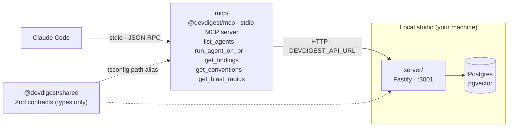

# `@devdigest/mcp` — local stdio MCP server

A thin local adapter that puts DevDigest inside Claude Code itself: import a
PR and run an agent review through the studio at `:3000`, or ask Claude Code
directly and get the same review back as one tool call. It is a **client of
the running Fastify API**, not a second entry point into the domain — no
database, no runtime import from `server/src`, only types via the
`@devdigest/shared` tsconfig alias. See the root [`README.md`](../README.md)
for the system's overall architecture; this module is the box on its
right-hand edge.

## Wiring into Claude Code

The root [`.mcp.json`](../.mcp.json) registers this server under the name
`devdigest`:

```json
{ "mcpServers": { "devdigest": {
  "command": "node",
  "args": ["mcp/bin/devdigest-mcp.mjs"],
  "env": { "DEVDIGEST_API_URL": "${DEVDIGEST_API_URL:-http://localhost:3001}" }
}}}
```

`bin/devdigest-mcp.mjs` loads the TypeScript source directly through `tsx` —
this package never emits JS. With `server/` running (`cd server && pnpm dev`),
restart Claude Code and `/mcp` lists `devdigest` with five tools.

`./scripts/dev.sh` does **not** start this server, and cannot: a stdio MCP
server is not a daemon — the client spawns it as a child process and it dies
with the client. Setup from a clean checkout, standalone runs, turning it off
and troubleshooting are all in [`docs/running.md`](docs/running.md).

## The five tools

| Tool | What it does |
|---|---|
| `list_agents` | Lists the configured reviewer agents and their models. Call first — `run_agent_on_pr` needs an agent name from here. |
| `run_agent_on_pr` | Starts a review, waits for it, returns `{verdict, score, findings}` in one call. No separate start/poll step. |
| `get_findings` | Returns findings for a run that already finished; omit `run_id` for the newest one. |
| `get_conventions` | Returns the repo's extracted coding conventions. Read-only — never starts a scan. |
| `get_blast_radius` | Maps a PR's changed symbols to their callers and the HTTP endpoints and cron jobs those callers reach. Read-only; returns a degraded best-effort result when the repository is not indexed. |

Field-level detail — exact description strings, input schemas, API calls made,
example payloads — is in [`docs/tool-surface.md`](docs/tool-surface.md). The
design rationale — why these five shapes, why polling over SSE, why
`get_blast_radius` now pays for a repo/PR resolve — is in
[`specs/2026-08-14-devdigest-mcp.md`](specs/2026-08-14-devdigest-mcp.md).

## Request flow



**Claude Code** talks to the **`mcp/`** server over **stdio** JSON-RPC; the
server never touches Postgres and never imports server source, so it sits
outside the studio boundary and reaches it the same way any external client
would — **HTTP** against the running **Fastify API**, which owns the
database. `@devdigest/shared` supplies compile-time types to both sides (the
dotted edges) without either process depending on the other's runtime code.
See [`../reviewer-core/README.md`](../reviewer-core/README.md) and
[`../server/README.md`](../server/README.md) for what happens once a request
reaches the API.

## Testing

`npm test` runs a hermetic vitest suite — unit coverage for resolution,
formatting, error text, the wait loop, and an in-memory MCP client/server
integration, plus a token-budget gate. See [`../TESTING.md`](../TESTING.md)
for the cross-module testing strategy.
