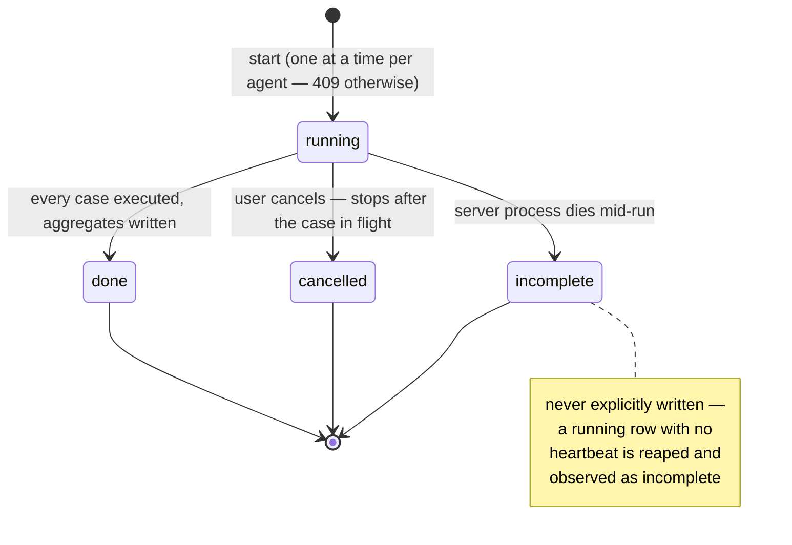
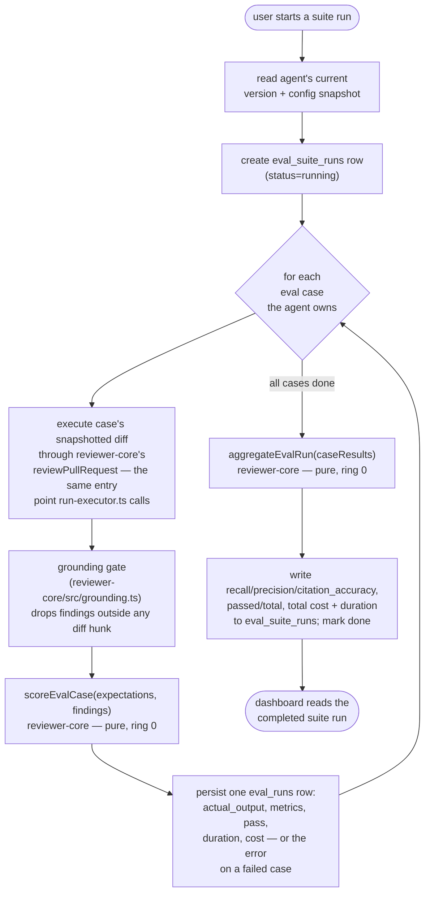

# How the eval pipeline works

Practical reference for the eval slice: what the tables mean, how a suite run
moves through its states, why the scorer lives outside `server/` entirely, and
the path a case takes from creation to an aggregate number on the dashboard.
The behavioural contract — every acceptance criterion this slice must satisfy —
is `specs/2026-08-30-eval-pipeline.md` (SPEC-04); this page is the checklist
and the mental model, not the source of truth.

## Vocabulary — read this before anything else

This repository has two unrelated things named "eval", and confusing them is
the fastest way to look in the wrong directory.

| Term | What it is | Where it lives |
|---|---|---|
| **eval case** | A stored regression example — a snapshotted diff plus an expectation list — owned by one reviewer agent inside one workspace | `eval_cases` table, `server/src/modules/eval/` |
| **eval run** | One execution of one eval case against an agent's configuration, producing a pass/fail and per-case metrics | `eval_runs` table |
| **eval dashboard** | The `/evals` and `/evals/[agentId]` client pages listing agents, their cases and their run history | `client/src/app/evals/` |
| **`@devdigest/evals`** | The **root-level** package that evaluates the Claude Code harness building *this product* — a meta-tool for grading the AI pair-programmer, unrelated to reviewer agents | repo root `evals/` |

**"eval case", "eval run" and "eval dashboard" are product terms owned by a
reviewer agent inside a workspace.** The root `@devdigest/evals` package is a
different thing entirely: it evaluates the tool that builds DevDigest, not a
DevDigest reviewer. Nothing in this document, or in the `modules/eval/` slice,
has anything to do with the root `evals/` package. See `specs/README.md` for
the same note kept in the specs index.

## What problem this solves

A reviewer agent's system prompt can be edited with no way to tell whether the
edit made the agent better or worse. The eval pipeline turns an accept/dismiss
decision a reviewer already makes on a real finding into a durable regression
case, lets an agent author re-run the whole set on demand, and scores the
result deterministically — no model call, no cost, same inputs always produce
the same numbers — so "did this prompt change help" becomes a number instead
of an impression.

## The tables

| Table | Carries | Notes |
|---|---|---|
| `eval_cases` | one regression example: `owner_kind`/`owner_id` (polymorphic — today always `agent`), a snapshotted `input_diff`, an `expected_output` expectation list, an optional `source_finding_id` | `owner_id` carries **no** foreign key because `owner_kind` is polymorphic — deleting an owner is an application-level responsibility (see `modules/agents/service.ts`'s delete path), not a database cascade |
| `eval_suite_runs` | one "run the whole set" invocation: the agent, the agent version snapshot it ran against, status (`running` / `done` / `cancelled` / `failed`), start/finish time, cases total/passed, aggregate recall/precision/citation accuracy (all nullable until complete), total cost, total duration | one row per **start**, never per case |
| `eval_runs` | one per-case execution: the case, a nullable `suite_run_id`, a nullable `agent_version`, the agent's raw `actual_output`, per-case recall/precision/citation-accuracy/pass, duration, cost, and an error message on failure | a case run alone from the editor (not as part of a suite) has a `suite_run_id` of `null` and feeds no aggregate, no trend point and no comparison |

`eval_cases.source_finding_id` is nullable permanently, not just until backfill
— a case must keep running after the finding, its review, its pull request or
even its repository is deleted, so the case only ever snapshots what it needs
(the diff and the expectation list) and never depends on the finding row
surviving.

## The suite-run lifecycle



`done` and `cancelled` are both terminal states with the run's per-case rows
intact and readable. `incomplete` is not a status value stored on the row; it
is what a `running` row looks like once nothing is advancing it, and it is
treated identically to `cancelled` by every downstream reader: excluded from
an agent's trend series, excluded from delta computation, and unselectable for
comparison. A stale-run reaper — the same shape as
`ReviewService.reapStaleRuns` / `reapStaleRunningRuns` in `modules/reviews/` —
is what keeps a dead process's row from blocking `eval_suite_runs`'s
one-run-at-a-time rule forever; without it AC-21's 409 would lock an agent out
permanently after any crash.

Only `done` suite runs are ever eligible for trend, delta or comparison. That
selection happens in the repository's query itself — `cancelled` and
`incomplete` rows are excluded by the `WHERE`, never filtered after the fact by
a caller that might forget to.

## The run path — case to aggregate



A failed case — provider error, timeout, malformed output — does not stop the
suite. Its `eval_runs` row is persisted with the error message, it counts as
zero matched findings, and it stays in the run's denominators, so a flaky
provider shows up as a metric drop rather than silently shrinking the set.

The grounding gate runs **before** scoring, on exactly the terms a real
pull-request review applies it. This is deliberate: without it, "did the agent
cite a real diff hunk" would be trivially 1.0 for every case (the gate already
guarantees that), so the metric that matters is citation *distance to the
expected line*, not citation validity — and the eval has to measure the path a
user actually gets, gate included, or it would grade an easier problem than
the product actually solves.

## Where the scorer lives, and why

`scoreEvalCase` and `aggregateEvalRun` live in `reviewer-core/src/eval/`, at
ring 0, next to `reviewer-core/src/grounding.ts` — not in `server/`. Two
reasons, both hard requirements rather than style preferences:

1. **Determinism and purity.** The scorer's only inputs are a case's
   expectation list and the agent's findings for that case. No network
   request, no model call, no database read. `reviewer-core/CLAUDE.md`'s
   purity contract — no DB, fs, GitHub or server imports, ever — is what makes
   "same inputs always give the same numbers" a property you can actually
   trust rather than one you hope holds.
2. **A pure function is trivially testable without infrastructure.** The
   purity test constructs the scorer with every provider adapter and network
   client replaced by a fake that throws on use; a scorer that could reach
   into `server/`'s DI container could never make that promise.

The match rule — same file, an overlapping line range widened by one named
±3-line tolerance, same category — and the pass rule — every `must_find`
matched, no `must_not_flag` violated — are both pure decisions with no I/O, so
both are exactly the kind of code `onion-architecture` puts at ring 0: usable
by `server/`'s eval runner today, and by anything else that ever needs to
score a case without booting a Fastify server.

`server/src/modules/eval/domain.ts` is a different, deliberately separate
layer: it decides things the scorer does not — deriving an expectation kind
from a finding's `accepted`/`dismissed` state, disambiguating a case name by
numeric suffix, treating an empty expectation list as an assertion of silence
— and it composes the ring-0 scorer's pass rule without duplicating it.

## Where the slice lives

```
server/src/modules/eval/
  ports.ts        interfaces the service depends on — EvalCaseStore, EvalRunStore,
                   EvalSuiteRunStore, AgentConfigSource, SourceDiffSource, SuiteExecutor
  repository.ts    the only file in this slice that touches Drizzle; every method
                   is scoped by workspace id
  domain.ts        pure decisions with no database: expectation derivation, name
                   disambiguation, empty-list-as-silence, the pass rule composed
                   over reviewer-core's scorer
  helpers.ts       row → DTO mapping, safeParse against the contract, never a
                   bare .parse()
  constants.ts     the spec's limits: 200 cases/agent, 100 expectations/case,
                   256 KiB diff, 64 KiB expectation JSON, 120s per-case timeout, …
  service.ts       orchestration — takes its ports in the constructor, never Container
  runner.ts        implements SuiteExecutor; the eval analogue of
                   modules/reviews/run-executor.ts
  routes.ts        thin handlers — parse via schema, one service call, a status
                   code; no route declares response: (server-wide convention)
```

This follows the same ring layout every other feature slice in `server/`
follows — see the `onion-architecture` skill's project profile for the general
shape. The one thing worth calling out here specifically: the eval runner
duplicates a fair amount of `modules/reviews/run-executor.ts` (provider
resolution, cost accounting, cancellation, grounding) rather than sharing it.
That is deliberate, not an oversight — extracting a common executor would
touch the shipping review path, and this feature's spec explicitly forbids any
change to how a real review runs, is scored, or is displayed.

## What a suite run replays, and what its ports promise

A case is replayed against the immutable `agent_versions` snapshot the run was
started at, never against the agent's live row. The snapshot carries the
provider, the model, the system prompt, the review strategy and the ids of the
skills linked at that version; `EvalRepository.getVersionSnapshot` resolves
those ids to the enabled skills' rendered bodies (`skillBlocks`) so a suite run
prompts with the same skill text a real review would. An agent whose behaviour
lives in an attached skill is therefore scored with that skill attached.

What an eval does **not** replay is repo-intel context: the callers digest, the
repo map and the project specs a real review assembles from a cloned
repository. A case owns a snapshotted diff and nothing else, so those sections
are absent from an eval prompt. Read an eval as measuring prompt + model +
strategy + skills, and not the repository context around them.

The ports in `ports.ts` carry promises the type signatures cannot state:

- Every read and write is scoped by workspace id. `eval_runs` has no
  `workspace_id` column of its own, so its queries join through
  `eval_cases.workspace_id`, or through `eval_suite_runs.workspace_id` for a
  suite's per-case rows.
- `startIfNoneRunning` does its check and its insert in one transaction, so two
  concurrent starts cannot both create a suite run; the loser gets the 409.
- `cancelIfRunning` distinguishes `not_found` (no such run in this workspace —
  a cross-workspace read is a 404) from `not_running`, in one transaction so
  the two outcomes cannot race.
- `trend`, `recentCompleted` and `getCompletedById` all filter to `done` in the
  query itself: a `running`, `failed` or `cancelled` run is excluded from the
  trend, the delta and the comparison view by construction, not by a caller
  remembering to filter.
- `reapStale` runs on boot and marks every still-`running` suite run `failed`,
  so a run orphaned by a dead process stops blocking the next start and stays
  out of the trend.
- `cases_passed` and `cases_total` are nullable on purpose. Only `finish()`
  writes aggregates, so a `running`, `failed` or `cancelled` run carries null
  there — "not computed", which the UI must render as such and never as 0.

## Further reading

- `specs/2026-08-30-eval-pipeline.md` (SPEC-04) — the full behavioural
  contract: every acceptance criterion, the edge cases, the non-functional
  requirements and the contract/schema impact this slice carries.
- `specs/README.md` — the same vocabulary note, kept in the specs index.
- `server/src/modules/reviews/` — the shipping review path this slice mirrors
  for execution but never imports from directly.
