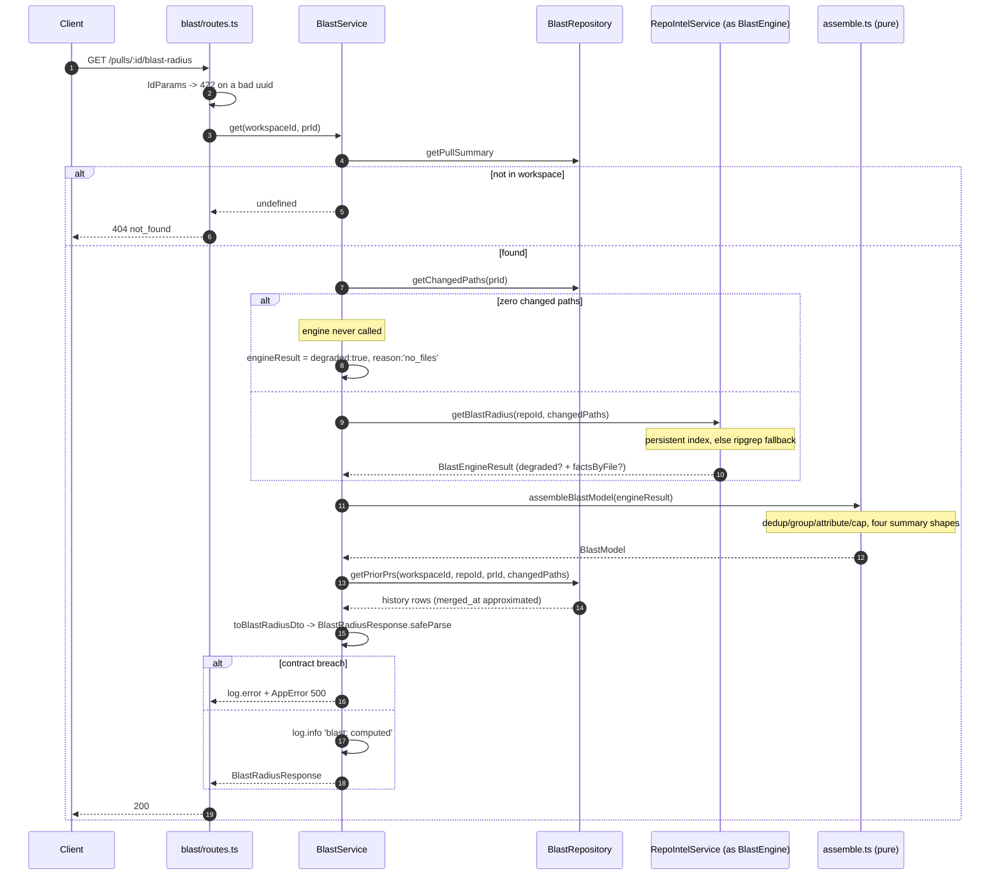

# Spec: Blast Radius (server)

A reviewer looking at a diff cannot answer "what else does this touch?" from
the diff alone: which callers reach the changed symbols, which HTTP endpoints
and cron jobs those callers own, and which other PRs recently touched the same
files. Blast Radius answers that question with `GET /pulls/:id/blast-radius`.

Unlike the Intent Layer and Smart Diff, this feature made **no LLM call and
built no analysis engine**. `RepoIntelService.getBlastRadius`
(`src/modules/repo-intel/service.ts:220`) already existed, already worked, and
already had two paths — a persistent Postgres index (`tryPersistentBlast`,
`:315`) and a ripgrep fallback (`:220`-`:304`) — plus the `BlastRadius` /
`PrHistoryItem` contracts (`vendor/shared/contracts/brief.ts:65-109`). It had
no HTTP route. This spec is a wiring job: route → service → assembly →
contract, plus the seed data without which the wiring has nothing to show.

## What already existed and was unreachable

- `RepoIntelService.getBlastRadius(repoId, changedFiles)` — a persistent-index
  path that reads `symbols` / resolved `references` / `file_rank` /
  `file_facts` straight from Postgres, and a ripgrep-over-the-clone fallback
  that reads only from `container.codeIndex` when the index is absent or
  disabled (`src/modules/repo-intel/service.ts:220-304`).
- `BlastResult`, `BlastChangedSymbol`, `BlastCallerRow`,
  `DegradedReason` — the facade's own types (`src/modules/repo-intel/types.ts:27-87`),
  not exported for cross-slice use.
- `BlastRadius`, `ChangedSymbol`, `BlastCaller`, `DownstreamImpact`,
  `PrHistoryItem` (`vendor/shared/contracts/brief.ts:65-109`), byte-identical
  in the client mirror, zero readers.
- `client/messages/en/blast.json` — an orphaned i18n namespace nobody called
  `useTranslations("blast")` against.
- A seed PR that is the feature's own mockup: `acme/payments-api` #482
  (`src/db/seed.ts:122-133`).

No `RepoIntelService` method signature changed and no `repo-intel` file was
touched. Everything below is new: `src/modules/blast/`, one contract export,
two indexes, and seed rows.

## Contract

`BlastRadius`, `ChangedSymbol`, `BlastCaller`, `DownstreamImpact`,
`PrHistoryItem` are unchanged. One export was added to
`vendor/shared/contracts/review-api.ts:95-102`, alongside `SmartDiffResponse`
and `PrIntentRecord`, importing `BlastRadius` / `PrHistoryItem` from
`./brief.js`:

```ts
export const BlastRadiusResponse = BlastRadius.extend({
  endpoints_affected: z.array(z.string()).default([]),
  crons_affected: z.array(z.string()).default([]),
  history: z.array(PrHistoryItem).default([]),
  truncated: z.boolean().default(false),
  degraded: z.boolean(),
  reason: z.string(),
});
```

Additive over `BlastRadius`; nothing renamed, removed or narrowed. **MINOR.**
The index migration is a pure `ADD INDEX` — **PATCH**, no expand/contract, no
`@deprecated` marker.

**Why a flat envelope, not `{ blast, history }`.** `mcp/src/blast/contract.ts`
parses the response body as `BlastRadius.extend({ degraded, reason })`.
Keeping the server's envelope flat means that file needed no change at all —
zod's default `strip` mode drops the fields (`history`, the roll-ups) MCP
doesn't want to pay tokens for. See `mcp/specs/2026-08-14-devdigest-mcp.md`'s
amendment for the MCP side of this.

**Why `reason` is a required `z.string()`, not `.nullish()`.** MCP's local
`BlastRadiusResult` already declares `reason: z.string()`; a nullish source
field would fail that schema's own `.parse()`. `''` means "not degraded" —
there is no separate boolean for that, `degraded` already carries it.

**Why the top-level roll-ups duplicate what `downstream[]` already carries.**
On the degraded (ripgrep) path, `BlastResult.factsByFile` is absent
(`types.ts:79-84`), so an endpoint or cron cannot be attributed to the
specific symbol whose callers reach it — even though `impactedEndpoints` is
populated. Without a top-level field the card would show `0 endpoints` on a
degraded PR the engine knows touches five. So `downstream[].endpoints_affected`
/ `crons_affected` are the *attributed* truth (empty when degraded, because
attribution would be a guess) and `endpoints_affected` / `crons_affected` at
the top level are the *union* truth (always correct, on both paths). Fabricating
per-symbol attribution on the degraded path would put a false claim in front
of a reviewer, which is worse than an admittedly coarser number.

### `merged_at`

`PrHistoryItem.merged_at` is a required `z.string()`, but `pull_requests` has
no `merged_at` column: the GitHub adapter reads `pr.merged_at` only to derive
`status`, never persists it (`src/adapters/github/octokit.ts:60`).

The contract was not loosened. `BlastRepository.getPriorPrs` maps
`merged_at ← updated_at ?? opened_at` and carries the real state in `notes`
(`"merged"` / `"open"` / …), documented in a JSDoc block on the method itself
(`src/modules/blast/repository.ts:26-33`). The UI renders `notes` as its
status badge and `merged_at` only as a secondary relative-time hint inside a
collapsed section — so the approximation never asserts a merge that did not
happen. The two alternatives considered: loosening `merged_at` to `.nullish()`
would formally weaken a guarantee every other reader of `PrHistoryItem`
relies on; adding a `merged_at` column plus a GitHub backfill is a new import
path change, disproportionate to a secondary field in one card section.

### Mirror

`client/src/vendor/shared/contracts/review-api.ts` stays byte-identical to the
server copy. The barrel is `export *`
(`vendor/shared/index.ts:18`), so no separate re-export was needed — only the
header comment in both files changed. `test/contracts.test.ts` does **not**
check the mirror (confirmed: no `readFileSync`, no file comparison there), so
`diff -q` between the two files is an explicit step in `scripts/verify-l04.sh`,
not something any existing test catches.

There is no third mirror to keep in sync: `mcp/tsconfig.json` maps
`@devdigest/shared` straight at the server file, so a contract drift there is
a `tsc` failure in `mcp/`, not a silent divergence.

## The structural port — the sharpest edge in this feature

`blast/` cannot import from `repo-intel/` at all, including for types.
`no-cross-slice-imports` is depcruise `severity: 'error'`
(`.claude/skills/onion-architecture/assets/dependency-cruiser.onion.cjs:133-134`),
and the config sets `tsPreCompilationDeps: true`
(`:207`) with no type-only exemption — dependency-cruiser resolves
pre-compilation (`import type`) edges the same as runtime ones under that flag,
so even `import type { BlastResult } from '../repo-intel/types.js'` fails the
rule.

`blast/ports.ts` therefore re-declares the engine's shape structurally and
imports nothing (`src/modules/blast/ports.ts:1-38`):

```ts
export interface BlastEngineResult {
  changedSymbols: BlastEngineChangedSymbol[];
  callers: BlastEngineCaller[];
  impactedEndpoints: string[];
  factsByFile?: Record<string, { endpoints: string[]; crons: string[] }>;
  degraded?: boolean;
  reason?: string;   // widened from repo-intel's DegradedReason on purpose
}

export interface BlastEngine {
  getBlastRadius(repoId: string, changedFiles: string[]): Promise<BlastEngineResult>;
}
```

`routes.ts` — the sanctioned composition root, where `Container` access is
allowed — does a bare assignment with no cast:

```ts
const engine: BlastEngine = container.repoIntel;
```

(`src/modules/blast/routes.ts:14`). This typechecks for two structural
reasons, both recorded in the port's own comment
(`src/modules/blast/ports.ts:15-25`): a method's return type is checked
covariantly, and `repo-intel`'s `reason?: DegradedReason` — a string-literal
union — is a narrower type than this port's `reason?: string`, so a narrower
source field still satisfies the wider port. `ENGINE_CALLER_CAP` in
`blast/constants.ts:22` is the same trick applied to a value instead of a
type: `repo-intel`'s `MAX_CALLERS_PER_SYMBOL` (`repo-intel/constants.ts:30`)
is hand-copied because there is no import path to the real constant at all.

**Nothing runs depcruise in CI.** `server/.dependency-cruiser.cjs` does not
exist, and no `package.json` script invokes depcruise — every rule in
`dependency-cruiser.onion.cjs` is honour-system for this module. The
cross-slice boundary above was proven by an ad-hoc run, not by a gate:

```sh
cd server && npx depcruise \
  --config ../.claude/skills/onion-architecture/assets/dependency-cruiser.onion.cjs src \
  | grep 'modules/blast'   # empty output
```

An empty grep result is the only evidence this rule holds; it is reproduced
in `scripts/verify-l04.sh` as an honour-system check, not as an enforced gate.

## Layering

`src/modules/blast/` copies the shape of `src/modules/smart-diff/`, the most
recent ports-first slice (`server/INSIGHTS.md:21`, `:53`): `ports.ts` (the
structural port above, plus `BlastStore` and `Logger` — imports nothing),
`constants.ts` (caps), `assemble.ts` (pure), `helpers.ts` (DTO mapping),
`repository.ts` (the only file in the slice touching Drizzle),
`service.ts` (orchestration, takes `deps` not `Container`), `routes.ts`
(composition root). No `index.ts` — `src/modules/index.ts:14,42` imports
`./blast/routes.js` directly.

## Mapping (`assemble.ts`)

`assembleBlastModel(engine: BlastEngineResult, log?: Logger): BlastModel` is
the only place this logic lives (`src/modules/blast/assemble.ts`).

1. **Changed symbols.** Deduped by `` `${name}|${file}` ``, capped at
   `MAX_CHANGED_SYMBOLS = 50` (`:154-161`).
2. **Callers.** Deduped by `` `${file}|${symbol}|${line}` ``, grouped by
   `viaSymbol`, sorted within a group by `rank desc → file asc → line asc`
   (`compareCallers`, `:74-89`). A caller whose `viaSymbol` matches no changed
   symbol is dropped and `log.warn`'d with a five-item sample
   (`MAX_LOGGED_ORPHAN_SAMPLES`, `:165-171`) — this is a real, not
   hypothetical, case: see Known limits below.
3. **Attribution.** `attributeFacts` (`:91-108`) unions `factsByFile` entries
   for the files a symbol's own callers live in, sorted and capped at
   `MAX_FACTS_PER_SYMBOL = 12` per list. When `factsByFile` is absent
   (degraded path), every symbol gets `endpointsAffected: []`,
   `cronsAffected: []` — attributing the flat `impactedEndpoints` list to an
   arbitrary symbol would be a fabricated claim.
4. **Roll-ups.** On the persistent path, `endpoints_affected` /
   `crons_affected` are the union of every `downstream[].*Affected`, sorted
   and capped at `MAX_ROLLUP = 40` (`:219-247`). On the degraded path,
   `endpoints_affected` is `engine.impactedEndpoints` verbatim and
   `crons_affected` is always `[]` — the ripgrep fallback never calls anything
   that extracts crons (see Known limits).
5. **`downstream`.** One entry per changed symbol, **including symbols with
   zero callers** (`callers: []`) — a symbol disappearing between the `N
   changed symbols` count and the list would read as a bug
   (`:178-205`). Sorted by `callers.length desc → max(caller.rank) desc →
   symbol asc` (`compareDownstream`, `:116-121`), then capped at
   `MAX_DOWNSTREAM = 25` (`:207-214`) — **sorting before slicing is what
   guarantees a symbol with callers survives the cap** over a
   zero-caller symbol; `blast-assemble.test.ts` pins this with 30 symbols
   where only `sym0` and `sym29` have callers.
6. **`truncated`** = `engine.callers.length >= ENGINE_CALLER_CAP` (`:249`) —
   the only reliable signal that the *engine* (not this slice) already cut the
   array, since `blast` never sees the pre-truncation count.
7. **`summary`** — one deterministic English sentence, built and unit-tested
   here (`buildSummary`, `:127-151`): normal
   (`"12 changed symbols, 27 callers across 9 files, 3 endpoints, 1 cron job."`),
   no-callers (`"…, no downstream callers found."`), truncated
   (`"20+ callers"` in place of the exact count), and degraded (prefixed
   `"Best-effort (repository not fully indexed): "`). **The client never
   renders `summary`** — it is English-by-contract and would bypass
   next-intl; it exists for MCP and for the graph's SVG `<desc>`. The card
   builds its own text from i18n keys and counters.

Every cap that actually truncates something logs a `warn`, never silently —
matching the `smart-diff/service.ts` precedent for `orphanFiles` /
`duplicatePaths`.

## Prior PRs (`repository.ts`)

```sql
SELECT pr.number, pr.title, pr.author, pr.status, pr.updated_at, pr.opened_at,
       count(DISTINCT f.path)::int AS overlap_count,
       array_agg(DISTINCT f.path)  AS overlap_paths
FROM pr_files f JOIN pull_requests pr ON pr.id = f.pr_id
WHERE pr.workspace_id = $1 AND pr.repo_id = $2 AND pr.id <> $3
  AND f.path = ANY($4::text[])
GROUP BY pr.id
ORDER BY overlap_count DESC, pr.updated_at DESC NULLS LAST
LIMIT $5
```

(`src/modules/blast/repository.ts:43-69`.)

**Scoped by workspace AND repo.** `src/index.ts` exists in nearly every repo,
so scoping only by path would surface unrelated PRs from other repos — this
is a correctness requirement, not an optimisation.

**No status filter.** An open PR touching the same files is precisely the
collision worth surfacing; status rides along in `notes` instead of gating
the row out.

Caps: `MAX_HISTORY_PROBE_PATHS = 200` (truncates the path list before
binding, `:41`), `MAX_HISTORY_PRS = 5` (`LIMIT`), `MAX_OVERLAP_PATHS_PER_PR = 5`
(sliced in JS after sorting, `:79` — not in SQL, because a `[1:5]` subscript
on an aggregate does not template cleanly through Drizzle).

`array_agg(DISTINCT …)` needed an explicit `sql<string[]>` cast, and
`count(DISTINCT …)` needed `sql<number>` — Drizzle does not infer either.

## Migration

`pr_files` had **no index at all** besides its primary key
(`0000_init.sql`), while also carrying full `patch` text per row. This PR
added two, in `src/db/schema/pulls.ts:37-51`:

```ts
prIdx: index('pr_files_pr_id_idx').on(t.prId),
pathIdx: index('pr_files_path_idx').on(t.path),
```

`pathIdx` serves this query's `f.path = ANY(...)`. `prIdx` is broader:
`smart-diff`, `intent` and the diff viewer all already filter `pr_files` by
`pr_id` with no index (`server/specs/2026-08-10-smart-diff.md`'s "Out of
scope" section names this explicitly). The precedent for adding an index
alongside the feature that first needs it, rather than deferring it, is
`findings_review_id_severity_idx` (`server/INSIGHTS.md:60`). Both are pure
`ADD COLUMN`-equivalent additions, so `pnpm db:generate` produced a
non-interactive `0017_old_major_mapleleaf.sql` with two `CREATE INDEX`
statements — no interactive prompt (`server/INSIGHTS.md:15`).

## Route and status codes

`GET /pulls/:id/blast-radius`, `schema: { params: IdParams }`, `getContext`
for tenancy, **no `response:` schema** — `fastify-type-provider-zod` would
strip unknown keys from a nested shape like `downstream[].callers[]`, and
this codebase's declared rule is that no route validates its outgoing body
(`server/INSIGHTS.md:43`; also stated in `server/CLAUDE.md`).

| Situation | Response |
|---|---|
| PR does not exist in this workspace | **404** `NotFoundError` |
| `:id` is not a uuid | **422**, via `IdParams` |
| everything else, including an unindexed repo | **200**, possibly with an empty/degraded body |
| `changedPaths.length === 0` | **200**, `degraded:true, reason:'no_files'` — the engine is **not** called (`service.ts:23-32`) |

**Deliberate divergence from `intent`.** `GET /pulls/:id/intent` treats 404 as
"not computed yet" and the client's hook sets `isNotComputed` on it
(`server/specs/2026-08-09-intent-layer.md:226-227`). Blast Radius is
deterministic and always computable from what's already in the database — a
404 here means "wrong id," full stop. The client hook has no
`isNotComputed` equivalent for this reason.

The DTO validates itself: `BlastRadiusResponse.safeParse(dto)`
(`service.ts:40`); on failure the service logs `error` with `result.error.issues`
and throws `AppError('internal_error', …, 500)` — never a bare `.parse()`,
because `app.setErrorHandler` maps a `ZodError` to **422**, which would
mislabel a server-side contract breach as a bad client request.

## No caching

Deliberately absent. The computation is deterministic, makes no LLM call, and
costs nothing beyond what `symbols` / `references` / `file_rank` /
`file_facts` already indexed. `pr_brief` is deliberately **not written to** —
it is an unversioned jsonb blob belonging to a later composed-brief lesson,
and writing a partial document into it now would create an undeclared
contract on a shared row. The client gets `staleTime: 60_000` instead of a
server-side cache.

## Seed

The seed repo previously had `clonePath: null` and no rows in `symbols`,
`references`, `file_facts`, `file_rank` or `repo_index_state`
(`src/db/seed.ts`), so both `getBlastRadius` paths would return empty +
degraded — the card would render nothing to verify against. The seed now
populates a `repo_index_state` row (`status: 'full'`) and `symbols` /
`references` / `file_rank` / `file_facts` for `acme/payments-api`, declaring
`rateLimit` and `bucketKey` in `src/middleware/ratelimit.ts` with callers in
`src/api/public/index.ts`, `webhooks.ts`, `health.ts` and `server.ts`
(`src/db/seed.ts:207-393`), plus endpoints `GET /api/public/items`,
`POST /api/public/webhooks`, `GET /api/public/health` and cron
`reset-rate-buckets`, and a second PR touching the same middleware file so
Prior PRs is non-empty. This is exactly the feature's own mockup — the seed
*is* the proof the wiring works end-to-end.

## Flow



The client fetches the resolved PR row through this route, the engine
distinguishes the persistent-index and ripgrep paths internally, and
`assemble.ts` is the single place that turns either shape into one DTO —
matching `server/specs/2026-08-09-intent-layer.md` and
`server/specs/2026-08-10-smart-diff.md`'s sequence-diagram convention of
naming every module that touches the request.

## Known limits, stated honestly

1. **`repo-intel`'s `MAX_CALLERS_PER_SYMBOL = 20` truncates the callers array
   GLOBALLY, not per symbol** — `tryPersistentBlast` does
   `callers.slice(0, MAX_CALLERS_PER_SYMBOL)` (`repo-intel/service.ts:386`)
   over the *entire* sorted array before this slice ever groups by symbol. A
   PR changing many symbols can legitimately show `0 callers` for some of
   them, and the card presents that as fact. This is the single largest
   correctness risk in the feature. Mitigation is the `truncated` flag and
   the `20+` summary/UI treatment, not a fix — the real fix is a per-symbol
   slice inside `repo-intel`, a change to a different slice and out of scope
   here.
2. **`ENGINE_CALLER_CAP` is a hand-copied constant**
   (`blast/constants.ts:12-22`), guarded only by a test
   (`blast-assemble.test.ts`'s drift-guard case pinning it against
   `repo-intel/constants.ts`'s `MAX_CALLERS_PER_SYMBOL`) — nothing catches a
   silent value change automatically; the pin only makes the drift visible
   in a failing test.
3. **`factsByFile` is keyed by CALLER file, not by the changed file itself**
   (`repo-intel/types.ts:79-84`; `assemble.ts`'s `attributeFacts`). A PR that
   edits a route handler with no external callers reports `0 endpoints` for
   that symbol, even though the handler obviously affects an endpoint. This
   is why the empty-impact copy in the client says "traced to these
   callers," not "affected" — see the client spec.
4. **`crons_affected` is always `[]` on the degraded path.** The ripgrep
   fallback only calls `extractEndpoints` (`repo-intel/service.ts:293`),
   never anything that extracts crons. An unindexed repo will always read
   `0 cron jobs` regardless of what's actually there; the `partial` /
   `degraded` badge is what explains this rather than a fix for it.
5. **`viaSymbol` is a bare name with no declaring file.** Both engine paths
   record only the symbol's name on a caller row
   (`repo-intel/types.ts:63-72`), so two changed symbols sharing a name in
   different files receive the identical caller list — the engine cannot
   disambiguate them, and neither can this slice.

## Server tests

- `test/blast-assemble.test.ts` — 11 cases against `assembleBlastModel`
  directly: grouping by `viaSymbol` with dedup and rank/file/line ordering;
  per-symbol attribution from `factsByFile` plus the union roll-up; the
  degraded path (per-symbol empty, roll-up equals `impactedEndpoints`
  verbatim, crons `[]`); the 30→20 per-symbol caller cap with exactly one
  `warn`; the 30→`MAX_DOWNSTREAM` downstream cap where symbols with callers
  (`sym0`, `sym29`) survive the slice; a zero-caller symbol still producing a
  `downstream` entry with `callers: []`; `truncated` flipping exactly at
  `ENGINE_CALLER_CAP`; all four `summary` shapes verbatim; an orphan
  `viaSymbol` being dropped with a `warn` naming the count; a `toBlastRadiusDto`
  output that clean-`safeParse`s against `BlastRadiusResponse`; and the
  `ENGINE_CALLER_CAP === repo-intel MAX_CALLERS_PER_SYMBOL` drift guard.
- `test/blast-service.test.ts` — 5 cases against fake `BlastStore` /
  `BlastEngine` ports: no PR row returns `undefined` (the route's 404
  signal); `getChangedPaths` output reaches `engine.getBlastRadius` verbatim;
  zero changed paths short-circuits — the engine is never called and the DTO
  is `degraded:true, reason:'no_files'`; history mapping
  (`merged_at` from `updatedAt` falling back to `openedAt`, `notes` from
  `status`, `files_overlap` capped at `MAX_OVERLAP_PATHS_PER_PR`); and a
  contract-breaking engine result throwing `AppError(500, 'internal_error')`
  that is explicitly asserted **not** to be a `ZodError`.
- `test/blast.it.test.ts` — 5 cases against Testcontainers Postgres,
  self-skipping via `dockerAvailable()`: 200 with the full shape for the
  seeded PR; history ordered by overlap count descending, excluding the
  current PR; excluding a same-path PR in a different repo; excluding a PR in
  a different workspace; 404 for an unknown PR and 422 for a non-uuid.
  `container.repoIntel` is injected via `ContainerOverrides.repoIntel`
  (`platform/container.ts:50,114`) so the indexer never actually runs.
- `test/routes-smoke.test.ts` — one case asserting `GET /pulls/:id/blast-radius`
  is registered (`:103-106`), in its own block — there is no shared
  route-table fixture (`server/INSIGHTS.md:39`).
- `test/contracts.test.ts` — `BlastRadiusResponse` round-trips a full fixture
  covering the persistent path, history, and both roll-ups (`:109-138`).

## Out of scope

Blast analysis logic itself — that already existed in `repo-intel` and is
untouched by this feature. Fixing the global (not per-symbol) caller cap in
`repo-intel` (Known limits, #1). Attributing endpoints/crons to a changed
file rather than only to its callers' files (Known limits, #3). Extracting
crons on the ripgrep fallback (Known limits, #4). Caching the response —
`pr_brief` stays empty; this endpoint is deterministic and cheap enough that
a `staleTime` on the client is sufficient. An index on `pr_files.pr_id` was
already flagged as missing by `server/specs/2026-08-10-smart-diff.md`'s "Out
of scope" and is added here, but no `EXPLAIN` measurement was taken beyond
the precedent that motivated it. Wiring depcruise into CI — the honour-system
gap documented above stays open.
