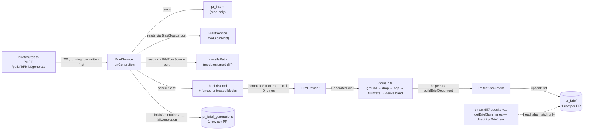

# Spec: PR Why + Risk Brief (server)

Source spec: `specs/2026-08-24-pr-why-risk-brief.md` (SPEC-03). This document
covers only the server half — the new `modules/brief/` slice, its two routes,
the `pseudocode_summary` read path added to `modules/smart-diff/`, the schema
and the seed row. The client half is `client/specs/2026-08-24-pr-why-risk-brief.md`.

Two things existed and had nothing behind them before this feature: `pr_brief`
was a table with two columns and zero writers
(`server/src/db/schema/reviews.ts:101-106` before this change), and `Risk`,
`Risks` and `PrBrief` were contracts with zero readers
(`server/src/vendor/shared/contracts/brief.ts:12-24,152-158` before this
change). This slice is the first writer and the first reader of both.

## The pipeline

A **generate** request writes the `running` row before the 202 reply, then
runs the pipeline fire-and-forget: read the pull's intent, blast radius and
smart-diff roles through two structurally-declared ports, assemble one
fenced prompt, make exactly one `completeStructured` call, and run the raw
model output through six pure `domain.ts` functions in a fixed order —
`groundFileRefs` → `dropRisksWithoutRefs` → `capRisks` → `truncateStrings` /
`groundFocusRows` → `orderFocusRows` → `capFocusRows` → `deriveMergeRisk` —
before persisting. `smart-diff/repository.ts` reads the same `pr_brief` row
directly for `file_summaries`, comparing its own `head_sha` rather than going
through the brief slice at all. See `server/specs/2026-08-16-blast-radius.md`
and `server/specs/2026-08-10-smart-diff.md`, both of which deferred exactly
this lesson by name.

## Layering — two ports satisfied at the composition root

**Component:** `server/src/modules/brief/ports.ts`
**Behavior:** declares `BlastSource` (`get(workspaceId, prId):
Promise<BlastRadiusResponse | undefined>`) and `FileRoleSource`
(`get(workspaceId, prId): Promise<ReadonlyMap<string, SmartDiffRole> |
undefined>`) as structural interfaces the slice owns. Neither imports
anything from `modules/blast/` or `modules/smart-diff/`.

**Component:** `server/src/platform/container.ts:194-205`
**Behavior:** `get blastSource()` constructs `new BlastService({ store: new
BlastRepository(this.db), engine: this.repoIntel })` and returns it as the
port; `get briefFileRoles()` constructs `new SmartDiffFileRoleSource(new
BriefRepository(this.db), classifyPath)` (`modules/brief/adapters.ts`),
injecting `classifyPath` from `modules/smart-diff/classify.ts`.
`brief/routes.ts` reads `container.blastSource` and `container.briefFileRoles`
— it never imports `modules/blast/` or `modules/smart-diff/` directly.

**Why the composition root and not an import.** `no-cross-slice-imports` is a
dependency-cruiser rule at `severity: 'error'` with `tsPreCompilationDeps:
true`, so even `import type { BlastRadiusResponse } from '../blast/…'` fails —
the same constraint `blast/ports.ts:16-25` was built against when it
re-declared the repo-intel engine structurally rather than importing it
(`server/specs/2026-08-16-blast-radius.md`). `platform/container.ts` is exempt
from that rule; `platform-not-to-modules` there is only `warn`. Confirmed by
running the ruleset before and after wiring both getters: the depcruise
baseline moved from 7 errors / 41 warnings to 7 errors / 46 warnings — five new
`platform-not-to-modules` warnings, zero new errors (`server/INSIGHTS.md`,
2026-08-24).

**Why `smart-diff` reads `t.prBrief` directly instead of a third port.**
`smart-diff/repository.ts:getBriefSummaries` (`server/src/modules/smart-diff/repository.ts`)
selects `t.prBrief.headSha` and `t.prBrief.json` straight from `db/schema.ts` —
a ring-3 Drizzle read, which the onion ruleset permits — rather than declaring
a `BriefSource` port and wiring a third `container` getter. Importing
`modules/brief/` is the same hard error as importing `modules/blast/`; reading
the row directly avoids a second cross-slice port for a single column pair,
and the same row already carries the `head_sha` that decides staleness
(AC-64), so there is no second source of truth to keep in sync.

## The merge-risk band is derived, never model-supplied

**Component:** `server/src/modules/brief/domain.ts:GeneratedBrief`
**Behavior:** the Zod schema for the model's structured output has no
`merge_risk` field at all — `{ summary, risks, review_focus, file_summaries }`.
There is no parameter through which a model-tainted band could reach the
persisted document.

**Component:** `server/src/modules/brief/domain.ts:deriveMergeRisk`
**Behavior:** `high` if any *surviving* risk (after grounding, dropping and
capping) has severity `high`, else `medium` if any has `medium`, else `low`.
Called from `helpers.ts:buildBriefDocument`, which is the only place
`merge_risk` is set on the persisted document.

**Why derive it rather than ask the model for it.** A derived band is
reproducible from the stored `risks` array alone, with no provider call —
the same reasoning `intent/confidence.ts:scoreConfidence` already applies to
intent's own confidence number. It also guarantees the band never describes a
risk that grounding or capping already dropped: if the model's single
high-severity risk turns out to name a fabricated file and gets dropped by
`groundFileRefs` → `dropRisksWithoutRefs`, the band recomputes from what
survived and can fall from `high` to `medium` in the same generation
(`server/test/brief-domain.test.ts`, `deriveMergeRisk` describe block). A model
that supplies its own band anyway is not rejected — it is silently discarded,
because `GeneratedBrief` has no field to hold it.

## Two separate spend surfaces

**Component:** `server/src/modules/brief/repository.ts:readReviews`
**Behavior:** joins `reviews` to `agent_runs` on `run_id` and selects
`agentRuns.score`, `agentRuns.findingsCount` and `agentRuns.blockers` for the
verdict strip's review-present path — never `reviews.score`.

**Component:** `server/src/modules/brief/repository.ts:upsertBrief` /
`finishGeneration` / `failGeneration`
**Behavior:** brief generation cost and tokens land only in `pr_brief`'s and
`pr_brief_generations`'s own columns. Nothing here writes to
`agent_runs.cost_usd`.

**Why keep them disjoint at the query level, not just by convention.**
`reviews.score` is documented as PR quality where *higher is better*
(`vendor/shared/contracts/findings.ts`); `merge_risk` is the inverse reading.
Reusing the column would invert a meaning without changing a shape — the same
rule the intent layer set. Never selecting `reviews.score` or
`agent_runs.cost_usd` anywhere in `brief/repository.ts` makes the two
money/score surfaces provably disjoint rather than merely undocumented as
shared (`server/INSIGHTS.md`, 2026-08-24).

## Staleness is sha-only and derived per request

**Component:** `server/src/modules/brief/helpers.ts:buildBriefResponse`
**Behavior:** `stale = storedBrief.headSha !== currentHeadSha`, computed fresh
on every `GET`/`POST` response and never written to a column. `BriefService.get`
catches a `PrBrief.parse` failure on the stored row and degrades to `{ brief:
null, generation, stale }` rather than a 500, still computing `stale` from the
row's raw `head_sha` column.

**Accepted consequence (matches `SPEC-02`'s AC-54).** A brief generated before
any review keeps `orderFocusRows`' no-findings ordering tier and a
single-model cross-model note, and goes on presenting as fresh after a review
completes — nothing about a completed review moves `head_sha`. This is
deliberate: invalidating on review-completion would spend a regeneration the
user never asked for, the moment they run the very review the brief was meant
to help them read.

## The AC-48 stuck-generation reap runs inside `beginGeneration`

**Component:** `server/src/modules/brief/repository.ts:beginGeneration`
**Behavior:** one `db.transaction`: first an `UPDATE … WHERE status='running'
AND started_at < now - STUCK_GENERATION_MS` scoped to the `prId` being
claimed, immediately followed by `INSERT … ON CONFLICT DO UPDATE … setWhere:
ne(status, 'running')`. The insert's `returning()` is non-empty exactly when
the row was not genuinely running, so the caller gets `true`/`false` from one
round trip.

**Why the reap has to be here and not only at boot.** `routes.ts` also runs a
boot-time `reapRunning()` (all rows, unconditional), but AC-48 requires a
*request* made against a ten-minute-old `running` row to answer 202 rather
than 409 — a check that only runs once at process start cannot see a row that
went stale ten minutes into a long-lived server's uptime. Putting the
scoped reap inside the same transaction as the claim also means two concurrent
requests against the same PR always resolve to exactly one `true`, with no
extra locking (`server/INSIGHTS.md`, 2026-08-24).

## The generate route's per-workspace rate limit

**Component:** `server/src/modules/brief/routes.ts:workspaceRateLimitKey`
**Behavior:** `POST /pulls/:id/brief/generate` sets `config.rateLimit.keyGenerator`
to a function that resolves the caller's workspace and returns
`` `brief-generate:${workspaceId}` ``, at `max: 5` / `1 minute`.

**Why X and not Y — a bare `max` is one global bucket.**
`intent/routes.ts:76`'s `POST /pulls/:id/intent` still ships with a bare
`max: 5` and no `keyGenerator`, which is one shared bucket across every
workspace, not 5-per-workspace as its own AC intends. This route follows
`onboarding/routes.ts`'s pattern instead — the plan called this out explicitly
rather than copying the route it otherwise used as a template.

## Untrusted content: the fence and the escaped closer

**Component:** `server/src/modules/brief/assemble.ts:escapeFence`
**Behavior:** every author-controlled value (PR title, body, branch, commit
messages, patch text) is wrapped in a labelled `<untrusted source="…">…
</untrusted>` block, with every literal `</untrusted>` inside the content
rewritten to `<\/untrusted>` before interpolation.

**Component:** `server/src/prompts/brief.risk.md`
**Behavior:** the system prompt carries no `{{placeholder}}` slots for
untrusted data at all — `renderPrompt(BRIEF_PROMPT_TEMPLATE, {})` is called
with an empty variable map. Untrusted content only ever arrives as the
separate user message `assembleGenerationInput` builds.

**Why the closer must be escaped before interpolation, not after.**
`renderTemplate` (`server/src/platform/prompts.ts:36`) is a raw
`String.replace` — it does not escape anything itself. A PR body containing a
literal `</untrusted>` would otherwise close the fence early and let the
remainder of that body be read as an instruction rather than data
(`server/test/brief-assemble.test.ts`, "escapes a literal `</untrusted>`
closer"). The system prompt takes no untrusted variable specifically so this
escaping work has exactly one call site (`assemble.ts`) to get right, rather
than two.

## Input caps: what gets dropped first

**Component:** `server/src/modules/brief/assemble.ts:capChangedFiles`
**Behavior:** per-file patch text is truncated to `MAX_INPUT_FILE_BYTES`
(20 KB); the whole set is capped to `MAX_INPUT_TOTAL_BYTES` (200 KB) by
dropping files in `boilerplate` → `wiring` → lowest-byte-`core` order until
the total fits. Both the dropped-file count and the truncated-file count are
returned to the service for an `info`-level log line.

**Why `core` files are only dropped last, and by size.** `boilerplate` and
`wiring` files are the ones a reviewer is least likely to need explained; a
`core` file is only dropped once every lower-ranked file is already gone, and
even then the smallest surviving `core` file goes first — the cap removes as
little substantive content as it can while still fitting the budget
(`server/test/brief-assemble.test.ts`, the two `capChangedFiles` cases).

## Domain caps and grounding rules

**Component:** `server/src/modules/brief/domain.ts`
**Behavior:** each rule is a pure function of its inputs, with no I/O, and
each dropper returns both the survivors and a count:

- `groundFileRefs` — accepts a `file_refs` entry only when its parsed path is
  in the allowed set (changed files, plus blast-attributed paths unless the
  blast result is `degraded`); malformed refs are dropped the same way as
  out-of-union ones.
- `dropRisksWithoutRefs` — a risk left with zero surviving refs after grounding
  is dropped entirely, not persisted with an empty array.
- `capRisks` — orders by severity descending, stable on generation order for
  ties, keeps at most `MAX_RISKS` (12) and at most `MAX_REFS_PER_RISK` (5) refs
  per kept risk.
- `truncateStrings` — caps `summary` (400), risk `title` (80) / `explanation`
  (600), focus `reason` (140) and file `summary` (200) to their contract
  maximums.
- `groundFocusRows` — a row survives only if its `start_line`–`end_line` range
  intersects a real hunk of the reconstructed diff for that file.
- `orderFocusRows` — ranks by the severity of the finding the row's range
  overlaps (`CRITICAL` → `WARNING` → `SUGGESTION` → no finding), then file path
  ascending, then start line ascending.
- `capFocusRows` — keeps at most `MAX_FOCUS_ROWS` (5).
- `selectFileSummaries` — keeps a generated file summary only when
  `roleByPath` classifies that path `core` or `wiring`; a `boilerplate` file
  never gets a stored summary even if the model produced one.

**Why the model-output schema (`GeneratedBrief`) carries none of these caps
itself.** `BRIEF_MAX_RETRIES` is `0` (`constants.ts`) — the run is
backgrounded, so the timeout/retry budget is spent once. If `GeneratedBrief`
declared `.max(12)` on `risks`, a model that over-generates to 40 risks would
fail the whole parse with no retry left to recover, instead of being corrected
by `capRisks` after a successful parse. The model-output schema stays
permissive (`z.string()`, uncapped arrays); every cap is a pure post-parse
step (`server/INSIGHTS.md`, 2026-08-24).

**Why `groundFocusRows`/`orderFocusRows` reconstruct the diff and the finding
lookup themselves rather than reusing `reviewer-core`.** `ring-1-domain-stays-pure`
(the onion-architecture dependency-cruiser ruleset) whitelists `domain.ts` /
`ports.ts` importing only `^src/vendor/shared` and `node_modules/zod` — not
`@devdigest/reviewer-core`, even though the onion skill's own ring table lists
`reviewer-core/src/` as ring 0 alongside `vendor/shared/`. Reusing
`reviewer-core/src/grounding.ts`'s `buildLineIndex`/`groundFindings` from here
would be a new depcruise error, so `domain.ts` carries its own small
`buildLineIndex`/`rangeIntersects` pair instead, deliberately mirroring rather
than importing (`server/INSIGHTS.md`, 2026-08-24, and the earlier
`sanitizePathLabel` precedent it points at).

**Where `groundFocusRows` gets its diff from.** `BriefService.runGeneration`
has no `GitClient` port — `FileSource.getChangedFiles` already returns each
file's stored `patch`, so the service reconstructs a synthetic unified diff
text (`diff --git a/p b/p` / `--- a/p` / `+++ b/p` / patch, one block per
file) and parses it with `parseUnifiedDiff` (`src/adapters/git/diff-parser.ts`,
already reused by `modules/reviews/diff-loader.ts:diffFromPrFiles`) rather than
adding a second port for the same data (`server/INSIGHTS.md`, 2026-08-24).

## `orderFocusRows`'s finding-severity lookup

**Component:** `server/src/modules/brief/service.ts:buildFindingSeverityLookup`
**Behavior:** matches a generated review-focus row to the worst severity among
stored `findings` whose `[startLine, endLine]` overlaps the row's range, using
`ReviewSource.readFindings(prId)` (joins `findings` to `reviews`, filters
`dismissedAt IS NULL`), returned as `BriefFindingRow[]` and looked up per row
by `buildFindingSeverityLookup`. A row with no overlapping finding ranks in
`orderFocusRows`' fourth tier, exactly as AC-26 requires for a PR with zero
reviews.

> `server/INSIGHTS.md`'s Open Questions section (2026-08-24) records this as
> an unresolved gap — that `ReviewSource` had no per-PR findings read and
> `runGeneration` passed `() => undefined` for the lookup. That is no longer
> what the tree shows: `ports.ts` declares `readFindings` on `ReviewSource`,
> `repository.ts` implements it, and `service.ts` uses it as described above.
> The insight is stale as of this reading and is flagged rather than silently
> corrected — an INSIGHTS.md correction is its owning agent's to append, not
> this document's.

## Persisted document assembly

**Component:** `server/src/modules/brief/helpers.ts:buildBriefDocument`
**Behavior:** fills all four fields `PrBrief` already required before this
feature — `intent` (from the stored `pr_intent` row via `toContractIntent`,
never written back), `blast` (`changed_symbols`/`downstream`/`summary` from
the same `BlastRadiusResponse` generation already loaded), `risks` and
`history` — alongside the nine fields this feature adds. `truncated` is taken
from the blast result, not from the input-cap truncation; `degraded_reason`
is the blast result's own `reason` when non-empty, else `null`.

**Why fill all four inherited fields instead of narrowing them.** `PrBrief`
required `{ intent, blast, risks, history }` before this feature and this
feature adds fields **additively** — narrowing any of the four to optional
would be the one change that could break the pre-existing (if reader-less)
contract. Filling them from data the generation already loads for other
reasons costs nothing extra and keeps the additive/MINOR verdict intact.

## Amendment (AC-83–AC-98): `agent_runs.ci_fail_on`, denormalized on the done path only

AC-83–AC-98 fix a client defect (see
`client/specs/2026-08-24-pr-why-risk-brief.md` `## Amendment`): the verdict
strip's blocker badge read the frozen `agent_runs.blockers` column, which a
dismissal could no longer agree with. The fix moves the count client-side onto
a live finding set gated by the run's own recorded policy — which requires the
run to carry that policy at all. This section is the server-side half: the one
new column that makes the gate readable per historical run.

**Component:** `server/src/db/schema/runs.ts:33`
**Behavior:** `ciFailOn: text('ci_fail_on', { enum: [...] })` — nullable, no
default, no backfill. `server/src/db/migrations/0022_bent_master_mold.sql` is
a bare `ALTER TABLE "agent_runs" ADD COLUMN "ci_fail_on" text;`, non-interactive
per this repo's migration convention.

**Component:** `server/src/modules/reviews/run-executor.ts` (the `'done'`
`completeAgentRun` call, alongside `score`/`blockers`)
**Behavior:** `ciFailOn: agent.ciFailOn` is passed only from the success path
that also computes `blockers` via `countBlockers(keptFindings, agent.ciFailOn)`
— the same policy value that produced the frozen `blockers` count now also
lands on the row itself, so a later client-side re-derivation has something to
gate against.

**Component:** `server/src/modules/reviews/run-executor.ts` (`failAll`, and the
outer `catch` block's `completeAgentRun` call)
**Behavior:** neither failure/cancel call site includes a `ciFailOn` key in its
`completeAgentRun` payload; `repository/run.repo.ts:completeAgentRun` defaults
an absent `ciFailOn` to `null` (`values.ciFailOn ?? null`) in the same way it
already defaults `score` and `blockers` — the failure and cancel paths leave
the column null because a failed run produces no review whose gate anyone
reads.

**Why nullable with no default, rather than defaulting to `'critical'`.** A
default would silently claim a gate policy for every run that predates this
column — runs whose agent may have held `'warning'` or `'any'` at the time and
whose actual policy is now unrecoverable from `agent_runs` alone. Leaving the
column null and letting the **reader** supply the default keeps that
uncertainty visible at the one place it is resolved:
`client/src/lib/severity.ts:meetsGate` reads a `null`/`undefined` gate as
`"critical"` — the strictest gate, so an unknown historical policy fails safe
by under-counting blockers only, never by silently permitting more.

**Component:** `server/src/vendor/shared/contracts/trace.ts:118`
**Behavior:** `RunSummary.ci_fail_on: CiFailOn.nullish()` — `.nullish()`, not
`.nullable()`.

**Why `.nullish()` and not `.nullable()`.** `.nullable()` still requires the
key to be present (typed `CiFailOn | null`) in `z.infer<typeof RunSummary>`;
`.nullish()` makes the key optional as well (`CiFailOn | null | undefined`).
Several `RunSummary` client-side fixtures are built as complete object
literals for pre-existing fields and were never going to be revisited to add a
new required key — `.nullable()` would have broken every one of them at
`typecheck`, on a field most fixtures have no reason to care about.
`server/test/contracts.test.ts:265-297` parses `ci_fail_on` absent, `null`, a
valid enum value, and rejects an out-of-enum string, covering exactly this
distinction.

**Component:** `server/src/modules/reviews/repository/run.repo.ts:68`
(`listRunsForPull`)
**Behavior:** `ci_fail_on: run.ciFailOn` is one field in this function's
hand-written return object, which is the entire wire shape of `GET
/pulls/:id/runs` — no route in this codebase declares a `response:` schema
(`server/CLAUDE.md`), so `RunSummary` validates nothing on the way out.

**Why the field only reaches a client because this one mapping line was
edited.** Adding `ci_fail_on` to the `RunSummary` Zod contract alone would have
been silently inert: the contract is request-side-only in this codebase, and
`listRunsForPull`'s object literal is the actual DTO a client receives. The
contract change and this repository edit are two separate, both-required
steps — the same gap `server/CLAUDE.md`'s Conventions section already
documents ("edit a contract without its DTO and the contract silently lies"),
made concrete here by the field this amendment adds.

## Contract impact

Additive, **MINOR**, non-breaking — see `specs/2026-08-24-pr-why-risk-brief.md`
`## Non-functional requirements` for the full grep-verified compatibility
argument. On the server side specifically:

- `+ MergeRisk`, `+ ReviewFocusRow`, `+ PrBriefFileSummary` — new exports in
  `vendor/shared/contracts/brief.ts`.
- `PrBrief` extended with `summary`, `merge_risk`, `review_focus`,
  `file_summaries`, `degraded_reason`, `truncated`, `head_sha`, `model`,
  `review_models`, `tokens_in`, `tokens_out`, `cost_usd` — all optional or
  defaulted.
- `+ PrBriefGenerationState`, `+ PrBriefResponse` — new exports in
  `vendor/shared/contracts/review-api.ts`.
- `+ pr_brief` columns (`head_sha`, `model`, `provider`, `tokens_in`,
  `tokens_out`, `cost_usd`, `degraded_reason`, `truncated`, `generated_at`) —
  all nullable or defaulted; one non-interactive `ADD COLUMN` migration
  (`server/src/db/migrations/0021_moaning_monster_badoon.sql`).
- `+ pr_brief_generations` table, modelled on `conventionScans`
  (`server/src/db/schema/knowledge.ts:80-103`).
- `+ GET /pulls/:id/brief`, `+ POST /pulls/:id/brief/generate` — new routes.
- `pseudocode_summary` now populated on `GET /pulls/:id/smart-diff` for `core`/
  `wiring` files while the brief is fresh; the field was already `.nullish()`
  and is omitted, never `null`, when absent.
- `+ agent_runs.ci_fail_on` (AC-83–AC-98 amendment) — nullable `text` column,
  no default, no backfill; one non-interactive `ADD COLUMN` migration
  (`server/src/db/migrations/0022_bent_master_mold.sql`). Written on the `done`
  completion path only.
- `RunSummary.ci_fail_on` (AC-83–AC-98 amendment) — new `.nullish()` field in
  `vendor/shared/contracts/trace.ts`, surfaced on `GET /pulls/:id/runs` through
  `listRunsForPull`'s hand-written DTO
  (`server/src/modules/reviews/repository/run.repo.ts:68`).

`server/src/vendor/shared/contracts/brief.ts` and `review-api.ts` are
byte-identical to their `client/src/vendor/shared/contracts/` mirrors
(`diff` empty both ways, verified this session).

## Observability

**Component:** `server/src/modules/brief/service.ts:runGeneration`
**Behavior:** logs `info` at start (PR id, workspace id) and at end (provider,
model, both token counts, cost, duration, dropped file/ref/risk/focus counts,
degraded reason), and `warn` at each individual grounding/capping step that
actually dropped something. On failure, logs `error` with the PR id and the
error message only. **The prompt and every patch string are never logged** —
only counts and identifiers reach the logs, because the diff routinely carries
secrets (the seeded demo PR's own stored finding names a literal `sk_live_`
Stripe key at `server/src/db/seed.ts:527-528`).

## Server tests

- `server/test/brief-domain.test.ts` — pure `domain.ts` rules: `parseFileRef`
  parses and rejects malformed refs; `groundFileRefs` drops an out-of-union or
  malformed ref and restricts a degraded result to changed-files-only, and
  leaves a 30-ref risk's valid refs untouched at the grounding step;
  `dropRisksWithoutRefs` drops a risk left with zero refs and keeps one with at
  least one; `capRisks` caps 40 risks to 12 in severity-descending,
  generation-order-tiebroken order and caps refs per risk to 5;
  `truncateStrings` caps every string field to its own maximum and leaves short
  strings untouched; `groundFocusRows` drops a row outside every hunk and a row
  whose file has no hunks; `orderFocusRows` orders CRITICAL → WARNING →
  SUGGESTION → no-finding then path then start line, and breaks within-severity
  ties the same way; `capFocusRows` keeps at most `max`; `deriveMergeRisk` falls
  from `high` to `medium` when grounding drops the only high risk, yields `low`
  for zero surviving risks, and ignores a band the model has no field to
  supply; `selectFileSummaries` keeps only `core`/`wiring` paths.
- `server/test/brief-assemble.test.ts` — `assembleGenerationInput` escapes a
  literal `</untrusted>` closer in the PR body so it cannot end the fence
  early; `capChangedFiles` drops boilerplate before wiring before the
  lowest-ranked core file to fit the total byte cap, and truncates one
  oversized file's patch and reports it; `buildBriefResponse` returns a null
  brief with `stale: false` when nothing is stored, and flips `stale` to `true`
  when the current head sha has moved while the stored document is unchanged.
- `server/test/brief-prompt.test.ts` — `brief.risk.md` loads and
  `renderPrompt` resolves it with no stable variables to fill; the rendered
  text states the untrusted-data rule, the approved/exempt/low-risk-claim rule
  and the band-is-not-yours rule verbatim; the output caps are declared in the
  prompt text; the prompt never asks for a boilerplate-file summary; and
  `renderTemplate` leaves an unknown placeholder intact while filling a known
  one.
- `server/test/brief-service.test.ts` — `BriefService.get` returns the stored
  brief with zero provider calls and throws `NotFoundError` for a PR outside
  the workspace; `runGeneration` makes exactly one provider call and persists
  a document that parses against `PrBrief`, still produces a brief with the
  degraded reason stored when blast is degraded, leaves the previously stored
  document byte-identical on failure while recording the error, orders
  persisted review-focus rows by intersecting-finding severity rather than
  path alone (including the worst-of-several-findings and tie-break cases),
  and logs counts on success while never logging the prompt or patch text;
  `beginGeneration` raises a conflict when a generation is genuinely still
  running.
- `server/test/smart-diff-summaries.test.ts` — the `pseudocode_summary` read
  path: a fresh stored summary surfaces on the file; an absent summary omits
  the key rather than emitting `null`; a stale stored brief (`head_sha`
  mismatch) omits the key on every file; group roles and file path ordering
  are identical with and without summaries present.
- `server/test/brief.it.test.ts` — the full route matrix against Testcontainers
  Postgres: a null brief with no generation state for a PR that never
  generated one; 404 outside the workspace; 422 for a non-uuid; the `running`
  row written before the 202 reply and readable by the immediately following
  poll; 409 on a second generate request while one runs; 202 rather than 409
  against a running row aged past the stuck-generation timeout; a 429 on the
  sixth generate request within a minute for one workspace; a successful
  generation replacing the stored brief, recording provenance and keeping one
  row per PR; a failed generation leaving the stored document byte-identical
  while recording the error; zero writes to `pr_intent.computed_at`,
  `reviews.score` or `agent_runs.cost_usd` across a generation; a brief
  produced for a PR with zero review rows; and zero generation rows added
  across an import, a re-index and ten reads.
- `server/test/contracts.test.ts:265-297` (AC-83–AC-98 amendment) —
  `RunSummary` parses `ci_fail_on` absent, `null`, and a valid `CiFailOn` enum
  value, and rejects an out-of-enum string.
- `server/test/reviews.it.test.ts` (AC-83–AC-98 amendment) — "denormalizes the
  agent gate onto the run at completion, frozen against a later agent edit,
  written only on the done path (AC-93)": the completed run's row carries the
  agent's `ci_fail_on` at the time it ran; `GET /pulls/:id/runs` surfaces the
  same value; editing the agent's *current* gate afterward does not rewrite the
  historical run's stored value; a run inserted directly with `status:
  'failed'` and no `ciFailOn` reports `ci_fail_on: null` through the same DTO
  rather than inventing a value.

## Out of scope

Taken from `specs/2026-08-24-pr-why-risk-brief.md`'s `## Non-goals`, unchanged
on the server side:

- Writing `pr_intent` — the brief reads it and never writes it.
- Creating an agent run, or writing `reviews`/`findings`.
- A second provider call for the cross-model note — it is composed entirely
  from `readReviews`'s `distinctModels` and the generation's own `model`
  column, on the client side, from the `brief` i18n namespace.
- Automatic generation on import, push, review completion, re-index or a
  schedule — the only writer of a `pr_brief_generations` row is the `POST`
  route.
- Editing a stored brief — it is replaced wholesale by the next successful
  generation, never patched.
- Any `mcp/` change — `mcp/`'s `tsconfig.json` maps `@devdigest/shared`
  straight at this package, so it is typechecked, not modified, by this
  feature.
- Backfilling a brief for a PR that had one before this feature shipped —
  there was no writer before, so there is nothing to backfill.
