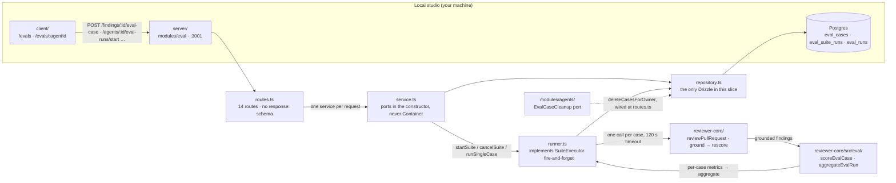

# Spec: Eval pipeline (server)

Source spec: `specs/2026-08-30-eval-pipeline.md` (SPEC-04). This document covers
only the server half — the new `modules/eval/` slice, its fourteen routes, the
`eval_suite_runs` table and the additive columns on `eval_runs` and
`eval_cases`, the `EvalCaseCleanup` port added to `modules/agents/`, and the
seeded regression set. The client half is
`client/specs/2026-08-30-eval-pipeline.md`.

This is the **why**. The operating mental model — what each table means, how a
suite run moves through its states, the run path drawn end to end, and the
vocabulary note that separates a product "eval case" from the root
`@devdigest/evals` package — lives in
[`../docs/eval-pipeline.md`](../docs/eval-pipeline.md) and is deliberately not
repeated here.

Two things existed and had nothing behind them before this feature.
`eval_cases` and `eval_runs` were tables with zero writers and zero readers, and
`EvalCaseInput`, `EvalDashboard`, `EvalTrendPoint` and `EvalRun` were contracts
nothing parsed. This slice is the first writer and the first reader of all of
them, which is what made the contract narrowings under `## Contract impact`
cost-free.

## The slice

A **start** resolves the agent, writes one `eval_suite_runs` row inside the same
transaction that checks nothing is already running, and hands the suite to the
runner without awaiting it (`service.ts:234-257`). The **runner** walks the
agent's cases in order, and for each one parses the stored diff, calls
`reviewPullRequest` with the version snapshot's prompt, model, strategy and
skill blocks, and persists one `eval_runs` row (`runner.ts:88-103,135-206`).
**Scoring** is `reviewer-core`'s pure `scoreEvalCase` over the findings that
survived grounding; **aggregation** is `aggregateEvalRun` over the per-case
scores, written once at the end by `finish()` (`runner.ts:107-116`). The
**repository** is the only file here that names Drizzle and the only place
workspace scoping is enforced. Deeper architecture lives in the module READMEs:
[`server`](../README.md) · [`reviewer-core`](../../reviewer-core/README.md) ·
[`client`](../../client/README.md).

## Why the runner duplicates `run-executor.ts` and does not extract a shared executor

`runner.ts` and `modules/reviews/run-executor.ts` both resolve a provider,
call `reviewPullRequest` once, account cost and tokens, honour a cancellation
signal and persist a result row. That overlap is a **deliberate copy, not an
oversight**.

SPEC-04's Non-goals forbid any change to how a real pull-request review runs, is
scored or is displayed. Extracting a common executor is, by construction, a
change to the shipping review path: `run-executor.ts` is the code every real
review goes through, and the only way to share it is to edit it. The cost of the
duplication is bounded and visible; the cost of a regression in the review path
is not.

**What is shared anyway, and why that is the part that matters.** The two
executors meet at one entry point — `reviewPullRequest`
(`runner.ts:155`, `run-executor.ts:246`). Everything behind that call is common
by construction: the map/single-pass selection, `wrapUntrusted` on every
untrusted block, the citation-grounding gate, and the score recomputed from the
findings that survived it (`reviewer-core/src/review/run.ts:198-210`). An eval
therefore grades the same gate a user gets, not an easier problem. What is
copied is orchestration around that call, which is the cheap half.

**What the eval runner deliberately does *not* copy.** `run-executor.ts` builds
a callers digest, a repo map, a project-context block and a derived-intent block
from a cloned repository (`run-executor.ts:206-264`). None of that is
reconstructible from a stored diff, so `runner.ts` passes none of it. See
*What a snapshot replays* below.

> Once eval is stable, a follow-up plan can revisit extraction. Doing it in this
> feature would have meant editing the review path to add a capability the review
> path does not need.

## `eval_cases.owner_id` carries no foreign key, and cannot

`owner_kind` is `'skill' | 'agent'` (`db/schema/eval.ts:14`), so `owner_id`
points into one of two tables depending on a sibling column. Postgres has no
foreign key for that, and inventing one — two nullable columns, or a check
constraint plus a trigger — would buy a cascade at the cost of a schema that
lies about what the row means.

**Why an application-level port and not a database cascade.** Deleting an agent
must delete its cases (AC-17), so the deletion moved up a layer:

- `modules/agents/ports.ts` declares `EvalCaseCleanup` with exactly one method,
  and nothing else (`agents/ports.ts:1-3`).
- `AgentsService.delete` deletes the agent, and *only if a row was actually
  deleted* calls the port (`agents/service.ts:72-77`). The order matters: a
  cross-workspace delete that removes nothing must not remove that workspace's
  cases either.
- The concrete implementation is constructed at the composition root in
  `agents/routes.ts:73-77`, which is where it is allowed to name
  `container.evalRepo`.

**`modules/agents/` must not import `modules/eval/`.** The depcruise onion
ruleset scores `no-cross-slice-imports` as an error, so the port is declared in
the *agents* slice and satisfied from outside it. `rg 'modules/eval'
server/src/modules/agents` returns nothing.

Per-case `eval_runs` rows go with the cases through a real cascade —
`eval_runs.case_id` does reference `eval_cases` — so only the polymorphic edge
needs the port.

## `eval_runs.suite_run_id` is permanently nullable, not nullable-until-tightened

A column added nullable is usually a step toward `NOT NULL`. This one is not.

A single case can be run on its own from the case list, outside any suite
(`service.ts:211-232`). That run's `suite_run_id` is `null`, and the null is the
statement: this result feeds no aggregate, contributes no trend point, and is
never selectable for comparison (AC-26). Backfilling a synthetic one-case suite
run to make the column `NOT NULL` would put a row in `eval_suite_runs` that no
user started, and every "completed suite runs" query would then have to exclude
it again.

`eval_cases.source_finding_id` is nullable on the same terms rather than for the
same reason: a hand-authored case never had a source finding, and a case created
from one must outlive it. `eval.it.test.ts` pins that directly — a case created
from a finding still runs to completion after its source pull request is
deleted.

## A metric that was not computed is `null`, never `0`

This is the invariant the whole MAJOR contract verdict was paid for, and it is
enforced at four points rather than one:

- **The scorer** returns `null` when a denominator is zero — no `must_find`
  expectation means recall is not computed; zero findings means precision is not
  computed (`reviewer-core/src/eval/score.ts:185-187`, and the same three
  guards in `aggregateEvalRun` at `:215-217`).
- **The schema** leaves `recall`, `precision`, `citation_accuracy` and
  `cases_passed` nullable on `eval_suite_runs`, and only `finish()` writes them,
  so a `running` or `cancelled` row carries null there by construction and a
  `failed` one is finished with nulls explicitly (`repository.ts:374-393`,
  `runner.ts:117-132`). `cases_total` is the exception — it is known at start
  and written there (`repository.ts:265-274`), which is what lets a cancelled
  run still say how many cases it was going to run.
- **The contract** was narrowed to `z.number().nullable()` on every metric
  field, so a `0` substituted anywhere upstream would still be a lie the type
  cannot catch — but a `null` can now be *transmitted*, which is what makes the
  lie unnecessary.
- **The service** builds `current` and `delta` from explicit null branches, and
  `diffOrNull` refuses to subtract when either side is missing
  (`service.ts:70-72,294-319`).

**Why `null` and not `0`, stated as a rule: `0%` recall is a result, and "we did
not measure recall" is not.** Collapsing them makes a case set with no
`must_find` expectations look like a total failure, and makes an agent's first
run look like a regression against nothing.

## The stale-suite-run reaper is not required by any acceptance criterion

AC-24 only requires an interrupted run to be *observable as incomplete*. The
reaper exists anyway, and the reasoning is worth keeping because the failure it
prevents is invisible until it happens.

Cancellation state lives in process memory — `EvalRunner` holds a
`Set<string>` of cancelled suite-run ids (`runner.ts:55`). A `SIGKILL` mid-suite
therefore leaves an `eval_suite_runs` row at `running` with nothing advancing it.
Three things then follow: AC-21's one-at-a-time rule 409s that agent **forever**,
the client's run list polls every four seconds indefinitely because it sees a
`running` row (`client/src/lib/hooks/evals.ts:202-206`), and the run is neither
in the trend nor removable.

`reapStaleSuiteRuns` marks every still-`running` row `failed` at boot
(`repository.ts:601-608`), called next to the review slice's existing
`ReviewService.reapStaleRuns` and behind the same non-fatal `try` (`app.ts:87-95`).

**Why boot-time and not a heartbeat or a timeout column.** A heartbeat needs a
writer on a schedule, and this API has no scheduler; a `stale_after` column
needs a reader on a schedule for the same reason. Boot is the one moment the
process knows for certain that nothing it is holding in memory is still running,
which is exactly the condition the reap tests for. It mirrors
`reapStaleRunningRuns` in `modules/reviews/repository/run.repo.ts`, so there is
one shape for this problem in the codebase and not two.

## What a snapshot replays, and what it deliberately does not

A case runs against the immutable `agent_versions` row the suite was started at,
never the agent's live configuration (`repository.ts:436-476`). That is what
makes a comparison between two runs meaningful — the compare view can show the
system prompts that produced each side.

`AgentVersionSnapshot` carries more than the runner consumes
(`ports.ts:189-201`). `repoIntel`, `outputSchema` and `ciFailOn` are read off
the stored config and never passed to `reviewPullRequest`
(`runner.ts:154-166`). That asymmetry is intentional and is the single most
useful thing to know before reading an eval number:

**An eval scores prompt + model + strategy + skills. It does not score the
repository context around them.** A case owns a snapshotted diff and nothing
else — no clone, no caller graph, no repo map, no attached project documents —
so those prompt sections are simply absent. `repoIntel: true` on the snapshot
does not mean an eval ran with repo intel; it means the agent has it switched on
for real reviews.

`skillBlocks` is the exception, and it is resolved rather than snapshotted: the
version stores skill *ids*, and `skillBlocksFor` renders the currently enabled
skills' bodies at run time (`repository.ts:479-495`). An agent whose behaviour
lives in an attached skill is therefore scored with that skill attached — but
editing the skill body changes what a *replay* of an old version does. The
snapshot is version-exact for the prompt and model, and current for skill text.

## Workspace scoping has exactly one enforcement point

Every method on every port takes a workspace id, and the repository is the only
place it is applied (`ports.ts:48-77,108-117,157-180`). `eval_runs` has no
`workspace_id` column of its own, so its queries join through
`eval_cases.workspace_id` — including `insertRun`, which re-reads the owning
case inside its transaction and throws rather than writing an unattributable row
(`repository.ts:167-180`).

**Why scoping lives in the repository and not in the routes.** AC-18 requires a
cross-workspace case or run to answer 404 on read *and* write. Enforced in the
handler, that is fourteen places to forget; enforced in the query's `WHERE`, a
forgotten check produces `undefined`, and `undefined` is what every service
method turns into `NotFoundError`. The 404 is a consequence of the query, not of
a guard someone remembered to write.

The same argument shapes the completeness filters: `trend`, `recentCompleted`
and `getCompletedById` all pin `status = 'done'` in the query itself
(`repository.ts:319-372`), so a `running`, `failed` or `cancelled` run is
excluded from the trend, the delta and the comparison by construction. AC-24 and
AC-61 are then the same line of SQL rather than two client-side filters that can
drift apart.

## Both rate-limited routes carry an explicit `keyGenerator`

`POST /agents/:id/eval-runs/start` and `POST /eval-cases/:id/run` are each
limited to ten per minute (`routes.ts:75-113`). Both pass an explicit
`keyGenerator` that resolves the workspace from the request and prefixes it with
its own bucket name (`routes.ts:16-23`).

**Why an explicit key generator, and why two buckets.** Without a
`keyGenerator`, `@fastify/rate-limit` produces *one global bucket*, not a
per-workspace one — `server/INSIGHTS.md` records this, and
`modules/brief/routes.ts:11-17,54-60` is the shape that gets it right. Sharing
one bucket between the two routes would additionally let a user exhaust their
suite-start budget by running single cases from the editor, which is a different
and much cheaper operation.

## A failing case is a data point, not an abort

`executeCase` catches everything — provider error, missing snapshot, malformed
output, the 120-second timeout — and still writes an `eval_runs` row, carrying
`{ error: message }` as its `actual_output`, `pass: false`, and the metrics the
scorer produces for *zero findings* (`runner.ts:186-205,215-217`).

The case therefore stays in the run's denominators. **Why that, and not
excluding it:** an excluded case makes a broken provider look like a smaller,
healthier set. Scoring it as zero matches makes the same outage show up as a
metric drop, which is a thing a person investigates.

`scoreCaseAsZeroMatches` forces `passed: false` on top of the scorer's own
answer, because a case whose only expectations are `must_not_flag` would
otherwise "pass" by having crashed before it could flag anything
(`runner.ts:215-217`).

## Contract impact

Every eval contract had zero readers when it was narrowed, which is the entire
argument for doing it in one step rather than through an
expand/migrate/contract sequence.

| Change | Shape | Effect |
|---|---|---|
| `EvalCaseInput.expected_output`, `EvalCase.expected_output`: `z.unknown()` → `z.array(EvalExpectation)` | narrowing | MAJOR in principle, zero consumers |
| `EvalDashboard.current.*`, `.delta.*`, `EvalTrendPoint.*`, `EvalRun.*` metrics → `.nullable()` | narrowing | MAJOR in principle, zero consumers; this is the `null`-never-`0` invariant made representable |
| `+ EvalExpectation`, `EvalExpectationKind` (`knowledge.ts:117-132`) | addition | the one schema AC-9 requires, shared by the client editor |
| `+ EvalCaseRecord`, `EvalSuiteRunRecord`, `EvalMetricDiff`, `EvalCompare` (`eval-ci.ts:59-116`) | addition | new read shapes |
| `+ EvalRunRecord.suite_run_id`, `.agent_version` | addition | nullable, `z.object` strips unknown keys |
| `+ eval_suite_runs`; `+ eval_runs.suite_run_id`, `.agent_version`; `+ eval_cases.source_finding_id`, `.created_at` | database | additive; migrations `0023_swift_dakota_north.sql`, `0024_handy_vargas.sql` |

**No `@deprecated` marker and no rollout sequence.** Nothing was renamed,
removed or dropped, and every database change is `CREATE TABLE`, `ADD COLUMN` or
`CREATE INDEX` — which is also why `pnpm db:generate` stayed non-interactive.

**The mirror gate was widened rather than worked around.** `contracts/eval-ci.ts`
and `contracts/knowledge.ts` are edited on both sides in this change, so both
moved out of `verify-l04.sh`'s known-divergent list and into its `diff -q` loop,
alongside four other files that were already identical and simply ungated.
`contracts/productionize.ts` is now the only excluded file. `verify-l06.sh`
carries the same gate as a lane of its own, so a one-character one-sided edit
fails a command instead of reaching a browser.

## Server tests

- `server/test/eval-domain.test.ts` — the pure rules and the DTO mapping:
  `resolveFindingActionState` reads accepted / dismissed / undecided off the
  timestamps; `deriveExpectationFromFinding` produces exactly one `must_find`
  from an accepted finding, exactly one `must_not_flag` from a dismissed one,
  and refuses one that is neither; `disambiguateCaseName` leaves a unique name
  alone, appends and keeps incrementing a numeric suffix on collision, produces
  distinct names for two findings sharing a title, and — the case that exists to
  record the trap — yields a suffixed candidate *distinct from* the truncated
  base name for an over-long title, which is what lets the suffix search
  terminate; the helpers map a case, run and suite-run row to their contract
  records and throw `AppError('internal_error', …, 500)` when a row fails its own
  contract.
- `server/test/eval.it.test.ts` — the case lifecycle against a real database:
  an accepted finding becomes a case with one `must_find`; a dismissed one with
  one `must_not_flag`; an undecided one is refused 400 and persists nothing; the
  created case stores a non-empty snapshot of the cited file's diff and its
  source finding id; a second create for the same finding returns the existing
  case rather than a duplicate; an invalid expected output is refused 400 naming
  the failing index and field, persisting nothing; a case or run in another
  workspace answers 404 on read and on write; cancelling an already-terminal
  suite run answers 200 with `ok: false` rather than 404; and a case created from
  a finding still runs to completion after its source pull request is deleted.
- `server/test/eval-runner.it.test.ts` — the suite runner, with
  `container.overrides.llm` supplying a fixed structured fixture: a start writes
  one suite-run row, one per-case row per case, and completion writes aggregates
  and marks the run done; a second start while one is in progress answers 409 and
  writes no second suite run; a failing case neither stops the suite nor leaves
  the denominators; a run whose process died is incomplete and excluded from
  trend, delta and compare; starts are limited to ten per minute per workspace;
  a single-case run carries a null suite id and feeds no aggregate; the trend
  series is oldest→newest and capped at 30 completed runs; the grounding gate
  applies before anything is persisted or scored; a cancel stops after the case
  in flight, keeps the rows already written, unblocks the next start and excludes
  the cancelled run from trend, delta and comparison; and a case with an empty
  expectation list passes when the agent reports no findings.
- `server/test/eval-agent-delete.it.test.ts` — deleting an agent through its real
  route removes that workspace's eval cases and their run rows while leaving
  another workspace's cases untouched, proving the `EvalCaseCleanup` port scoped
  rather than global.
- `server/test/eval-seed.it.test.ts` — the seed plants at least eight cases on
  the seeded `Security Reviewer`, each with a non-empty diff and an expectation
  list that parses under `EvalExpectation`; the set is served through the agent
  eval-cases endpoint; a second seed does not multiply them.
- `server/test/eval-prompt-sensitivity.it.test.ts` — the witness that the whole
  pipeline is sensitive to the thing it claims to measure: removing the one named
  `SECURITY_REVIEWER_SSRF_LINE` from the seeded prompt and re-running the same
  unchanged case set moves recall or precision, across two suite runs carrying
  different agent versions.
- `server/test/routes-smoke.test.ts` — "registers the eval module in the route
  table" asserts all fourteen `/evals*` routes with `app.hasRoute`. This block is
  a `verify:l06` lane of its own, so deleting a route fails the command directly
  rather than only as a side effect of a broader suite going red.
- `server/test/vendor-mirror-gate.test.ts` — asserts `verify-l04.sh` gates
  `contracts/eval-ci.ts` inside the `diff -q` loop rather than the excluded list,
  that the gate exits zero for the two tracked copies as they stand, and that it
  exits non-zero when one copy differs by a single character.
- `server/test/contracts.test.ts` — parses a conforming and a non-conforming
  expectation list and pins the nullable metric fields.
- `reviewer-core/test/eval-score.test.ts` and
  `reviewer-core/test/eval-score-purity.test.ts` belong to the engine, not this
  slice; see `reviewer-core/src/eval/`.

## Out of scope

Taken from SPEC-04's `## Non-goals`, unchanged on the server side:

- Any change to how a real pull-request review runs, is scored or is displayed —
  which is why `runner.ts` duplicates rather than refactors `run-executor.ts`.
- Skill-owned eval cases. `EvalOwnerKind` keeps its `skill` member and is not
  narrowed; this slice only ever writes `'agent'`.
- Any scheduled, on-save or CI-triggered eval run. Every run is started by a
  person, through a route.
- A per-run spend ceiling. Rejected in the spec's edge cases: a partially-run
  suite's metrics are not comparable to a full one's under AC-22's
  keep-failures-in-the-denominator rule.
- The rest of the L06 roadmap row — Secret/Phantom gates, Plan Verifier, Export
  to CI.
- Repairing `contracts/productionize.ts`'s mirror drift. It is the one file left
  out of the widened gate, and it is not this feature's drift.
